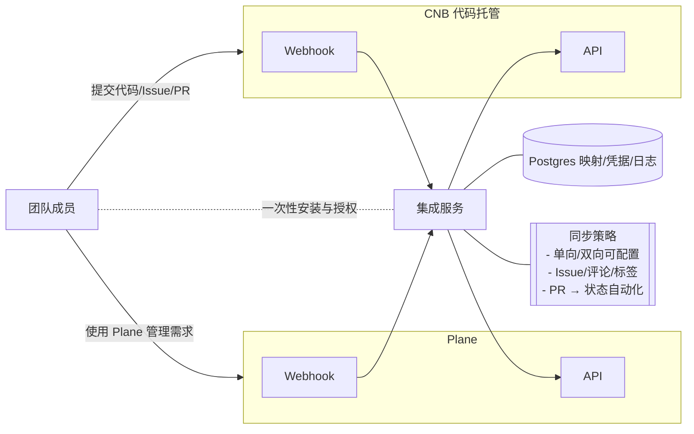
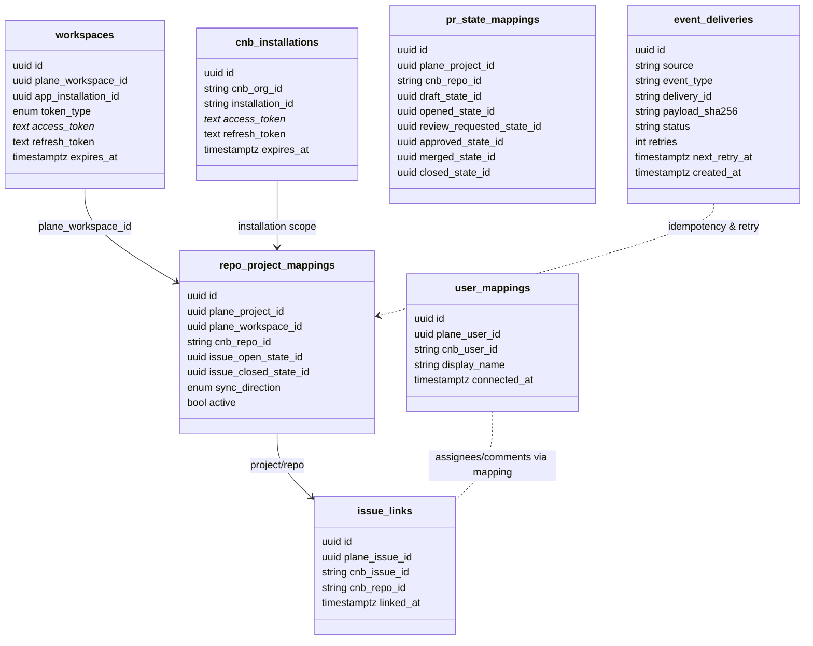
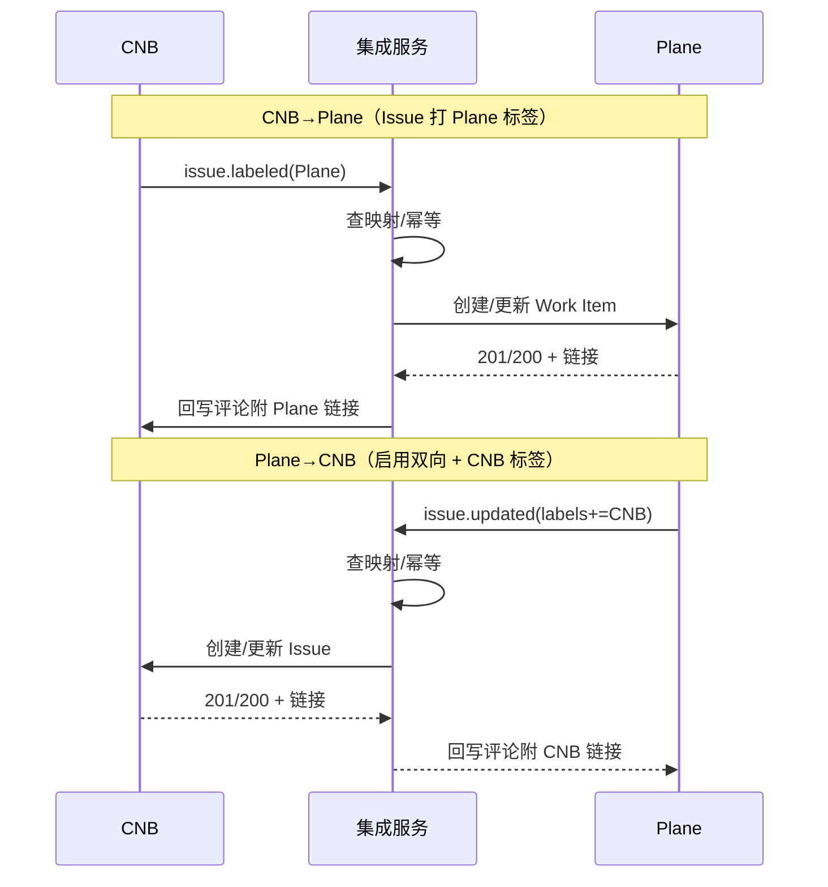
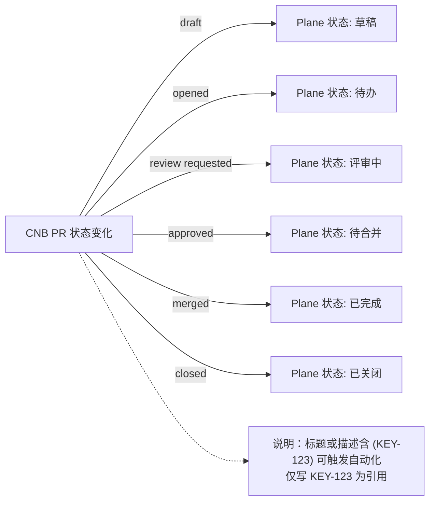
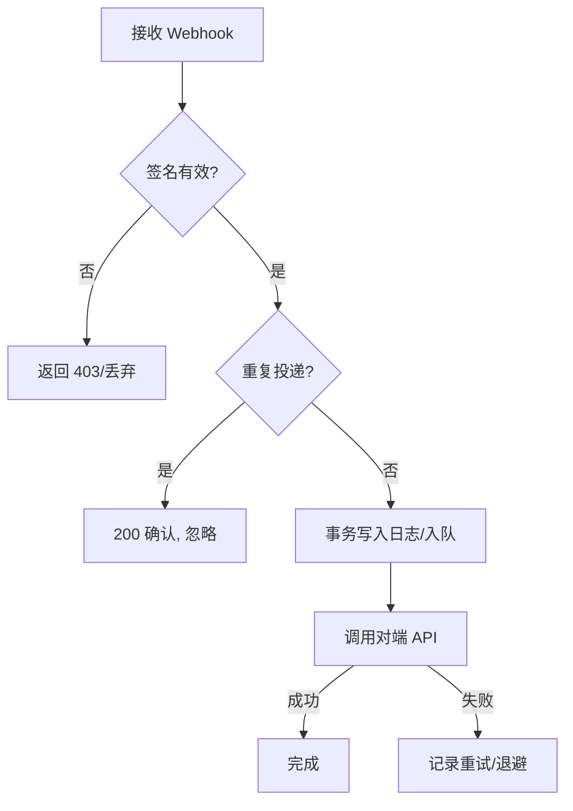

**CNB 集成设计（参考 GitHub 集成）**

- 目标：将公司内部 CNB 代码托管平台与 Plane 双向或单向同步，简化需求/开发协作。参考 Plane × GitHub 集成能力：仓库与项目映射、Issue 双向同步、PR 生命周期联动、评论与标签同步、用户身份映射、可配置的同步方向。

**整体架构**
- 技术栈：Go 1.24、Echo Web 框架、Postgres 16。
- 组件划分：
  - `plane-connector`：通过 Plane OAuth 获取 user/bot token，订阅 Plane Webhook，消费事件并回写 CNB。
  - `cnb-connector`：对接 CNB OAuth/App、Webhook 验签与事件消费，回写 Plane。
  - `sync-core`：映射与路由层（项目/仓库/用户/状态/标签/PR 状态映射、方向控制、去重与幂等）。
  - `storage`：Postgres 存储凭据、映射关系、事件投递日志、去重指纹。
  - `jobs`：异步任务与重试（本地队列/表驱动，事务内投递，指数退避）。

**部署与配置**
- 进程配置：
  - `PORT`（服务端口），`DATABASE_URL`，`ENCRYPTION_KEY`（KMS/本地），`LOG_LEVEL`。
  - Plane：`PLANE_CLIENT_ID`，`PLANE_CLIENT_SECRET`，`PLANE_BASE_URL`（如 https://api.plane.so），`PLANE_WEBHOOK_SECRET`。
  - CNB：`CNB_APP_ID`，`CNB_CLIENT_ID`，`CNB_CLIENT_SECRET`，`CNB_BASE_URL`，`CNB_WEBHOOK_SECRET`（或公钥配置）。
- 回调与事件端点：
  - Plane OAuth：`/plane/oauth/start`、`/plane/oauth/callback`
  - CNB OAuth/App：`/cnb/oauth/start`、`/cnb/oauth/callback`
  - Plane Webhook：`/webhooks/plane`
  - CNB Webhook：`/webhooks/cnb`

**数据模型（Postgres）**
- 下图仅展示核心表及主要关系，帮助理解“凭据/映射/链接/投递日志”的职责分工。

- `workspaces`：存 Plane 侧安装与令牌
  - `id` (pk)、`plane_workspace_id`、`app_installation_id`、`token_type`（user/bot）、`access_token`（加密）、`refresh_token`（加密，可空）、`expires_at`。
- `cnb_installations`：存 CNB 安装与令牌
  - `id`、`cnb_org_id`/`owner_id`、`installation_id`、`access_token`（加密）、`refresh_token`（加密，可空）、`expires_at`。
- `repo_project_mappings`：仓库与项目映射与同步方向
  - `id`、`plane_project_id`、`plane_workspace_id`、`cnb_repo_id`、`issue_open_state_id`、`issue_closed_state_id`、`sync_direction`（`cnb_to_plane`/`bidirectional`）、`active`。
- `pr_state_mappings`：PR 生命周期到 Plane 状态映射
  - `id`、`plane_project_id`、`cnb_repo_id`、`draft_state_id`、`opened_state_id`、`review_requested_state_id`、`approved_state_id`、`merged_state_id`、`closed_state_id`。
- `user_mappings`：用户身份映射
  - `id`、`plane_user_id`、`cnb_user_id`、`display_name`、`connected_at`。
- `issue_links`：跨系统工单关联
  - `id`、`plane_issue_id`、`cnb_issue_id`、`cnb_repo_id`、`linked_at`。
- `event_deliveries`：事件去重与可观测
  - `id`、`source`（plane/cnb）、`event_type`、`delivery_id`/`signature`、`payload_sha256`、`status`、`retries`、`next_retry_at`、`created_at`。

**同步模型与规则**
- 典型的双向/单向同步时序如下：

- 同步方向（默认单向 CNB→Plane，可切换双向）：参考 docs/docs-master/docs/integrations/github.mdx 的“Sync issues”“What gets synced?”
  - 标题、描述、指派人、标签、评论：默认双向；遵循冲突最后写入或来源优先（由 `sync_direction` 决定）。
  - 状态：默认 CNB→Plane（issue open/closed 映射 Plane State）。
- 触发机制（参考 GitHub 集成的标签触发）：
  - CNB→Plane：在 CNB issue 打上 `Plane` 标签 → 创建/链接 Plane Work Item。
  - Plane→CNB：在 Plane Work Item 打上 `CNB` 标签 → 创建/链接 CNB Issue。
- 评论同步：
  - 双向同步，若未映射用户则以 Bot 身份留言（Plane 侧可绑定“个人账户”以便归属评论，参考 GitHub 文档“Connect personal GitHub account”）。
- 用户映射：
  - 后台支持手动/半自动（邮件/用户名）映射；缺省不阻断同步但可能丢失“指派人”。

**PR 生命周期自动化（参考 GitHub PR mapping）**
- PR 状态到 Plane 状态的自动化映射：

- 支持将 CNB PR 状态映射到 Plane Work Item 状态：draft/opened/review_requested/approved/merged/closed。
- 参考格式（同 GitHub）
  - 标题/描述包含带方括号的 Issue 标识如 `[WEB-344]` → 链接并触发状态自动化。
  - 不带括号 `WEB-344` → 仅建立引用关系，不触发状态变更。

**接口设计（Echo）**
- `GET /healthz`：健康检查。
- `GET /plane/oauth/start`：重定向至 Plane 授权；`GET /plane/oauth/callback`：换取 token（支持 user/bot token，含 `app_installation_id`）。
- `GET /cnb/oauth/start`：重定向至 CNB 授权；`GET /cnb/oauth/callback`：换取 token。
- `POST /webhooks/plane`：Plane webhook（校验 `X-Plane-Delivery`/`X-Plane-Event`/`X-Plane-Signature`，HMAC-SHA256）。
- `POST /webhooks/cnb`：CNB webhook（建议 HMAC-SHA256 签名头，如 `X-CNB-Signature`）。
- `POST /admin/mappings/repo-project`：创建/更新仓库-项目映射（含状态映射与方向）。
- `POST /admin/mappings/pr-states`：配置 PR 生命周期映射。
- `POST /admin/mappings/users`：批量用户映射。

**Webhook 事件与处理（概要）**
- 事件校验、去重与重试流程：

- CNB → 集成服务 → Plane：
  - Issue：opened/edited/labeled/unlabeled/closed/reopened/comment_created → 创建/更新/评论 Work Item。
  - PR：opened/ready_for_review/review_requested/review_submitted/merged/closed → 根据 `pr_state_mappings` 调整 Work Item 状态；添加引用/评论回链。
- Plane → 集成服务 → CNB（参考 docs/developer-docs-preview/dev-tools/intro-webhooks.mdx）：
  - 事件：issue、issue_comment、project、cycle、module（主要消费 issue/issue_comment）。
  - 行为：标题/描述/标签/评论变更反写 CNB；Plane State→CNB issue open/close（当 `sync_direction=bidirectional`）。

**安全与幂等**
- Webhook 校验：
  - Plane：校验 `X-Plane-Signature`（HMAC-SHA256(secret, raw_body)）。
  - CNB：建议同 HMAC-SHA256 或公钥验签；记录 `delivery_id`/`payload_sha256` 去重。
- Token 安全：对 `access_token`/`refresh_token` 透明加密存储；最小权限；定期轮换。
- 幂等处理：以 `delivery_id`+`payload_sha256` 作为幂等键；业务侧以 `issue_links`/`PR 引用` 防重复创建。

**错误与重试**
- 同步失败写入 `event_deliveries` 并进入 `jobs` 队列，指数退避（10m/30m/...）。
- 明确不可重试错误（4xx 语义错误）与可重试错误（网络/429/5xx）。

**Go/Echo 参考实现结构**
- 目录：
  - `cmd/server/main.go`（引导、路由、依赖注入）
  - `internal/handlers/plane.go`、`internal/handlers/cnb.go`（Webhook/OAuth 回调）
  - `internal/services/sync.go`（核心映射/路由）
  - `internal/connectors/plane.go`、`internal/connectors/cnb.go`（各平台 API 客户端）
  - `internal/store/...`（Repo/Project/User/PR 映射、凭据）
  - `internal/jobs/...`（异步任务/重试）

**关键流程（文字时序）**
- CNB Issue 打上 `Plane` 标签 → CNB Webhook → 查映射（repo→project）→ 在 Plane 创建 Work Item → 记录 `issue_links` → 回写 CNB 评论附 Plane 链接。
- Plane Work Item 打上 `CNB` 标签 → Plane Webhook → 查映射 → 在 CNB 创建 Issue → 记录 `issue_links` → 回写 Plane 评论附 CNB 链接。
- PR 标题含 `[ABC-123]` → CNB Webhook → 查 `pr_state_mappings` → 推动 Plane Work Item 状态流转；反向在 PR 留言引用。

**测试与验收**
- 单元：映射、签名校验、幂等、方向策略。
- 集成：模拟 Webhook 负载（Plane 示例见 intro-webhooks.mdx），本地回调。
- 试点：单项目、双向同步关闭（仅 CNB→Plane）；稳定后开放双向与 PR 自动化。

**里程碑**
- M1：最小可用（CNB→Plane 单向：Issue 创建/更新/评论、基础映射 UI/接口）。
- M2：Plane→CNB 双向、用户映射、评论归属。
- M3：PR 生命周期自动化、引用行为、性能与可观测性完善。
