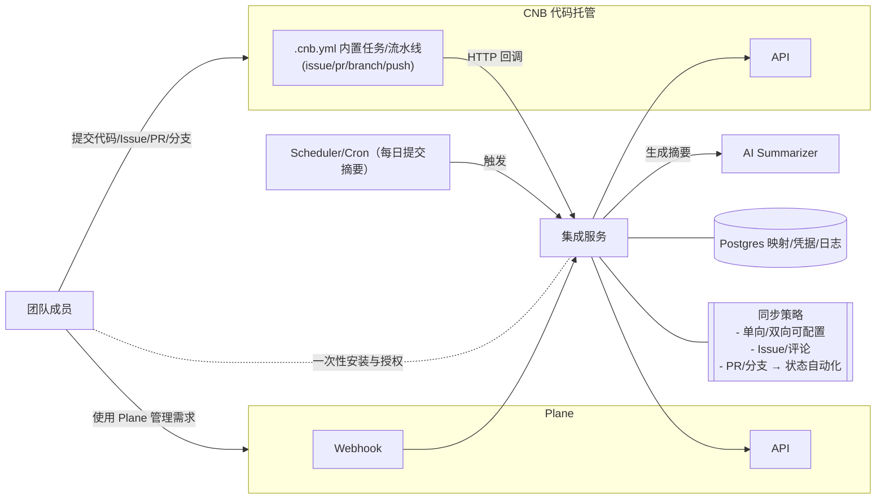
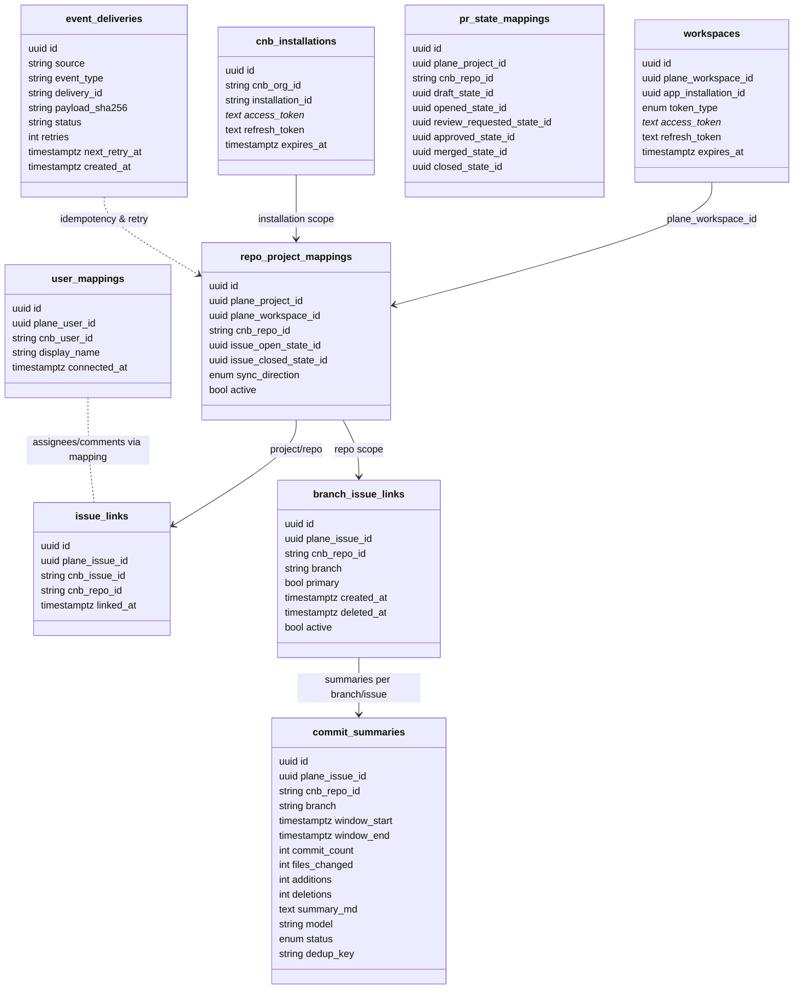
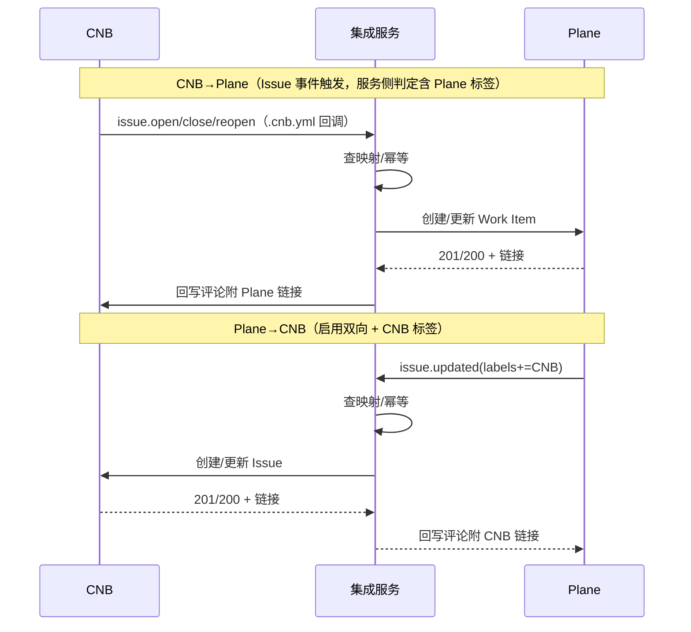
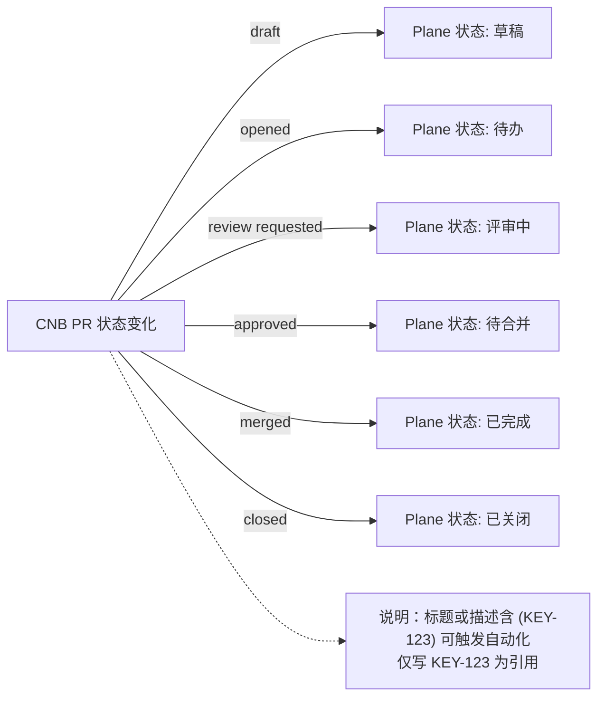
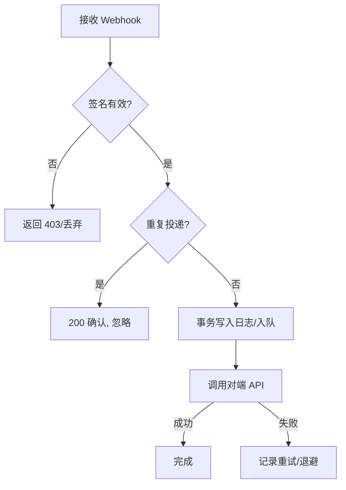

**CNB 集成设计（参考 GitHub 集成）**

- 目标：将公司内部 CNB 代码托管平台与 Plane 双向或单向同步，简化需求/开发协作。参考 Plane × GitHub 集成能力：仓库与项目映射、Issue 双向同步、PR 生命周期联动、评论与标签同步、用户身份映射、可配置的同步方向。

**整体架构**
- 技术栈：Go 1.24、Echo Web 框架、Postgres 16。
- 组件划分：
  - `plane-connector`：通过 Plane OAuth 获取 user/bot token，订阅 Plane Webhook，消费事件并回写 CNB。
  - `cnb-connector`：对接 CNB API；通过仓库 `.cnb.yml` 配置的内置任务在 CNB 事件发生时回调集成服务；回写 Plane。
  - `sync-core`：映射与路由层（项目/仓库/用户/状态/标签/PR 状态映射、方向控制、去重与幂等）。
  - `storage`：Postgres 存储凭据、映射关系、事件投递日志、去重指纹。
  - `jobs`：异步任务与重试（本地队列/表驱动，事务内投递，指数退避）。

**数据模型（Postgres）**
- 下图仅展示核心表及主要关系，帮助理解“凭据/映射/链接/投递日志”的职责分工。

- `workspaces`：存 Plane 侧安装与令牌
  - `id` (pk)、`plane_workspace_id`、`app_installation_id`、`token_type`（user/bot）、`access_token`（加密）、`refresh_token`（加密，可空）、`expires_at`。
- `cnb_installations`：存 CNB 安装与令牌
  - `id`、`cnb_org_id`/`owner_id`、`installation_id`、`access_token`（加密）、`refresh_token`（加密，可空）、`expires_at`。
- `repo_project_mappings`：仓库与项目映射与同步方向
  - `id`、`plane_project_id`、`plane_workspace_id`、`cnb_repo_id`、`issue_open_state_id`、`issue_closed_state_id`、`sync_direction`（`cnb_to_plane`/`bidirectional`）、`active`。
- `pr_state_mappings`：PR 生命周期到 Plane 状态映射
  - `id`、`plane_project_id`、`cnb_repo_id`、`draft_state_id`、`opened_state_id`、`review_requested_state_id`、`approved_state_id`、`merged_state_id`、`closed_state_id`。
- `user_mappings`：用户身份映射
  - `id`、`plane_user_id`、`cnb_user_id`、`display_name`、`connected_at`。
- `issue_links`：跨系统工单关联
  - `id`、`plane_issue_id`、`cnb_issue_id`、`cnb_repo_id`、`linked_at`。
- `event_deliveries`：事件去重与可观测
  - `id`、`source`（plane/cnb）、`event_type`、`delivery_id`/`signature`、`payload_sha256`、`status`、`retries`、`next_retry_at`、`created_at`。
 - `branch_issue_links`：分支与 Issue 关联
   - `id`、`plane_issue_id`、`cnb_repo_id`、`branch`、`primary`、`created_at`、`deleted_at`、`active`。
 - `commit_summaries`：提交摘要记录
   - `id`、`plane_issue_id`、`cnb_repo_id`、`branch`、`window_start`、`window_end`、`commit_count`、`files_changed`、`additions`、`deletions`、`summary_md`、`model`、`status`、`dedup_key`。

**同步模型与规则**
- 典型的双向/单向同步时序如下（CNB 侧通过 .cnb.yml 触发回调，非 Webhook）：

- 同步方向（默认单向 CNB→Plane，可切换双向）：参考 Plane×GitHub 的“Sync issues / What gets synced?”
  - 标题、描述、指派人、标签、评论：默认双向；遵循冲突最后写入或来源优先（由 `sync_direction` 决定）。
  - 状态：默认 CNB→Plane（issue open/closed 映射 Plane State）。
- 触发机制（CNB 无 Webhook 的适配）：
  - CNB→Plane：在 `issue.open/issue.close/issue.reopen` 等事件中通过 `.cnb.yml` 以内置任务回调集成服务；服务侧拉取 Issue 详情并判断是否含 `Plane` 标签，满足则创建/链接 Plane Work Item（标签作为“门槛”而非事件源）。
  - Plane→CNB：在 Plane Work Item 打上 `CNB` 标签 → 由 Plane Webhook 触发服务回写 CNB（创建/链接 Issue）。若需“补同步”，可在 CNB 仓库提供 `web_trigger` 按钮手动触发一次回调。
  - 分支与提交：分支 create/delete/push 事件通过 `.cnb.yml` 回调 `/ingest/cnb/branch`（或由后台轮询发现）→ 建立/更新 `branch_issue_links`、推动 Issue 状态自动化；每日由 Scheduler 执行汇总任务，使用 AI 生成提交摘要并在 Issue 下评论。
- 评论同步：
  - 双向同步，若未映射用户则以 Bot 身份留言（Plane 侧可绑定“个人账户”以便归属评论，参考 GitHub 文档“Connect personal GitHub account”）。
- 用户映射：
  - 后台支持手动/半自动（邮件/用户名）映射；缺省不阻断同步但可能丢失“指派人”。

**PR 生命周期自动化（参考 GitHub PR mapping）**
- PR 状态到 Plane 状态的自动化映射：

- 支持将 CNB PR 状态映射到 Plane Work Item 状态：draft/opened/review_requested/approved/merged/closed。
- 参考格式（同 GitHub）
  - 标题/描述包含带方括号的 Issue 标识如 `[WEB-344]` → 链接并触发状态自动化。
  - 不带括号 `WEB-344` → 仅建立引用关系，不触发状态变更。

**接口设计（Echo）**
- `GET /healthz`：健康检查。
- `GET /plane/oauth/start`：重定向至 Plane 授权；`GET /plane/oauth/callback`：换取 token（支持 user/bot token，含 `app_installation_id`）。
- `POST /webhooks/plane`：Plane webhook（校验 `X-Plane-Delivery`/`X-Plane-Event`/`X-Plane-Signature`，HMAC-SHA256）。
- `POST /ingest/cnb/issue`：接收 `.cnb.yml` 流水线在 Issue 事件中回调的最小负载（repo、issue_iid、event）。
- `POST /ingest/cnb/pr`：接收 PR 相关事件回调（iid、action、状态等）。
- `POST /ingest/cnb/branch`：接收分支创建/删除/推送事件（若 CNB 不支持则由后台轮询替代）。
- `POST /jobs/issue-summary/daily`：手动触发当日提交摘要生成（支持限定 project/repo/issue）。
  请求示例：
  - `/ingest/cnb/issue`
    ```json
    {
      "event": "issue.open", // issue.open | issue.close | issue.reopen
      "repo": "group_slug/repo_name",
      "issue_iid": "42"
    }
    ```
  - `/ingest/cnb/pr`
    ```json
    {
      "event": "pull_request", // pull_request | pull_request.update | ...
      "action": "created|code_update|status_update",
      "repo": "group_slug/repo_name",
      "pr_iid": "13"
    }
    ```
- `POST /admin/mappings/repo-project`：创建/更新仓库-项目映射（含状态映射与方向）。
- `POST /admin/mappings/pr-states`：配置 PR 生命周期映射。
- `POST /admin/mappings/users`：批量用户映射。

**Issue 自动更新（分支与提交 AI 摘要）**
- 目标：当开发者以 Issue 标识（如 `#PROJ-002`/`PROJ-002`）命名分支并在该分支提交代码时，自动用 AI 汇总当日提交，在 Plane 对应 Issue 下追加评论，形成“进度日报”；当分支被创建→标记 Issue 已开始；当分支被删除→标记 Issue 结束并给出收尾摘要。

- 识别与关联
  - 分支命名规则（可配置）：默认采用正则 `(?i)#?([A-Z][A-Z0-9]+-\d+)` 提取 Issue Key，支持可选 `#` 前缀与大小写；同时支持从提交信息中解析（如 `feat: impl foo (#PROJ-002)`）。
  - 关联优先级：分支名 > 提交信息 > PR 标题/描述。出现多个 Key 时以第一个为主，其余作为引用。
  - 建立 `branch_issue_link` 关系：`(repo, branch) → plane_issue_id`，用于后续汇总与生命周期判定。

- 触发与时序
  - 分支创建：
    - 事件来源：`/ingest/cnb/branch`（action=`create`，或首次 push 视作 create）；若 CNB 不支持分支事件，则以服务侧轮询 CNB API 的方式检测新分支（按映射项目限定 repo 范围）。
    - 行为：解析分支→定位 Plane Issue→在 Issue 下评论“已创建开发分支 `<branch>`（repo: `<repo>`）”，并将 Issue 状态切至“进行中”（映射 `issue_open_state_id`）。
  - 每日汇总：
    - 调度：服务内置 `jobs` 定时任务（支持 CRON，如本地时区每日 18:00），对所有“活跃关联”的 `(repo, branch)` 拉取自上次汇总后的 commits（CNB API），汇总后以评论形式写回对应 Plane Issue。
    - 汇总范围：默认仅统计“同一分支”上的提交；若存在多个分支关联同一 Issue，则为该 Issue 聚合多条分支摘要并合并为一条评论（分支分节展示）。
  - 分支删除：
    - 事件来源：`/ingest/cnb/branch`（action=`delete`）；若缺失该事件，服务可在每日轮询中发现分支消失并标记删除。
    - 行为：生成“收尾摘要”（自上次汇总起的剩余提交 + 合并状态），在 Issue 下评论，并将 Issue 状态切至“已完成/已关闭”（`issue_closed_state_id`，可配置）。

- 汇总内容（AI 提示词模板）
  - 提示词包含：
    - 时间窗口（如：`YYYY-MM-DD` 日报 / `start_ts ~ end_ts`）。
    - 提交条目（提交信息、作者、合并/回退、关联 PR、变更统计：新增/删除/文件数）与代表性文件路径样本（≤ N 条，避免超长）。
    - 生成结构化评论：
      1) 今日进展概览（要点 3-6 条）
      2) 主要代码变更 / 影响范围
      3) 风险与待办（含阻塞项）
      4) 预计下个里程碑
  - 长度与合规：
    - 避免粘贴完整 diff 与敏感数据；仅引用提交标题与高层描述，以及少量文件路径样本。
    - 失败回退：若 AI 生成失败，则回写“原始提交列表（精简版）”。

- 接口与事件（新增）
  - `POST /ingest/cnb/branch`：分支事件入站回调（如 CNB 支持）；否则可不启用，由后台轮询替代。
    - 负载示例：
      ```json
      {
        "event": "branch",
        "action": "create|delete|push",
        "repo": "group/repo",
        "branch": "feature/PROJ-002-impl-x",
        "head": "abc123", // 可选：最新提交 SHA
        "commits": ["abc123","def456"] // 可选：push 扩展
      }
      ```
  - `POST /jobs/issue-summary/daily`：手动触发某项目/仓库范围的当日汇总（便于验收或补偿），支持查询参数：`project_id`/`repo_id`/`issue_id`。

- 存储与幂等（新增表）
  - `branch_issue_links`：`id`、`plane_issue_id`、`cnb_repo_id`、`branch`、`primary`（是否主分支）、`created_at`、`deleted_at`、`active`。
  - `commit_summaries`：`id`、`plane_issue_id`、`cnb_repo_id`、`branch`、`window_start`、`window_end`、`commit_count`、`files_changed`、`additions`、`deletions`、`summary_md`、`model`、`status`（ok/failed）、`dedup_key`（`issueId+branch+date`）。
  - 幂等：每日仅生成一次同键摘要（以 `dedup_key` 限定）；分支创建/删除事件以（repo+branch+action+ts_window）判重。

- 配置项（新增）
  - `SUMMARY_CRON`（如 `0 18 * * 1-5` 工作日 18:00）、`SUMMARY_TIMEZONE`、`SUMMARY_MAX_FILES`、`SUMMARY_MAX_COMMITS`、`SUMMARY_MODEL`。
  - `ISSUE_KEY_PATTERNS`（数组，默认包含 `#?([A-Z][A-Z0-9]+-\d+)`）。
  - `AUTO_STATE_TRANSITIONS` 开关：分支 create→`issue_open_state_id`，分支 delete→`issue_closed_state_id`。

- `.cnb.yml`（可选增强）
  - 若 CNB 支持 push/branch 事件的流水线触发，可在对应事件中使用 curl 通知 `/ingest/cnb/branch`：
    ```yaml
    $:
      push:
        - stages:
            - name: notify plane sync (branch push)
              image: curlimages/curl:8.7.1
              script: >
                curl -sS -X POST "$INTEGRATION_URL/ingest/cnb/branch" \
                  -H "Authorization: Bearer $INTEGRATION_TOKEN" \
                  -H "Content-Type: application/json" \
                  -d '{"event":"branch","action":"push","repo":"'"$CNB_REPO_SLUG"'","branch":"'"$CNB_BRANCH"'","head":"'"$CNB_COMMIT_SHA"'"}'
    ```

- 权限与风险
  - 仅在已建立 repo↔project 映射的仓库范围内执行分支扫描与汇总。
  - 摘要避免泄露敏感字符串（密钥/令牌/URL 参数等），内置敏感词裁剪与掩码。
  - 大量提交时进行抽样与聚合，防止评论过长；如超出上限，将分块多条评论发布并在首条附目录。

- 验收要点
  - 创建名为 `feature/PROJ-002-xxx` 的分支并 push 首次提交 → Plane Issue 自动评论“已开始开发”，状态切换为“进行中”。
  - 连续提交后，当日 18:00 触发汇总 → 在 Issue 下追加“每日进展摘要”。
  - 删除分支 → Plane Issue 自动评论“已结束（分支删除）”，并切至“完成/关闭”。

**事件与处理（概要）**
- 入站回调处理（校验、去重与重试）：

- CNB → 集成服务 → Plane：
  - 由 `.cnb.yml` 流水线在以下事件中回调：Issue `issue.open` / `issue.close` / `issue.reopen`；PR `pull_request` / `pull_request.update` / `pull_request.target` / `pull_request.mergeable` / `pull_request.merged` / `pull_request.approved` / `pull_request.changes_requested` / `pull_request.comment`。
  - 集成服务使用 `CNB_APP_TOKEN` 拉取详情，创建/更新/评论 Work Item，按 `pr_state_mappings` 推动状态同步。
- Plane → 集成服务 → CNB（参考 Plane webhook 文档）：
  - 事件：`issue`、`issue_comment` 为主。
  - 行为：标题/描述/标签/评论变更反写 CNB；Plane State→CNB issue open/close（当 `sync_direction=bidirectional`）。

**安全与幂等**
- 入站鉴权：
  - Plane：校验 `X-Plane-Signature`（HMAC-SHA256(secret, raw_body)）。
  - 来自 CNB 流水线的回调：`Authorization: Bearer {INTEGRATION_SHARED_SECRET}`。
- Token 安全：对 `access_token`/`refresh_token` 透明加密存储；最小权限；定期轮换。
- 幂等处理：Plane 侧以 `delivery_id`+`payload_sha256`；CNB 回调侧按（event+repo+iid+时间窗口）生成指纹；业务侧以 `issue_links`/`PR 引用` 防重复创建。

**错误与重试**
- 同步失败写入 `event_deliveries` 并进入 `jobs` 队列，指数退避（10m/30m/...）。
- 明确不可重试错误（4xx 语义错误）与可重试错误（网络/429/5xx）。

**Go/Echo 参考实现结构**
- 目录：
  - `cmd/server/main.go`（引导、路由、依赖注入）
  - `internal/handlers/plane.go`（Plane Webhook 回调）
  - `internal/handlers/cnb_ingest.go`（接收 `.cnb.yml` 回调入口：issue/pr/branch）
  - `internal/handlers/jobs.go`（手动触发：`/jobs/issue-summary/daily`）
  - `internal/services/sync.go`（核心映射/路由）
  - `internal/services/summaries.go`（提交拉取与窗口聚合、AI 提示词构建、评论写回）
  - `internal/connectors/plane.go`、`internal/connectors/cnb.go`（各平台 API 客户端）
  - `internal/connectors/ai.go`（AI Summarizer 客户端，带速率/重试）
  - `internal/store/...`（Repo/Project/User/PR 映射、凭据）
  - `internal/jobs/...`（异步任务/重试、定时调度器）

**关键流程（文字时序）**
- CNB Issue 事件（open/close/reopen）→ `.cnb.yml` 回调 → 服务查映射（repo→project）→ 拉取 Issue 详情（含标签）→ 若含 Plane 标签则在 Plane 创建/链接 Work Item → 记录 `issue_links` → 回写 CNB 评论附 Plane 链接。
- Plane Work Item 打上 `CNB` 标签 → Plane Webhook → 查映射 → 在 CNB 创建 Issue → 记录 `issue_links` → 回写 Plane 评论附 CNB 链接。
- PR 标题含 `[ABC-123]` → `.cnb.yml` 在 PR 事件中回调 → 查 `pr_state_mappings` → 推动 Plane Work Item 状态流转；反向在 PR 留言引用。

**.cnb.yml 配置示例（关键片段）**
- 在 Issue 和 PR 相关事件中，以内置任务调用集成服务，实现 CNB→Plane 同步。
```yaml
$:
  issue.open:
    - stages:
        - name: notify plane sync (issue open)
          image: curlimages/curl:8.7.1
          script: >
            curl -sS -X POST "$INTEGRATION_URL/ingest/cnb/issue" \
              -H "Authorization: Bearer $INTEGRATION_TOKEN" \
              -H "Content-Type: application/json" \
              -d '{"event":"issue.open","repo":"'"$CNB_REPO_SLUG"'","issue_iid":"'"$CNB_ISSUE_IID"'"}'

  issue.close:
    - stages:
        - name: notify plane sync (issue close)
          image: curlimages/curl:8.7.1
          script: >
            curl -sS -X POST "$INTEGRATION_URL/ingest/cnb/issue" \
              -H "Authorization: Bearer $INTEGRATION_TOKEN" \
              -H "Content-Type: application/json" \
              -d '{"event":"issue.close","repo":"'"$CNB_REPO_SLUG"'","issue_iid":"'"$CNB_ISSUE_IID"'"}'

  issue.reopen:
    - stages:
        - name: notify plane sync (issue reopen)
          image: curlimages/curl:8.7.1
          script: >
            curl -sS -X POST "$INTEGRATION_URL/ingest/cnb/issue" \
              -H "Authorization: Bearer $INTEGRATION_TOKEN" \
              -H "Content-Type: application/json" \
              -d '{"event":"issue.reopen","repo":"'"$CNB_REPO_SLUG"'","issue_iid":"'"$CNB_ISSUE_IID"'"}'

  pull_request:
    - stages:
        - name: notify plane sync (pr)
          image: curlimages/curl:8.7.1
          script: >
            curl -sS -X POST "$INTEGRATION_URL/ingest/cnb/pr" \
              -H "Authorization: Bearer $INTEGRATION_TOKEN" \
              -H "Content-Type: application/json" \
              -d '{"event":"pull_request","action":"'"$CNB_PULL_REQUEST_ACTION"'","repo":"'"$CNB_REPO_SLUG"'","pr_iid":"'"$CNB_PULL_REQUEST_IID"'"}'
```

提示：如何注入 `$INTEGRATION_URL` / `$INTEGRATION_TOKEN`
- 使用 `.cnb.yml` 的 `env` 或 `imports` 将密钥仓库中的变量注入为环境变量，避免明文暴露。
  - 参考：docs/cnb-docs/docs/build/env.md:9、docs/cnb-docs/docs/repo/secret.md:54
  - 环境变量命名限制参考：docs/cnb-docs/docs/build/env.md:61

**里程碑**
- M1：最小可用（CNB→Plane 单向：Issue 创建/更新/评论、基础映射 UI/接口）。
- M2：Plane→CNB 双向、用户映射、评论归属。
- M3：PR 生命周期自动化、引用行为、性能与可观测性完善。
- M4：Issue 自动更新（分支与提交 AI 日报）：分支生命周期联动、每日提交汇总评论、可配置 CRON 与模型、幂等与抽样控制。
