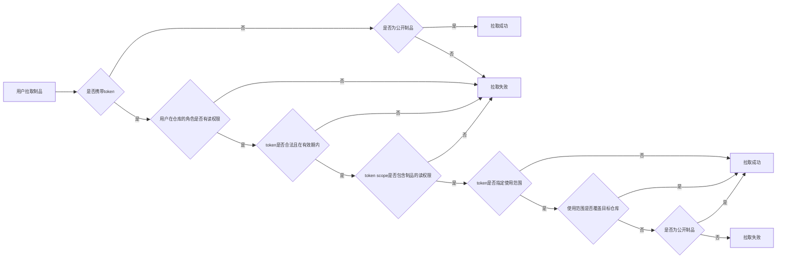

<!-- markdownlint-disable MD013 -->

CNB 提供常见制品的托管能力，在这里可以发布和分享您的制品。

## 身份认证

> 云原生构建平台的所有资源(包括代码仓库、制品库、OPENAPI等)，都需要通过访问令牌进行操作。

云原生构建平台(CNB)的各类制品库（包括Docker、Helm、NPM、Maven等）进行身份验证(AuthN)时均采用访问令牌机制。

当访问令牌缺失时，系统将视为匿名访问，匿名访问时操作权限将受到限制。

在进行制品登录鉴权时，用户名填写`cnb`，鉴权密码填写您的访问令牌，以 Docker 登录命令为例：

```bash
docker login docker.cnb.cool -u cnb -p {token-value}
```

执行登录命令时需确保访问令牌有效（未过期、格式正确），否则登录操作会被拒绝。有效的访问令牌与用户身份绑定，实现用户身份验证。

## 权限管控

在云原生构建平台(CNB)上，Docker/Helm制品可推送至代码仓库进行托管，Maven/NPM等类型的制品需创建制品库进行托管。

Docker/Helm类型的制品的可见性与所托管的代码仓库可见性一致，用户对制品的访问权限由所在代码仓库的角色而决定。

Maven/NPM等类型的制品的可见性取决于制品库的可见性，用户对制品的访问权限由所在制品库的角色而决定。

下表中列出了制品的行为及权限的对应关系：

| 资源 |  行为 |  所需权限 |
|:-----------|:--------------------|:--------------------|
|公开制品库制品      | 拉取 | 任何人都可以拉取，无需登录鉴权 |
|公开制品库制品      | 推送 | 开发者及以上 |
|公开制品库制品      | 删除 | 管理员及以上角色 |
|私有制品库制品      | 拉取 | 访客及以上，需登录鉴权 |
|私有制品库制品      | 推送 | 开发者及以上 |
|私有制品库制品      | 删除 | 管理员及以上角色 |

在用户角色的基础上，需要指定访问令牌的权限，最终对制品的操作行为能否获得授权，将由用户角色和访问令牌权限共同决定。

制品库详细鉴权策略如下：

1. 登录操作，个人令牌有效，将会允许登录，否则拒绝。

2. 匿名操作，仅允许拉取公开制品库制品，其余操作被拒绝。

3. 查询、拉取、推送制品操作，要求用户角色拥有对应权限，同时访问令牌的`registry-package`授权范围包含对应操作，则允许，否则拒绝；删除操作类似。

4. 在策略3允许操作的基础上，若访问令牌指定了使用范围（如指定仓库、制定制品库、仅公开仓库/制品库）且此范围与被访问的资源匹配，则返回实际授权范围；否则需要检查被操作资源的可见性，
如果被访问的资源可见性为公开，拉取操作仍然会被允许，其余操作被拒绝，但如果被访问的资源为私有，全部操作均将被拒绝。

5. 用户、令牌、被访问资源任何一项处于非正常状态（如被冻结），全部操作均将被拒绝。只要带上了错误的访问令牌（令牌登录之后过期，也会被视作非正常令牌），即使是拉取公开制品库的制品，也会被拒绝。

上述策略以图形化方式展示如下（其中制品行为以拉取操作作为示例，token指的是CNB的访问令牌，scope指的是访问令牌的授权范围）：



## 制品类型

CNB 当前支持如下制品：

| 制品类型 |   域名 |
|:-----------|:--------------------|
|Docker      | docker.cnb.cool |
|Helm        | helm.cnb.cool |

## 容量统计

我们将基于您托管在 CNB 的制品所占存储空间进行计费，您可以在 仓库-用量统计 中查看每个制品所占用的容量。

PS：针对 Docker 制品，重复的基础镜像会去重后计算容量。
