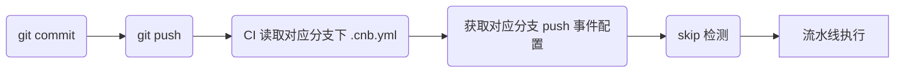

问题反馈前，建议先在下面常见问题和 [feedback](https://cnb.cool/cnb/feedback) 中查看问题是否已经存在。

若未能找到答案，请于 `feedback` 中提交 `issue`。

[[TOC]]

## 流水线为什么没触发

要定位流水线没触发问题，先要了解流水线从触发到执行的流程。

以 `push` 事件为例：



> 其中 `skip 检测` 包括 `ifNewBranch`、`ifModify`，参考[语法](./grammar.md#Pipeline-ifModify)。

那么可以按照这个流程一层层查下去：

1. 代码是否 push 到远端
2. 对应分支是否有 `.cnb.yml`
3. 是否配了 `push` 事件流水线
4. 是否命中了 skip 检测

## 在本地明明好的，为什么在 CI 上跑失败了

要定位这个问题，首先要明确本地环境和 CI 环境的区别：

|       | 本地                         | CI 环境                |
| ----- | ---------------------------- | ---------------------- |
| 网络  | 本地网络（比如一些办公内网） | CI 机器所在网络        |
| 文件  | 本地整个目录下所有文件       | Git仓库对应分支代码    |
| 环境  | 原生                         | 指定的 Docker 容器环境 |
| Shell | 本地指定                     | sh                     |

了解到差异，我们可以依次排查：

1. 是否访问了本地内网才能访问的资源。
1. 是否有文件未提交。
1. 构建依赖的文件是否命中 .gitignore。
1. 本地运行相同的镜像，得到与 CI 相同的构建环境，进行调试。

`云原生构建` 的默认镜像为 [cnbcool/default-build-env:latest](cnbcool/default-build-env:latest_LINK)。

那么，我们可以执行下面命令，进入默认 CI 环境进行调试

```bash
docker run --rm -it -v $(pwd):$(pwd) -w $(pwd) cnbcool/default-build-env:latest sh
```

如果声明了其他镜像作为流水线构建环境，请将上述命令中 `cnbcool/default-build-env:latest` 替换成对应镜像地址。

## 如何登录到流水线容器调试

参考 [登录调试](./login-debug.md)

## 流水线执行脚本和登陆调试执行脚本结果不一样

流水线里的默认使用 sh，登陆调试的是 bash。

如果确认指定的流水线容器是支持bash的（默认的流水线容器是支持的，但如果是自定义容器，可能不支持），可以把执行脚本改成 bash xxx.sh 或者 bash -c '{原来的语句}'。

## 超时无输出

一个 job 如果超过 10 分钟没有 log 输出，那么就会被终止掉。可以考虑增加 log，例如针对 `npm install` 的情况，可以加上 verbose 参数。

注意这个跟 job 的 timeout 声明的超时不一样，不能通过配置修改。

## 没改代码为什么流水线就失败了

可以检查依赖的其他资源是否有变动，比如：

1. 插件任务声明镜像版本为 latest，镜像是否有变动。
2. CI 配置文件引用了其他仓库文件，被引用文件是否有变动。
3. 有可能网络波动，Rebuild 试试。

### 代码合并冲突

若创建 PR 或在 PR 相关事件的构建中碰到代码冲突问题，可以通过如下命令解决：

```bash
git fetch origin          # 从远端仓库获取更新
git rebase -i origin/main # 实际的目标分支名

# 本地处理冲突

git commit  # 根据实际情况提交代码到本地仓库
git push -f # 推送到远端仓库
```

## 流水线报错 docker not found？

在 `Pipeline` 配置的 `services` 字段中需声明 `docker` 服务：

```yaml
services:
  - docker  # 声明 Docker 服务以使用 docker 命令
```