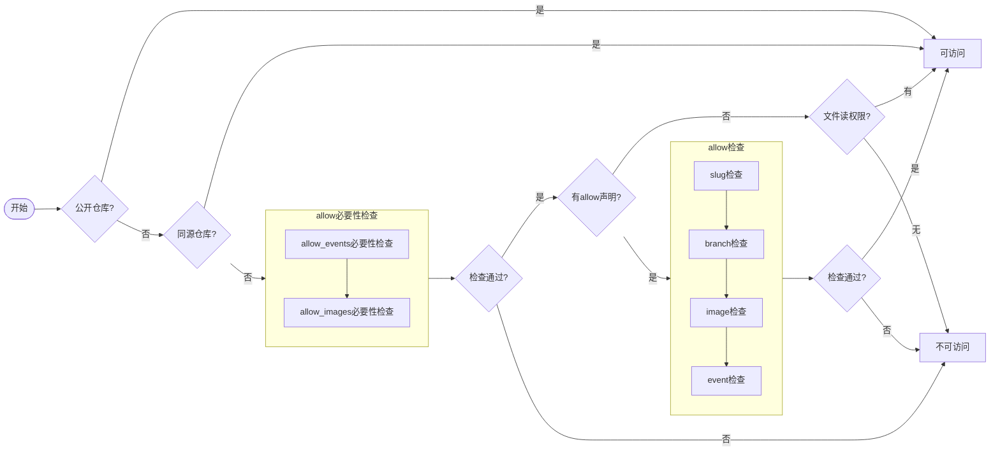
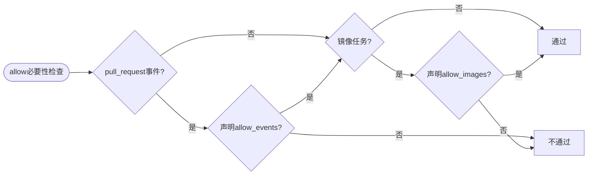
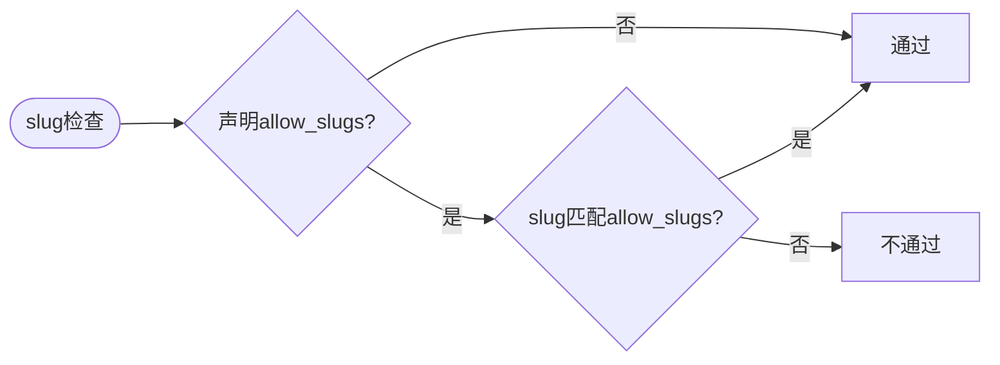
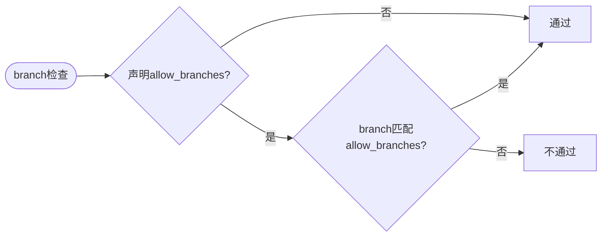
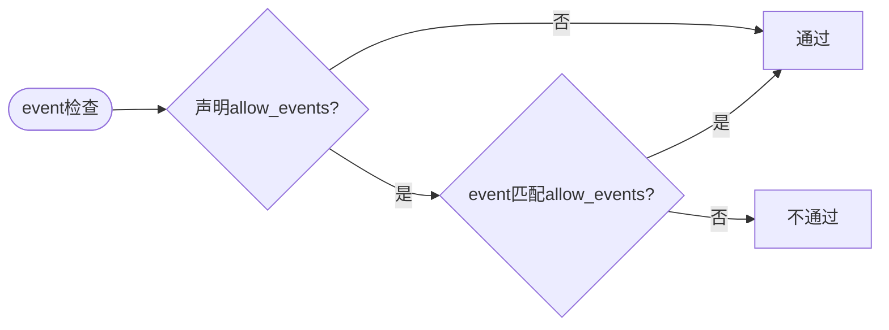
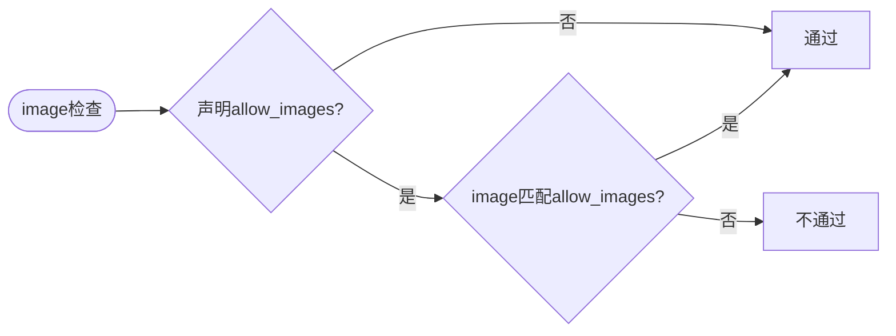

## 背景

流水线配置文件可以引用其他文件，用作流水线配置、环境变量、任务参数等。

文件中可能存在敏感信息，需要对文件引用进行权限检查，以避免敏感信息泄漏。

## 引用方式

CNB 中有如下四种配置文件引用方式：

- 流水线模版引用：[include](./configuration.md#include)
- 环境变量引用：[imports](./grammar.md#Pipeline-imports)
- 内置任务参数引用：[optionsFrom](./grammar.md#optionsfrom)
- 插件任务参数引用：[settingsFrom](./grammar.md#settingsfrom)

**注意：**

为了方便灵活的配置流水线任务的参数，`imports`、`optionsFrom` 和 `settingsFrom` 声明的文件路径支持使用环境变量。

可事先在流水线中声明环境变量，然后在任务中引用，如：

```yaml
main:
  push:
    - env:
        CNB_CONFIG_URL: https://cnb.cool/<your-repo-slug>/-/blob/main/xxx
        CNB_CONFIG_FILE: account.yml
      imports:
        # 假设 env1.yml 声明变量 CNB_ENV_FILE_URL
        - https://cnb.cool/<your-repo-slug>/-/blob/main/xxx/env1.yml
        # imports后面的文件路径支持使用前面文件中声明的环境变量
        - ${CNB_ENV_FILE_URL}/env2.yml
      stages:
        - name: echo
          script: echo 1
        - name: 内置任务
          type: some-type
          optionsFrom:
            - ${CNB_CONFIG_URL}/${CNB_CONFIG_FILE}
        - name: 插件任务
          image: some-image
          settingsFrom:
            - ${CNB_CONFIG_URL}/${CNB_CONFIG_FILE}
```

同时 `optionsFrom` 和 `settingsFrom` 支持读取本地文件，即便仓库中无 `./path/to/file`，但可以在流水线中写入该文件，让流水线执行时加载，如：

```yaml
main:
  push:
    - env:
        CNB_CONFIG_URL: https://xxx.com/p1/xxx
        CNB_CONFIG_FILE: account.yml
      stages:
        - name: echo
          script: echo some-content > ./path/to/file-not-in-git
        - name: 内置任务
          type: some-type
          optionsFrom:
            # 引用仓库不存在但流水线生成的文件
            - ./path/to/file-not-in-git
        - name: 插件任务
          image: some-image
          settingsFrom:
            # 引用仓库存在的文件
            - ./path/to/file-in-git
```

## 文件类型

CNB 中，支持引用的配置文件分为三种类型：

### yaml 文件

文件名后缀为 `.yml` 或 `.yaml`，如：

`account.yml`

```yaml
SOME_ACCOUNT: some-account
SOME_PASSWORD: some-password
```

### json 文件

文件名后缀为 `.json`，如：

`account.json`

```json
{
  "SOME_ACCOUNT": "some-account",
  "SOME_PASSWORD": "some-password"
}
```

### 文本文件

非以上两种文件类型，会被当作文本文件解析，如：

`account.txt`

```text
SOME_ACCOUNT=some-account
SOME_PASSWORD=some-password
```

## 权限检查

对于公开或同源仓库的配置文件，流水线可直接引用。

对于私有且非同源仓库的配置文件，可声明四个字段：`allow_slugs`、`allow_events`、`allow_branches`、`allow_images` 控制可被访问范围，四个字段均为 `glob` 模式`字符串`或`字符串数组`。

若未声明上述四个字段，则会检查流水线触发者是否有用配置文件所属仓库的`读权限`。

其中：

- `allow_slugs` 用于声明允许哪些仓库的流水线读取当前文件。
- `allow_events` 用于声明允许哪些事件下流水线可以读取当前文件，可配置的事件名参考[触发事件](./trigger-rule.md#trigger-event)。
- `allow_branches` 用于声明允许哪些分支下流水线可以读取当前文件。
- `allow_images` 用于声明允许哪些镜像插件可以读取当前文件。

CNB 关于流水线是否可以加载目标文件的权限检查流程图如下：

整体流程：



流程图说明：

- 同源仓库：流水线和目标文件属于同一个仓库。
- allow检查：声明的 allow 字段依次检查，每个都通过了才算通过。
- 文件读权限：指流水线触发者拥有被引用文件所属仓库的读权限，参见[角色权限](../guide/role-permissions.md)



allow 必要性检查说明：

- 文中 `pull_request` 事件包含 `pull_request` 和 `pull_request.update` 事件。
- `PR` 中，特别是 `fork` 仓库提 `PR` 时，源分支代码未经管理员评审，代码不可信。出于安全考虑，配置文件必须配置了 `allow_events` 才能被 `pull_request` 流水线引用。
- 流水线可使用第三方插件，出于安全考虑，配置文件必须声明 `allow_images` 才能被插件任务引用。





`allow_branches` 检查的 branch 同 [CNB_BRANCH](./build-in-env.md#CNB_BRANCH)。





image 检查说明：

- 镜像任务参数可以通过 `settingsFrom` 设置，也可以 `imports` 引入后通过环境变量的方式设置，这两种方式均被认为是插件任务引用文件。
- 镜像名不带标签时，会以 `镜像名` 和 `镜像名:latest` 去匹配 `allow_images`，匹配一个即算通过。
- 非插件任务的 image 是空字符串，不能匹配任何 `glob` 表达式，即：配置文件声明了 `allow_images` 不能被非插件任务引用。
- **注意：Job 同时设置了 image、script 属于以 image 作为执行环境的脚本任务。**
- 语法上流水线可以声明 image 作为构建环境，但不算插件任务，即：配置文件声明了 `allow_images` 不能在流水线级别被引用。

## 示例

### 流水线密钥文件引用

```yaml
# 密钥仓库中的配置文件 secret.yml
allow_slugs:
  - "p1/**"
allow_events:
  - push
allow_branches:
  - main
# dockerhub 用户名和密码
DOCKER_USER: docker-user
DOCKER_PWD: docker-pwd
```

```yaml
# 流水线配置文件 .cnb.yml
main:
  push:
    - services:
        - docker
      imports: https://cnb.cool/<your-repo-slug>/-/blob/main/xxx/secret.yml
      stages:
        - name: docker login
          script: |
            # 登录到 dockerhub
            docker login -u ${DOCKER_USER} -p "${DOCKER_PWD}"
            # docker build xxx
            # docker push xxx
```

流水线引用其他密钥仓库中的配置文件 `secret.yml`，但流水线触发者无该文件读权限。

被引用文件 `secret.yml` 声明了 `allow_slugs`、`allow_events` 和 `allow_branches`。

若 `p1` 组织下的仓库的分支 `main` 触发了 `push` 事件，那么流水线就能引用该密钥文件，使用其中的敏感信息。

这样限制了只有密钥仓库的负责人、管理员才能查看、修改 `secret.yml` 中的敏感内容，同时又能被符合条件的流水线引用。

### 插件任务参数引用

```yaml
# 密钥仓库中的配置文件 image-settings.yml
allow_images:
  - "registry.com/image1/**"
allow_slugs:
  - "p1/**"
arg1: arg1
arg2: arg2
```

```yaml
# 流水线配置文件 .cnb.yml 配置插件任务
name: image job
image: registry.com/image1/print:latest
settingsFrom:
  - https://cnb.cool/<your-repo-slug>/-/blob/main/xxx/image-settings.yml
```

镜像如果是第三方制作的，可能存在泄漏信息的风险，可以通过 `allow_images` 限制该配置文件只能被确定安全性的特定镜像名的插件任务使用。

`image: registry.com/image1/print:latest` 符合 `registry.com/image1/**`，image 检查通过。

`allow_slugs` 指定了只能被组织 `p1` 下的仓库流水线引用，进一步控制配置文件的使用范围。
