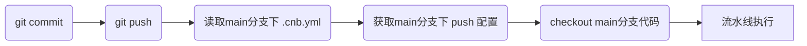

`云原生构建` 会在收到事件时，从对应的分支获取、解析 `.cnb.yml` 配置文件，从中获取对应分支下对应事件的流水线配置，然后分配 Runner 执行构建。

以 main 分支代码 `push` 事件为例：



代码示例：

```yaml
# .cnb.yml
main: # 触发分支
  push: # 触发事件，对应一个构建，可以包含多条 Pipeline。即可以是数组，也可以是对象。
    - stages: # 流水线1
        - echo "do some job"
    - stages: # 流水线1
        - echo "do some job"
```

## 触发分支

对应代码仓库的分支，用于匹配事件对应的分支，指定流水线配置。

**注意：在某个分支下 .cnb.yml 配置了其他分支的流水线，并不代表其他分支的事件会按此配置执行流水线，而是看各分支下具体的 .cnb.yml 的配置。**

### 匹配模式

分支名称支持通过 `glob` 模式匹配（[什么是 glob 匹配？](https://globster.xyz/)），如：

```yaml
.push_pipeline: &push_pipeline
  - stages:
      - name: do something
        script: echo "do something"

# 匹配以 dev/ 开头的所有分支
"dev/*":
  push:
    - *push_pipeline

# 匹配 main 或 dev 分支
"(main|dev)":
  push:
    - *push_pipeline

# 匹配除 main 和 dev 以外的所有分支
"**/!(main|dev)":
  push:
    - *push_pipeline

# 匹配所有分支
"**":
  push:
    - *push_pipeline

# 兜底，匹配没有 glob 匹配的分支
"$":
  push:
    - *push_pipeline
  tag_push:
    - *push_pipeline
```

### 匹配策略

分阶段，按优先级匹配，只有没有匹配结果时，才会尝试下一阶段的匹配。

1. `glob` 匹配分支名
2. `$` 兜底匹配所有未被 `glob` 匹配的分支

如果多个 `glob` 规则都匹配，所有的被匹配规则的流水线会被并行执行。

## 触发事件 {#trigger-event}

指定出现哪种事件时触发构建，支持配置多条流水线并行执行。

下面列出了 `云原生构建` 所支持的事件。

### Branch 事件

远端代码分支变动触发的事件。

#### push

分支 `push` 时触发。

#### commit.add

分支 `push` 有新的 `Commits` 时触发。

该事件会多一个环境变量 `CNB_NEW_COMMITS_COUNT`，值为新增的 `Commits` 数量，最大为 99。

可结合 `git log -n` 查看新增的 `Commits`。

#### branch.create

分支 `create` 时触发，同时会触发 `push` 事件，若存在新的commit，也会触发 `commit.add` 事件。

#### branch.delete

分支 `delete` 时触发。

流水线配置可以挂靠在 `分支名` 或 `$` 上。

流水线会使用 **默认分支** 的配置文件（原因：流水线运行时分支已删除）。

示例：

```yaml
dev/1:
  branch.delete:
    - stages:
        - name: echo
          # CNB_BRANCH 值为删除的分支
          script: echo $CNB_BRANCH
$:
  branch.delete:
    - stages:
        - name: echo
          # CNB_BRANCH 值为删除的分支
          script: echo $CNB_BRANCH
```

### Pull Request 事件

远端代码 `Pull Request` 相关操作触发的事件 (下文简称 `PR`)。

#### pull_request

由 `PR` 的创建、重新打开以及源分支 push 触发。同 `pull_request.target` 的区别参考[代码版本选择](#代码版本选择)。

#### pull_request.update

由 `PR` 的创建、重新打开、源分支 push 以及 `PR` 的 title、description 修改触发。

**`pull_request` 是 `pull_request.update` 的子集，**
**即 `PR` 的 title、description 修改，会触发 `pull_request.update` 但不触发 `pull_request`**

**`PR` 的创建、重新打开、源分支 push 会同时触发 `pull_request` 和 `pull_request.update`**

#### pull_request.target

由 `PR` 的创建、重新打开以及源分支 push 触发。同 `pull_request` 的区别参考[代码版本选择](#代码版本选择)。

#### pull_request.mergeable

开启中的 `PR` 同时满足以下条件时触发：

1. 目标分支为 **保护分支**，并勾选以下规则：
    1. 需要评审人批准
    2. 需要通过状态检查（可选）
2. 可合并
    1. 无代码冲突
    2. 状态检查通过（如勾选需要通过状态检查，且有状态检查）
3. 评审通过

该事件的配置文件取自目标分支，参考[代码版本选择](#代码版本选择)。

`PR` 的目标分支配置了该事件流水线，触发该事件时才会有对应流水线执行。

#### pull_request.merged

`PR` 合并完成时触发。

:::tip

a 分支合并到 b 分支，会触发 b 分支下的 `pull_request.merged`、`push` 事件。

:::

#### pull_request.approved

用户评审 `PR` `允许合并` 时触发。

:::tip

可能设置里保护分支需要多个评审人批准，有用户通过评审不代表 `PR` 是评审通过状态。

:::

#### pull_request.changes_requested

用户评审 `PR` `需要改进` 时触发。

#### pull_request.comment

`PR` 评论创建的事件。

### Tag 事件

由远端代码和页面 `Tag` 相关操作触发的事件。

#### tag_push

`Tag push` 时触发。

示例：

```yaml
# 对指定 tag 生效
v1.0.*:
  tag_push:
    - stages:
        - name: echo tag name
          script: echo  $CNB_BRANCH

# 对所有 tag 生效
$:
  tag_push:
    - stages:
        - name: echo tag name
          script: echo  $CNB_BRANCH
```

#### auto_tag

自动生成 `Tag` 事件。

1. 触发方式

    仅支持在仓库的 `Tag` 列表页面，点击 `自动生成 Tag` 按钮触发。

1. 实现原理

    启动一个流水线，默认使用 [cnbcool/git-auto-tag](../../plugin/#public/cnbcool/git-auto-tag) 插件实现自动生成 `Tag`。

1. 格式说明

    `Tag` 默认为 `3.8.11` 类型的格式。如果最新一个 `Tag` 以 `v` 开头，则自动生成的 `Tag` 也会带上 `v`，如 `v4.1.9`。

1. 自定义 `auto_tag` 事件流水线

    用户可在根目录 `.cnb.yml` 文件增加如下配置来覆盖默认模板。

    ```yaml
    # 用户自定义 .cnb.yml 配置
    main: # 默认分支，可使用仓库实际默认分支代替
      auto_tag: # 事件名
        - stages:
            - name: auto tag
              image: "cnbcool/git-auto-tag:latest"
              settings:
                tagFormat: 'v\${version}'
                branch: $CNB_BRANCH
                repoUrlHttps: $CNB_REPO_URL_HTTPS
              exports:
                tag: NEW_TAG
            - name: show tag
              script: echo $NEW_TAG
    ```

    **注意：** 默认配置会与 .cnb.yml 合并，同分支名下后者的配置会覆盖前者。
    如果 `.cnb.yml` 中 `auto_tag` 配置在 `$` 下而不是默认分支名下，两边的 `auto_tag` 配置都会保留，
    但 `$` 下的配置会被忽略，参考 [include 合并规则](./configuration.md#合并规则) 合并模式。

#### tag_deploy.*

在仓库 `Tag/Release` 页面通过 `部署` 按钮触发的事件。

详情参考[部署](./deploy.md)

### Issue 事件

由 `Issue` 的相关操作触发的事件。

`Issue` 事件流水线配置需挂靠在 `$` 下。

#### issue.open

`Issue` 创建的事件。

#### issue.close

`Issue` 关闭的事件。

#### issue.reopen

`Issue` 重新打开的事件。

### api_trigger 自定义事件 {#api_trigger}

事件名为 `api_trigger` 或者以 `api_trigger_` 开头，如 `api_trigger_test`。

API 自定义事件有以下三种触发方式：

1. 由 [cnb:apply](./internal-steps/#cnb-apply) 触发
1. 由 [cnb:trigger](./internal-steps/#cnb-trigger) 触发
<!-- markdownlint-disable MD033 -->
1. 由 [OPENAPI](//api.cnb.cool/#/Build/StartBuild) 触发
<!-- vuepress 判断带 # 会当作相对路径，会在前面补上 /zh/，没找到哪里调整，换用 a标签 -->

方式 1 和 2 是对方式 3 的封装

### web_trigger 自定义事件 {#web_trigger}

事件名为 `web_trigger` 或者 `web_trigger_` 开头，如 `web_trigger_test`。

仅支持在页面触发事件。

使用场景：

- 可结合[部署](./deploy.md)能力使用
- 页面中的[自定义按钮](./web-trigger.md)

手动触发构建（支持输入环境变量，仅支持触发 `web_trigger` 事件）

### 定时任务 事件

由定时任务触发的事件。

详情参考[定时任务](./crontab.md)。

### 云原生开发 事件 {#vscode}

在页面点击 `云原生开发` 按钮触发的事件。

详情参考[云原生开发](../workspaces/intro.md)

## 代码版本选择

事件触发时需要确定对应的代码版本，获取、解析对应的 `.cnb.yml`，checkout 代码执行流水线。
通常代码版本符合直觉和触发分支一致，但对于一些事件如 `PR` 相关、`branch.delete` 等事件，会有额外考虑，代码版本与触发分支不一致。

下面列举在各个事件中，`云原生构建` 是如何选择使用哪个版本的代码：

1. 对于 `push`、`commit.add`、`branch.create`、`vscode` 事件，会选择当前分支最新 Commit。
2. 对于 `auto_tag`、`branch.delete`、`issue.*` 会选择默认分支最新 Commit。
3. 对于 `tag_push`、`tag_deploy.*` 事件，会选择当前 `Tag`。
4. 对于 `pull_request`、`pull_request.update`、`pull_request.approved`、`pull_request.changes_requested` 事件，有源分支和目标分支，取预合并后的代码版本。
5. 对于 `pull_request.merged` 事件，取合并后的代码版本。
6. 对于 `pull_request.target`、`pull_request.mergeable` 事件，取合并前目标分支最新 Commit。
7. api_trigger 自定义事件，可以指定版本，[cnb:apply](./internal-steps/#cnb-apply) 则限制为当前流水线对应代码版本。
8. web_trigger 自定义事件，会从对应 分支、Tag 读取配置文件，参考具体应用场景。
9. 定时任务事件，从指定的分支读取配置文件。
10. 重新构建，取当前构建的的代码版本。
