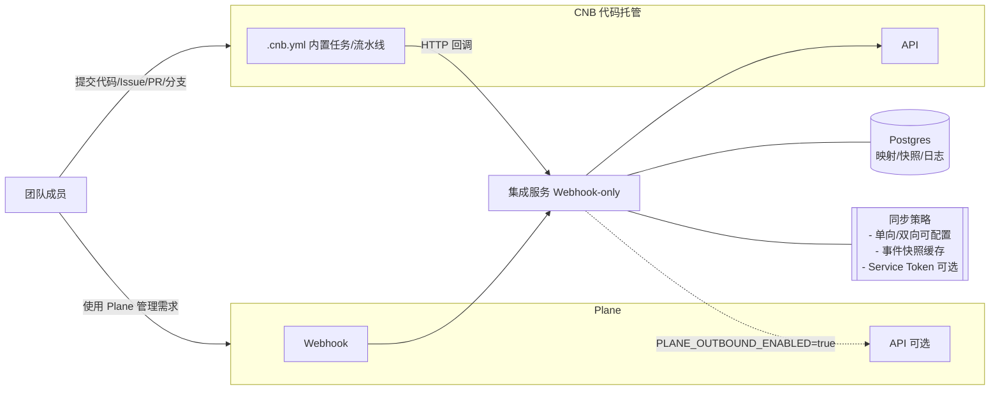
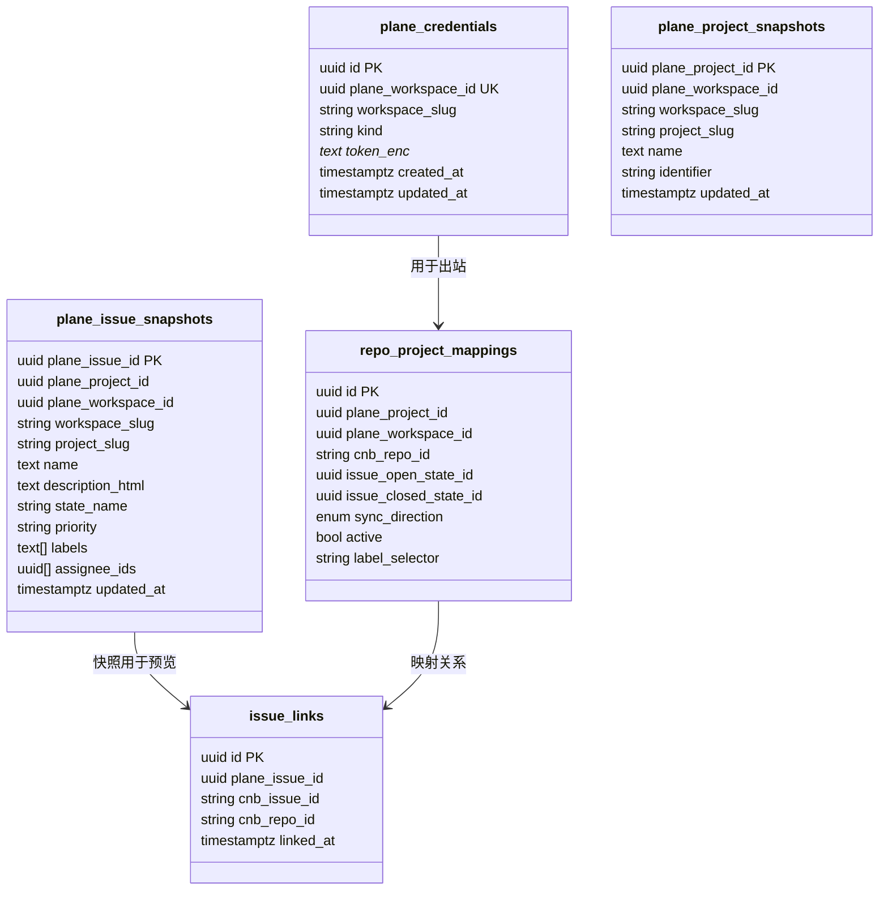
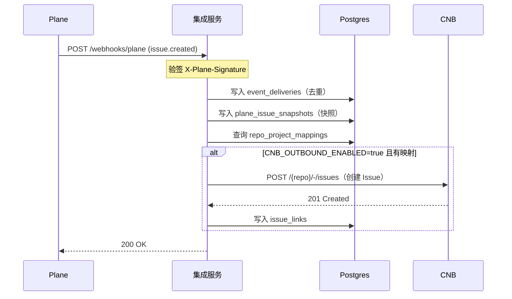
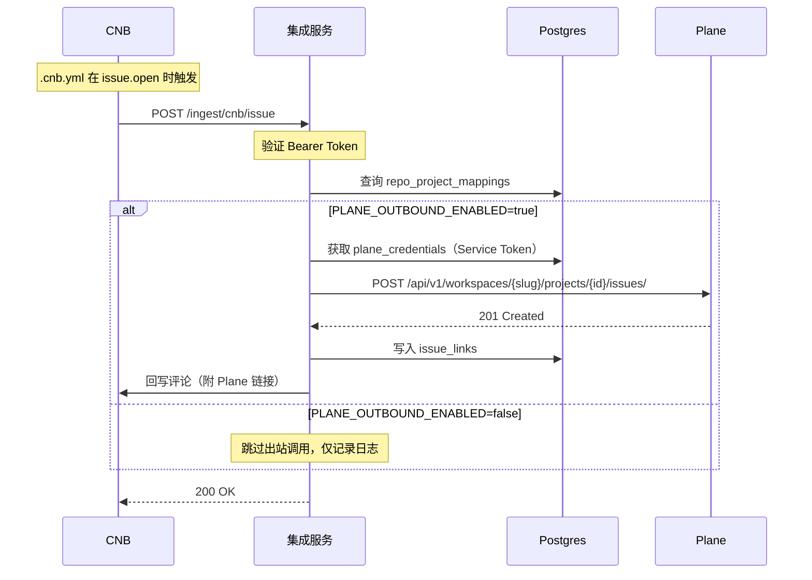
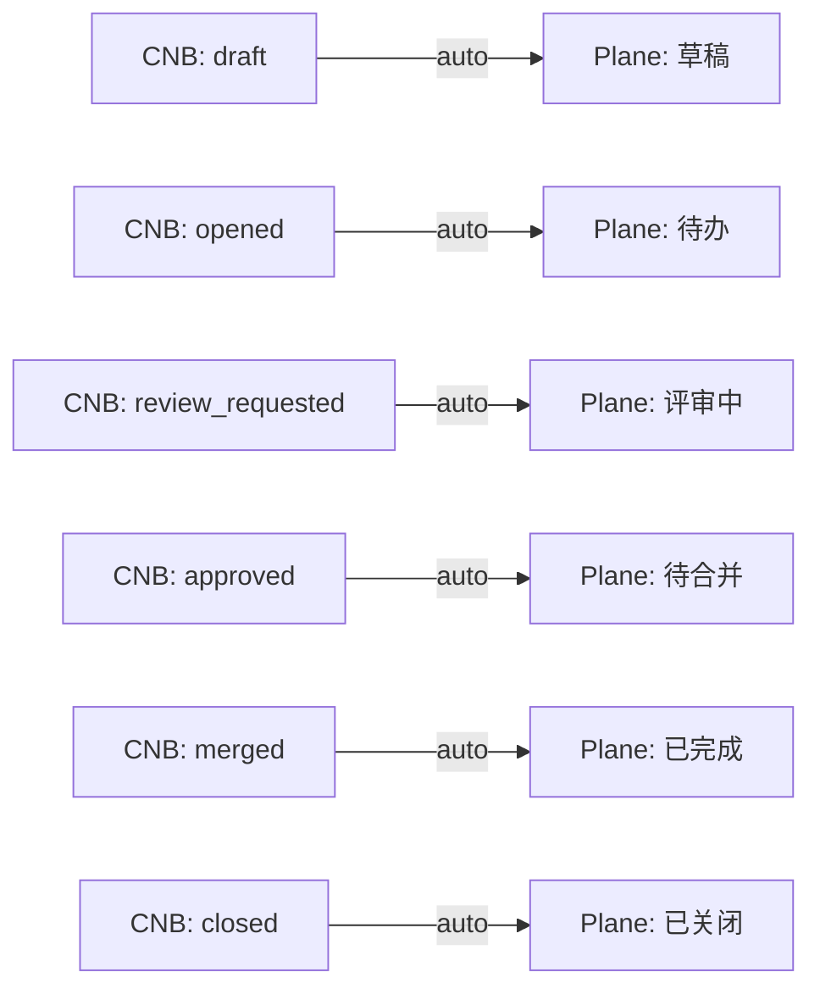

# CNB 集成设计（Webhook-only 模式）

## 概览

将公司内部 CNB 代码托管平台与 Plane 双向或单向同步，简化需求/开发协作。参考 Plane × GitHub 集成能力：仓库与项目映射、Issue 双向同步、PR 生命周期联动、评论与标签同步、用户身份映射、可配置的同步方向。

**重要变更**：采用 **Webhook-only 模式**，Plane 侧不依赖 OAuth，完全通过 Webhook 事件驱动。Plane → CNB 的写回功能通过 Service Token 实现（需手动配置，默认关闭）。

## 架构设计

### 技术栈
- Go 1.24、Echo Web 框架、Postgres 16

### 组件划分
- `plane-connector`：订阅 Plane Webhook，消费事件并回写 CNB；通过 Service Token（可选）调用 Plane API
- `cnb-connector`：对接 CNB API；通过仓库 `.cnb.yml` 配置的内置任务在 CNB 事件发生时回调集成服务
- `sync-core`：映射与路由层（项目/仓库/用户/状态/标签/PR 状态映射、方向控制、去重与幂等）
- `storage`：Postgres 存储凭据、映射关系、事件投递日志、**事件快照**
- `jobs`：异步任务与重试（本地队列/表驱动，事务内投递，指数退避）

### 数据流



## 核心表设计

### Plane 凭据与快照（Webhook-only）



### 表说明

- **plane_credentials**：存储 Plane Service Token（手动配置）
  - `kind='service'`：用于 `PLANE_OUTBOUND_ENABLED=true` 时的 API 调用
  - 透明加密存储 `token_enc`

- **plane_issue_snapshots**：Webhook 事件快照
  - 从 Plane Webhook payload 提取关键字段
  - 用于预览、通知、管理端展示
  - 避免频繁调用 Plane API

- **plane_project_snapshots**：项目快照（可选）
  - 用于管理端下拉选择、映射配置

- **repo_project_mappings**：仓库↔项目映射
  - `sync_direction`：`cnb_to_plane`（默认单向）/ `bidirectional`（双向）
  - `label_selector`：标签选择器，支持 `*` / `backend,frontend` / 空

## 配置与环境变量

### Plane 配置（Webhook-only）

```bash
# Plane Webhook（必需）
PLANE_BASE_URL=https://api.plane.so  # 或自托管地址
PLANE_WEBHOOK_SECRET=<your-webhook-secret>

# Plane 出站开关（默认关闭）
PLANE_OUTBOUND_ENABLED=false  # 设为 true 启用 CNB→Plane 写回功能

# 注意：不再需要 OAuth 相关配置
# ❌ PLANE_CLIENT_ID（已移除）
# ❌ PLANE_CLIENT_SECRET（已移除）
```

### CNB 配置

```bash
# CNB API Token（必需）
CNB_APP_TOKEN=<your-cnb-token>
CNB_BASE_URL=https://api.cnb.cool

# CNB 回调鉴权（必需）
INTEGRATION_TOKEN=<your-integration-secret>

# CNB 出站开关
CNB_OUTBOUND_ENABLED=true  # Plane→CNB 写回
```

## 工作流程

### Plane → CNB（单向同步，默认）



### CNB → Plane（需启用 PLANE_OUTBOUND_ENABLED）



## 端点设计

### Webhook 端点

- `POST /webhooks/plane`：接收 Plane Webhook
  - 验证：`X-Plane-Signature`（HMAC-SHA256）
  - 幂等：`delivery_id + payload_sha256`
  - 自动写入快照：`plane_issue_snapshots`

### CNB 回调端点

- `POST /ingest/cnb/issue`：Issue 事件回调
- `POST /ingest/cnb/pr`：PR 事件回调
- `POST /ingest/cnb/branch`：分支事件回调（可选）

验证：`Authorization: Bearer $INTEGRATION_TOKEN`

### 管理端点

- `POST /admin/mappings/repo-project`：配置仓库↔项目映射
- `GET /admin/mappings/repo-project`：查询映射列表
- `POST /admin/plane/credentials`：配置 Service Token（待实现）

## Service Token 配置流程

由于不再使用 OAuth，Plane → CNB 写回功能需要手动配置 Service Token：

### 1. 获取 Service Token

在 Plane Workspace Settings 中：
- 导航至 API → Service Accounts 或 Personal Access Tokens
- 创建新 Token，权限至少包括：
  - `read:workspace`
  - `read:project`
  - `write:issue`
  - `write:issue_comment`

### 2. 配置到集成服务

**方式一：通过管理端（推荐）**
```bash
curl -X POST http://localhost:8080/admin/plane/credentials \
  -H "Content-Type: application/json" \
  -d '{
    "plane_workspace_id": "uuid",
    "workspace_slug": "my-workspace",
    "token": "service-token-here"
  }'
```

**方式二：直接插入数据库（仅测试）**
```sql
INSERT INTO plane_credentials (plane_workspace_id, workspace_slug, kind, token_enc, created_at, updated_at)
VALUES (
  '<workspace-uuid>',
  '<workspace-slug>',
  'service',
  '<your-token>',  -- TODO: 生产环境需加密
  now(),
  now()
);
```

### 3. 启用出站功能

```bash
PLANE_OUTBOUND_ENABLED=true
```

## 同步策略

### 方向控制

- **`cnb_to_plane`**（默认）：只从 CNB → Plane
- **`bidirectional`**：双向同步，Plane ↔ CNB

### 标签选择器

支持通过标签过滤哪些 Issue 需要同步：

- `*` 或 `all`：所有带标签的 Issue
- `backend,frontend`：匹配任一标签
- 空：不限制（所有 Issue）

### 字段映射

- **标题/描述**：直接同步
- **状态**：通过 `issue_open_state_id` / `issue_closed_state_id` 映射
- **标签**：需要预先配置标签映射表
- **指派人**：需要预先配置用户映射表
- **评论**：双向同步，未映射用户以 Bot 身份发布

## PR 生命周期自动化

### 状态映射



### 识别规则

PR 标题或描述包含：
- `[PROJ-123]`：触发状态自动化
- `PROJ-123`：仅建立引用，不触发状态变更

## 安全与幂等

### 签名验证

- **Plane Webhook**：`X-Plane-Signature: sha256=...`
  ```go
  mac := hmac.New(sha256.New, []byte(secret))
  mac.Write(rawBody)
  expected := hex.EncodeToString(mac.Sum(nil))
  ```

- **CNB 回调**：`Authorization: Bearer $INTEGRATION_TOKEN`

### 幂等处理

- Plane：`delivery_id + payload_sha256` 去重
- CNB：`repo + event + iid + timestamp_window` 去重
- 业务层：`issue_links` 表防止重复创建

### Token 安全

- Service Token 应透明加密存储（`token_enc` 字段）
- 定期轮换 Token
- 最小权限原则

## 错误处理与重试

### 可重试错误
- 网络超时
- 429 Rate Limit
- 5xx 服务端错误

### 不可重试错误
- 4xx 客户端错误（参数错误、权限不足等）

### 重试策略
- 指数退避：10s → 30s → 1m → 5m → 15m
- 最大重试次数：5 次
- 写入 `event_deliveries` 表，包含 `next_retry_at`

## .cnb.yml 配置示例

```yaml
$:
  issue.open:
    - stages:
        - name: notify plane sync
          image: curlimages/curl:8.7.1
          script: >
            curl -sS -X POST "$INTEGRATION_URL/ingest/cnb/issue" \
              -H "Authorization: Bearer $INTEGRATION_TOKEN" \
              -H "Content-Type: application/json" \
              -d '{
                "event": "issue.open",
                "repo": "'"$CNB_REPO_SLUG"'",
                "issue_iid": "'"$CNB_ISSUE_IID"'"
              }'

  pull_request:
    - stages:
        - name: notify plane pr sync
          image: curlimages/curl:8.7.1
          script: >
            curl -sS -X POST "$INTEGRATION_URL/ingest/cnb/pr" \
              -H "Authorization: Bearer $INTEGRATION_TOKEN" \
              -H "Content-Type: application/json" \
              -d '{
                "event": "pull_request",
                "action": "'"$CNB_PULL_REQUEST_ACTION"'",
                "repo": "'"$CNB_REPO_SLUG"'",
                "pr_iid": "'"$CNB_PULL_REQUEST_IID"'"
              }'
```

**提示**：使用 CNB 密钥库注入 `$INTEGRATION_URL` 和 `$INTEGRATION_TOKEN`，避免明文暴露。

## 验收要点（DoD）

### Plane → CNB（默认功能）
- ✅ Plane 发送 `issue.created` Webhook 后，事件写入 `event_deliveries`
- ✅ 快照写入 `plane_issue_snapshots`
- ✅ 当 `CNB_OUTBOUND_ENABLED=true` 且有映射时，CNB 创建对应 Issue
- ✅ `issue_links` 表正确记录关联关系

### CNB → Plane（需启用）
- ✅ `.cnb.yml` 触发回调到 `/ingest/cnb/issue`
- ✅ 验证 `Bearer Token` 成功
- ✅ 当 `PLANE_OUTBOUND_ENABLED=true` 时，Plane 创建对应 Work Item
- ✅ 使用 `plane_credentials` 表中的 Service Token
- ✅ CNB Issue 收到包含 Plane 链接的评论

### 错误处理
- ✅ 签名验证失败返回 401
- ✅ 重复投递返回 200 `status=duplicate`
- ✅ 网络错误触发重试，写入 `next_retry_at`
- ✅ 4xx 错误不重试，记录失败原因

## 里程碑

- **M1（当前）**：Webhook-only 基础
  - Plane Webhook 接收与验签
  - 事件快照写入
  - 基础映射配置
  - CNB → Plane 单向同步（可选启用）

- **M2**：双向同步完善
  - Plane → CNB 双向
  - 用户映射与评论归属
  - 标签映射

- **M3**：PR 自动化
  - PR 生命周期状态映射
  - 分支关联
  - 引用行为

- **M4**：高级功能
  - 分支与提交 AI 摘要
  - 每日进展报告
  - 性能优化与可观测性

## 迁移指南

### 从 OAuth 模式迁移

如果之前使用过 OAuth 模式：

1. **运行迁移脚本**
   ```bash
   psql "$DATABASE_URL" -f db/migrations/0010_plane_snapshots.sql
   psql "$DATABASE_URL" -f db/migrations/0011_plane_credentials.sql
   psql "$DATABASE_URL" -f db/migrations/0012_drop_plane_oauth_columns.sql  # 可选
   ```

2. **配置 Service Token**（见上文"Service Token 配置流程"）

3. **更新环境变量**
   ```bash
   # 移除
   unset PLANE_CLIENT_ID
   unset PLANE_CLIENT_SECRET
   unset PLANE_REDIRECT_URI
   unset PLANE_APP_BASE_URL
   
   # 新增/保留
   export PLANE_WEBHOOK_SECRET=your-secret
   export PLANE_OUTBOUND_ENABLED=false  # 按需启用
   ```

4. **测试 Webhook**
   - 在 Plane Workspace Settings 配置 Webhook URL
   - 触发测试事件，观察日志和 `event_deliveries` 表

## 参考

- Webhook-only 重构文档：`docs/design/plane-webhook-only-refactor.md`
- 架构说明：`docs/ARCHITECTURE.md`
- CNB 文档：`docs/cnb-docs/`
