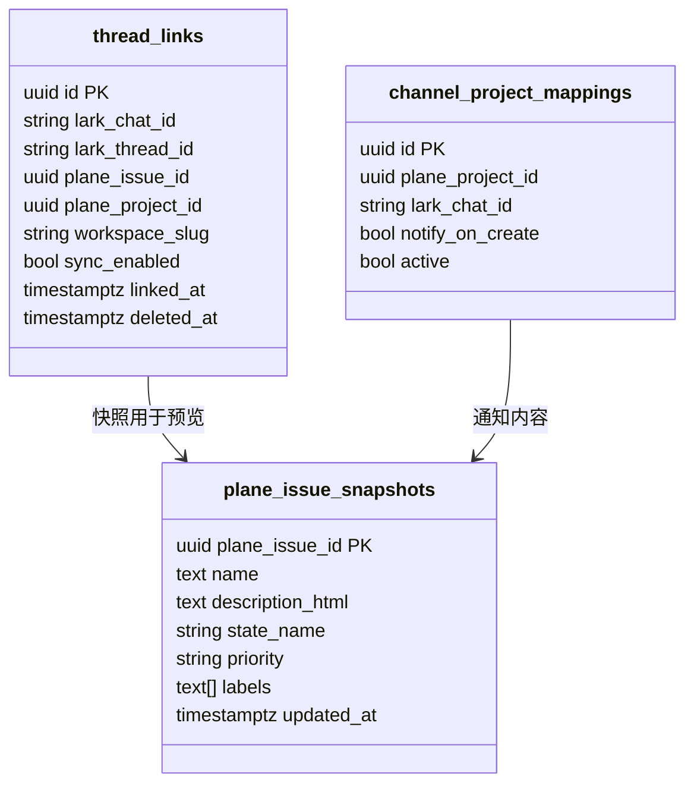
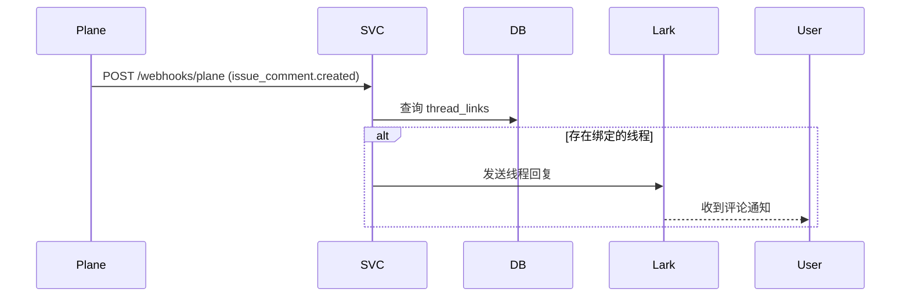
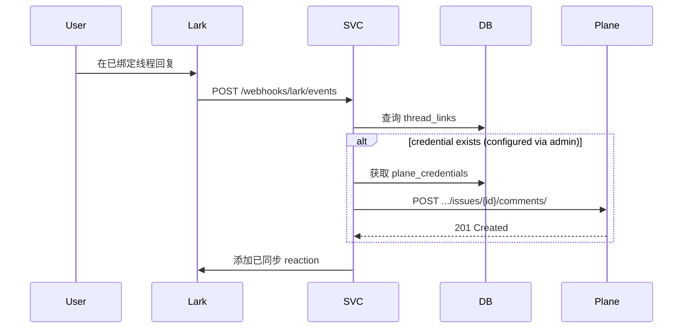
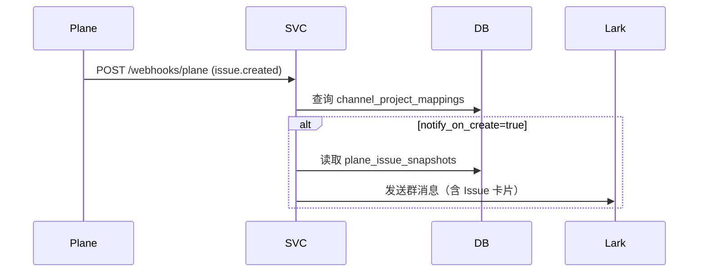

# 飞书集成设计（Webhook-only 模式）

## 概览

在飞书中创建/链接/预览 Plane 工作项，支持线程双向同步、命令创建、项目到频道通知。复用 Slack 集成的交互心智。

**重要变更**：采用 **Webhook-only 模式**，Plane 侧不依赖 OAuth，通过 Webhook 事件驱动。飞书 → Plane 的写回功能通过 Service Token 实现（需手动配置，默认关闭）。

## 架构设计

### 数据流

```mermaid
flowchart LR
  User[团队在飞书沟通] -->|消息/线程/命令| LarkNode

  subgraph LarkNode[飞书]
    LE[事件订阅]
    LA[消息/卡片 API]
  end

  subgraph PlaneNode[Plane]
    PWH[Webhook]
    PAPI[API 可选]
  end

  SVC[集成服务 Webhook-only]
  DB[(Postgres)]

  LE --> SVC
  SVC --> LA

  PWH --> SVC
  SVC -.->|credential exists (configured via admin)| PAPI

  SVC --- DB

  Note[["能力概览<br/>- 命令创建/绑定<br/>- 线程评论双向同步<br/>- 项目频道通知<br/>- 富预览（基于快照）"]]
  SVC --- Note
```

### 组件划分

- `plane-connector`：订阅 Plane Webhook，消费事件并通知飞书；通过 Service Token（可选）调用 Plane API
- `lark-connector`：获取 tenant_access_token、订阅事件、验签、IM/卡片/命令接口封装
- `sync-core`：线程-工作项关联、用户/项目/频道映射、富预览与交互动作编排
- `storage`：映射、链接、事件快照、凭据
- `jobs`：重试、可观测

## 核心表设计

### 飞书相关表



### 表说明

- **thread_links**：飞书线程 ↔ Plane Issue 绑定
  - `lark_thread_id`：飞书消息的 root_id
  - `sync_enabled`：是否启用评论双向同步
  - 使用快照生成富卡片预览

- **channel_project_mappings**：飞书频道 ↔ Plane 项目
  - `notify_on_create`：项目新建 Issue 时推送通知

- **plane_issue_snapshots**：复用 Webhook 快照
  - 避免频繁调用 Plane API 获取 Issue 详情

## 配置与环境变量

### Plane 配置（Webhook-only）

```bash
PLANE_BASE_URL=https://api.plane.so
PLANE_WEBHOOK_SECRET=<your-webhook-secret>
no credential (default)  # 设为 true 启用飞书→Plane 写回
```

### 飞书配置

```bash
# 飞书应用凭证（必需）
LARK_APP_ID=cli_xxx
LARK_APP_SECRET=xxx

# 飞书签名验证（推荐）
LARK_ENCRYPT_KEY=<your-encrypt-key>
LARK_VERIFICATION_TOKEN=<your-verification-token>  # 备用
```

### 飞书权限配置

在飞书开放平台配置：

**事件订阅**：
- URL：`POST {YOUR_BASE_URL}/webhooks/lark/events`
- 订阅事件：`im.message.receive_v1`（接收群聊消息）

**权限申请**：
- `im:message.group_at_msg:readonly`：接收群聊 @ 消息
- `im:message`：发送消息
- `im:message.p2p`：发送私聊消息（可选）

## 功能设计

### 1. 命令交互

在飞书群聊中 @ 机器人，支持以下命令：

#### 绑定 Issue
```
@机器人 /bind https://app.plane.so/workspace/projects/proj-id/issues/issue-id
@机器人 绑定 PROJ-123
```

行为：
- 解析 Plane Issue URL 或 序列号
- 查询快照或调用 API 获取 Issue 信息
- 建立 `thread_links` 关联
- 回复绑定成功卡片（含 Issue 标题、状态、标签）

#### 评论到 Plane
```
@机器人 /comment 这是一条评论
@机器人 评论 需要修复这个 bug
```

行为：
- 检查当前线程是否已绑定 Issue
- 当 `credential exists (configured via admin)` 时，调用 Plane API 追加评论
- 回复操作结果

#### 查询 Issue 状态
```
@机器人 /status
@机器人 状态
```

行为：
- 从 `plane_issue_snapshots` 读取最新快照
- 返回 Issue 当前状态、标签、指派人

### 2. 线程评论双向同步

#### Plane → 飞书


#### 飞书 → Plane


### 3. 项目通知到频道

配置 `channel_project_mappings` 后：



## 端点设计

### 飞书事件端点

- `POST /webhooks/lark/events`：接收飞书事件
  - 支持 challenge 握手
  - 验证 `X-Lark-Signature` 或 `Verification-Token`
  - 处理 `im.message.receive_v1` 事件

- `POST /webhooks/lark/interactivity`：卡片交互回调（待实现）
- `POST /webhooks/lark/commands`：斜杠命令（待实现）

### 管理端点

- `POST /admin/mappings/channel-project`：配置频道↔项目映射
- `GET /admin/links/lark-threads`：查询线程绑定列表
- `POST /admin/links/lark-threads`：手动创建/更新线程绑定
- `DELETE /admin/links/lark-threads`：删除线程绑定

## 富预览实现（基于快照）

由于不再实时调用 Plane API，富预览基于 `plane_issue_snapshots`：

### 卡片内容
```json
{
  "header": {
    "title": "Issue 名称（从快照读取）"
  },
  "elements": [
    {
      "tag": "div",
      "text": {
        "tag": "lark_md",
        "content": "**状态**：进行中\\n**优先级**：高\\n**标签**：backend, urgent"
      }
    },
    {
      "tag": "action",
      "actions": [
        {
          "tag": "button",
          "text": "在 Plane 中查看",
          "url": "https://app.plane.so/..."
        }
      ]
    }
  ]
}
```

### 快照更新策略
- Plane Webhook 事件自动更新快照
- 缓存时间：依赖 Webhook 推送频率
- 降级：快照不存在时显示"加载中..."或 Issue ID

## Service Token 配置（同 CNB）

### 获取 Token
在 Plane Workspace Settings 中创建 Service Token，权限：
- `read:issue`
- `write:issue`（用于评论）
- `read:project`

### 配置方式
与 CNB 集成相同，见 `cnb-integration-webhook-only.md`

## 验收要点（DoD）

### 基础绑定
- ✅ 飞书群聊 `/bind <Plane URL>` 成功建立 `thread_links`
- ✅ 返回包含 Issue 快照信息的卡片

### 评论同步
- ✅ Plane 添加评论后，绑定的飞书线程收到通知
- ✅ 飞书线程回复后（当 `credential exists (configured via admin)`），Plane Issue 收到评论
- ✅ 飞书消息添加"已同步" reaction

### 项目通知
- ✅ 配置 `channel_project_mappings` 后，Plane 新建 Issue 推送到飞书频道
- ✅ 通知包含 Issue 快照信息与操作按钮

### 快照机制
- ✅ Plane Webhook 触发后，`plane_issue_snapshots` 表更新
- ✅ 飞书卡片使用快照数据渲染，无需实时调用 API
- ✅ 快照缺失时有合理降级（显示 ID 或"加载中"）

## 待确认事项

- 飞书个人账户连接（类似 Slack "Connect personal account"）的必要性
- 卡片交互动作（指派、状态变更）是否需要实现
- 评论富文本格式转换规则（Plane HTML ↔ 飞书 Markdown）
- 飞书企业自建应用的审核与发布流程

## 参考

- Webhook-only 重构文档：`docs/design/plane-webhook-only-refactor.md`
- 飞书开放平台文档：https://open.feishu.cn/document/
- 架构说明：`docs/ARCHITECTURE.md`
