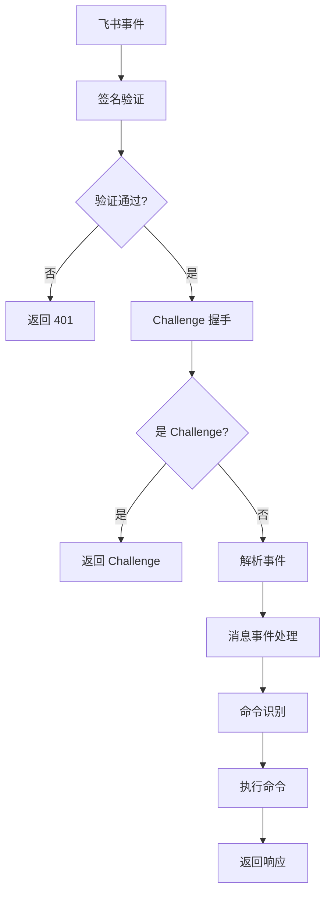

# 飞书集成完整设计文档

## 概述

本文档详细描述飞书（Lark）与 Plane/CNB 集成的完整实现，支持 Issue 绑定、评论同步、标签通知等核心功能，实现工作项与飞书群聊的双向联动。

## 核心架构

### 1. 集成模式
- **Webhook 模式**：基于飞书事件订阅的实时处理
- **双向同步**：支持飞书 ↔ Plane/CNB 的数据流转
- **命令驱动**：通过飞书机器人命令控制同步行为
- **通知推送**：关键事件自动推送到相关群聊

### 2. 系统组件

```
┌─────────────┐    Webhook    ┌─────────────┐    API     ┌─────────────┐
│   飞书      │ ──────────→ │   Cabb      │ ────────→ │  Plane/CNB  │
│  (Source)   │              │  (Gateway)  │            │  (Target)   │
└─────────────┘              └─────────────┘            └─────────────┘
       ↑                            ↓                            ↑
       │                            │                            │
       └──────────←─────────────────┘────────────────←──────────┘
                    双向同步 & 通知推送
```

### 3. 核心文件结构

```
internal/
├── handlers/
│   ├── lark_events.go         # 飞书事件处理
│   ├── issue_label_notify.go   # 标签变更通知
│   └── router.go              # 路由注册
├── lark/
│   └── client.go              # 飞书 API 客户端
└── store/
    └── repositories.go        # 数据访问层
```

## 数据库设计

### 1. 线程链接表

```sql
CREATE TABLE thread_links (
  id uuid PRIMARY KEY DEFAULT gen_random_uuid(),
  lark_thread_id text NOT NULL,
  plane_issue_id uuid NOT NULL,
  plane_project_id uuid,
  workspace_slug text,
  sync_enabled boolean NOT NULL DEFAULT false,
  linked_at timestamptz NOT NULL DEFAULT now(),
  created_at timestamptz NOT NULL DEFAULT now(),
  updated_at timestamptz NOT NULL DEFAULT now(),
  UNIQUE (lark_thread_id)
);
```

**字段说明：**
- `lark_thread_id`：飞书消息线程 ID
- `plane_issue_id`：Plane Issue UUID
- `sync_enabled`：是否启用自动同步
- `workspace_slug`：Plane 工作空间标识

### 2. 群聊 Issue 链接表

```sql
CREATE TABLE chat_issue_links (
  id uuid PRIMARY KEY DEFAULT gen_random_uuid(),
  lark_chat_id text NOT NULL,
  lark_thread_id text,
  plane_issue_id uuid NOT NULL,
  plane_project_id uuid,
  workspace_slug text,
  created_at timestamptz NOT NULL DEFAULT now(),
  updated_at timestamptz NOT NULL DEFAULT now(),
  UNIQUE (lark_chat_id)
);
```

**字段说明：**
- `lark_chat_id`：飞书群聊 ID
- `lark_thread_id`：关联的线程 ID（可选）
- `plane_issue_id`：绑定的 Plane Issue

### 3. 频道项目映射表

```sql
CREATE TABLE channel_project_mappings (
  id uuid PRIMARY KEY DEFAULT gen_random_uuid(),
  plane_project_id uuid NOT NULL,
  lark_chat_id text NOT NULL,
  notify_on_create boolean NOT NULL DEFAULT true,
  created_at timestamptz NOT NULL DEFAULT now(),
  updated_at timestamptz NOT NULL DEFAULT now(),
  UNIQUE (plane_project_id, lark_chat_id)
);
```

**字段说明：**
- `plane_project_id`：Plane 项目 UUID
- `lark_chat_id`：飞书群聊 ID
- `notify_on_create`：是否在创建时通知

## API 端点设计

### 1. 飞书事件接收

```
POST /webhooks/lark/events        # 事件订阅
POST /webhooks/lark/interactivity  # 交互回调
POST /webhooks/lark/commands       # 命令处理
```

### 多群绑定支持

- 同一 Plane 工作项（issue）可被多个飞书群聊的不同线程绑定。
- 来自 Plane 的事件（如评论、状态更新）会广播到所有已绑定的飞书线程；失败不会影响其他线程。
- 群内命令 `/comment`、`/sync on|off` 等按“线程粒度”生效：只影响当前绑定线程，不影响其他群聊或线程。
- 每个群聊仍保持“单一活跃绑定”的约束（同一群聊同一时间仅绑定一个 issue）；重复绑定同一 issue 会提示“已绑定（无需重复绑定）”。

### 2. 标签通知接口

```
POST /api/v1/issues/label-notify   # 标签变更通知
```

### 3. 管理接口

```
GET/POST /admin/links/thread        # 线程链接管理
GET/POST /admin/links/chat          # 群聊链接管理
GET/POST /admin/mappings/channel    # 频道映射管理
```

## 飞书 API 客户端

### 1. 客户端结构

```go
// internal/lark/client.go:17-22
type Client struct {
    AppID     string
    AppSecret string
    BaseURL   string // 默认 https://open.feishu.cn
    HTTP      *http.Client
}
```

### 2. 认证机制

```go
// internal/lark/client.go:52-87
func (c *Client) TenantAccessToken(ctx context.Context) (string, error) {
    // 获取租户访问令牌
    payload := map[string]string{
        "app_id":     c.AppID,
        "app_secret": c.AppSecret,
    }
    
    resp, err := c.HTTP.PostForm(c.BaseURL+"/open-apis/auth/v3/tenant_access_token/internal", payload)
    if err != nil {
        return "", err
    }
    defer resp.Body.Close()
    
    var result struct {
        Code int `json:"code"`
        Data struct {
            TenantAccessToken string `json:"tenant_access_token"`
            ExpireIn          int    `json:"expire_in"`
        } `json:"data"`
    }
    
    if err := json.NewDecoder(resp.Body).Decode(&result); err != nil {
        return "", err
    }
    
    if result.Code != 0 {
        return "", fmt.Errorf("failed to get tenant access token: code %d", result.Code)
    }
    
    return result.Data.TenantAccessToken, nil
}
```

### 3. 消息发送 API

#### 发送文本消息

```go
// internal/lark/client.go:89-120
func (c *Client) SendTextToChat(ctx context.Context, chatID, text string) error {
    token, err := c.TenantAccessToken(ctx)
    if err != nil {
        return err
    }
    
    payload := map[string]interface{}{
        "receive_id_type": "chat_id",
        "receive_id":      chatID,
        "msg_type":        "text",
        "content":         map[string]string{"text": text},
    }
    
    return c.sendMessage(ctx, token, payload)
}
```

#### 在线程中回复

```go
// internal/lark/client.go:122-153
func (c *Client) ReplyTextInThread(ctx context.Context, chatID, threadID, text string) error {
    token, err := c.TenantAccessToken(ctx)
    if err != nil {
        return err
    }
    
    payload := map[string]interface{}{
        "receive_id_type": "chat_id",
        "receive_id":      chatID,
        "msg_type":        "text",
        "content":         map[string]string{"text": text},
        "uuid":            threadID,
    }
    
    return c.sendMessage(ctx, token, payload)
}
```

#### 发送富文本消息

```go
// internal/lark/client.go:231-261
func (c *Client) SendPostToChat(ctx context.Context, chatID, title string, content []map[string]interface{}) error {
    token, err := c.TenantAccessToken(ctx)
    if err != nil {
        return err
    }
    
    post := map[string]interface{}{
        "zh_cn": map[string]interface{}{
            "title":   title,
            "content": content,
        },
    }
    
    payload := map[string]interface{}{
        "receive_id_type": "chat_id",
        "receive_id":      chatID,
        "msg_type":        "post",
        "content":         post,
    }
    
    return c.sendMessage(ctx, token, payload)
}
```

## 事件处理流程

### 1. 事件接收流程



### 2. 事件处理入口

```go
// internal/handlers/lark_events.go:73-355
func (h *Handler) LarkEvents(c echo.Context) error {
    // 1. 读取请求体
    body, err := io.ReadAll(c.Request().Body)
    if err != nil {
        return c.JSON(400, map[string]string{"error": "Failed to read body"})
    }
    
    // 2. 签名验证
    if !h.verifyLarkSignature(c.Request().Header, body) {
        // 兜底验证
        if !h.verifyLarkToken(c.Request().Header, body) {
            return c.JSON(401, map[string]string{"error": "Invalid signature"})
        }
    }
    
    // 3. 解析事件
    var event larkEvent
    if err := json.Unmarshal(body, &event); err != nil {
        return c.JSON(400, map[string]string{"error": "Invalid JSON"})
    }
    
    // 4. Challenge 握手
    if event.Type == "url_verification" {
        return c.JSON(200, map[string]string{"challenge": event.Challenge})
    }
    
    // 5. 处理消息事件
    if event.Header.EventType == "im.message.receive_v1" {
        return h.handleLarkMessage(event, c)
    }
    
    return c.JSON(200, map[string]string{"status": "ok"})
}
```

### 3. 签名验证机制

```go
// internal/handlers/lark_events.go:370-393
func (h *Handler) verifyLarkSignature(hdr http.Header, body []byte) bool {
    timestamp := hdr.Get("X-Lark-Request-Timestamp")
    nonce := hdr.Get("X-Lark-Request-Nonce")
    signature := hdr.Get("X-Lark-Signature")
    
    if timestamp == "" || nonce == "" || signature == "" {
        return false
    }
    
    // 时间窗口验证（5分钟）
    ts, err := strconv.ParseInt(timestamp, 10, 64)
    if err != nil {
        return false
    }
    
    if time.Since(time.Unix(ts, 0)) > 5*time.Minute {
        return false
    }
    
    // HMAC-SHA256 签名验证
    mac := hmac.New(sha256.New, []byte(h.config.LarkEncryptKey))
    mac.Write([]byte(timestamp))
    mac.Write([]byte(nonce))
    mac.Write([]byte(h.config.LarkEncryptKey))
    mac.Write(body)
    expectedSignature := hex.EncodeToString(mac.Sum(nil))
    
    return hmac.Equal([]byte(signature), []byte(expectedSignature))
}
```

### 4. 消息事件处理

```go
// internal/handlers/lark_events.go:109-355
func (h *Handler) handleLarkMessage(event larkEvent, c echo.Context) error {
    // 1. 提取消息信息
    message := event.Event.Message
    chatID := message.ChatID
    userID := event.Event.Sender.ID
    
    // 2. 只处理群聊消息
    if message.ChatType != "group" {
        return c.JSON(200, map[string]string{"status": "ignored"})
    }
    
    // 3. 解析消息内容
    var content struct {
        Text string `json:"text"`
    }
    
    if err := json.Unmarshal([]byte(message.Content), &content); err != nil {
        return c.JSON(400, map[string]string{"error": "Invalid message content"})
    }
    
    // 4. 命令处理
    text := strings.TrimSpace(content.Text)
    if strings.HasPrefix(text, "/") {
        return h.handleLarkCommand(chatID, message.MessageID, text, userID)
    }
    
    // 5. 自动同步处理
    return h.handleAutoSync(chatID, message.MessageID, text, userID)
}
```

## 命令处理系统

### 1. 支持的命令

#### `/bind <url>` - 绑定 Plane Issue

```go
// internal/handlers/lark_events.go:150-229
func (h *Handler) handleBindCommand(chatID, messageID, url, userID string) error {
    // 1. 解析 Plane Issue URL
    issueID, workspaceSlug, projectID, err := h.parsePlaneIssueURL(url)
    if err != nil {
        return h.larkClient.ReplyTextInThread(ctx, chatID, messageID, 
            fmt.Sprintf("❌ 无效的 Plane Issue URL: %v", err))
    }
    
    // 2. 检查重复绑定
    existing, err := h.store.FindChatIssueLinkByChat(ctx, chatID)
    if err != nil && err != pgx.ErrNoRows {
        return err
    }
    
    if existing != nil {
        return h.larkClient.ReplyTextInThread(ctx, chatID, messageID, 
            "❌ 该群聊已绑定其他 Issue，请先解绑")
    }
    
    // 3. 获取 Issue 信息
    issue, err := h.planeClient.GetIssue(ctx, workspaceSlug, issueID)
    if err != nil {
        return h.larkClient.ReplyTextInThread(ctx, chatID, messageID, 
            fmt.Sprintf("❌ 获取 Issue 失败: %v", err))
    }
    
    // 4. 创建绑定关系
    err = h.store.CreateChatIssueLink(ctx, chatID, messageID, issueID, projectID, workspaceSlug)
    if err != nil {
        return h.larkClient.ReplyTextInThread(ctx, chatID, messageID, 
            fmt.Sprintf("❌ 绑定失败: %v", err))
    }
    
    // 5. 发送确认消息
    confirmMsg := fmt.Sprintf("✅ 已绑定 Issue: **%s**\n🔗 %s", issue.Name, url)
    return h.larkClient.ReplyPostInThread(ctx, chatID, messageID, "绑定成功", []map[string]interface{}{
        {
            "tag":  "text",
            "text": confirmMsg,
        },
    })
}
```

#### `/comment <text>` - 同步评论到 Plane

```go
// internal/handlers/lark_events.go:236-246
func (h *Handler) handleCommentCommand(chatID, messageID, comment, userID string) error {
    // 1. 查找绑定的 Issue
    link, err := h.store.FindChatIssueLinkByChat(ctx, chatID)
    if err != nil {
        if err == pgx.ErrNoRows {
            return h.larkClient.ReplyTextInThread(ctx, chatID, messageID, 
                "❌ 该群聊未绑定任何 Issue")
        }
        return err
    }
    
    // 2. 添加评论到 Plane
    err = h.planeClient.AddComment(ctx, link.WorkspaceSlug, link.PlaneIssueID, comment)
    if err != nil {
        return h.larkClient.ReplyTextInThread(ctx, chatID, messageID, 
            fmt.Sprintf("❌ 评论同步失败: %v", err))
    }
    
    // 3. 发送成功反馈
    return h.larkClient.ReplyTextInThread(ctx, chatID, messageID, "✅ 评论已同步到 Plane")
}
```

#### `/sync on|off` - 开启/关闭自动同步

```go
// internal/handlers/lark_events.go:249-281
func (h *Handler) handleSyncCommand(chatID, messageID, state string) error {
    // 1. 查找线程链接
    link, err := h.store.FindThreadLinkByChat(ctx, chatID)
    if err != nil {
        if err == pgx.ErrNoRows {
            return h.larkClient.ReplyTextInThread(ctx, chatID, messageID, 
                "❌ 该群聊未绑定任何 Issue")
        }
        return err
    }
    
    // 2. 更新同步状态
    enabled := state == "on"
    err = h.store.UpdateThreadLinkSync(ctx, link.LarkThreadID, enabled)
    if err != nil {
        return h.larkClient.ReplyTextInThread(ctx, chatID, messageID, 
            fmt.Sprintf("❌ 更新同步状态失败: %v", err))
    }
    
    // 3. 发送确认消息
    status := "已开启"
    if !enabled {
        status = "已关闭"
    }
    
    return h.larkClient.ReplyTextInThread(ctx, chatID, messageID, 
        fmt.Sprintf("✅ 自动同步%s", status))
}
```

### 2. 命令解析器

```go
// internal/handlers/lark_events.go:283-310
func (h *Handler) handleLarkCommand(chatID, messageID, text, userID string) error {
    parts := strings.Fields(text)
    if len(parts) == 0 {
        return nil
    }
    
    command := parts[0]
    
    switch command {
    case "/bind":
        if len(parts) < 2 {
            return h.larkClient.ReplyTextInThread(ctx, chatID, messageID, 
                "❌ 用法: /bind <plane_issue_url>")
        }
        return h.handleBindCommand(chatID, messageID, parts[1], userID)
        
    case "/comment":
        if len(parts) < 2 {
            return h.larkClient.ReplyTextInThread(ctx, chatID, messageID, 
                "❌ 用法: /comment <comment_text>")
        }
        comment := strings.Join(parts[1:], " ")
        return h.handleCommentCommand(chatID, messageID, comment, userID)
        
    case "/sync":
        if len(parts) < 2 {
            return h.larkClient.ReplyTextInThread(ctx, chatID, messageID, 
                "❌ 用法: /sync <on|off>")
        }
        state := strings.ToLower(parts[1])
        if state != "on" && state != "off" {
            return h.larkClient.ReplyTextInThread(ctx, chatID, messageID, 
                "❌ 用法: /sync <on|off>")
        }
        return h.handleSyncCommand(chatID, messageID, state)
        
    default:
        return h.larkClient.ReplyTextInThread(ctx, chatID, messageID, 
            fmt.Sprintf("❌ 未知命令: %s", command))
    }
}
```

## 自动同步机制

### 1. 自动评论同步

```go
// internal/handlers/lark_events.go:312-355
func (h *Handler) handleAutoSync(chatID, messageID, text, userID string) error {
    // 1. 查找线程链接
    link, err := h.store.FindThreadLinkByChat(ctx, chatID)
    if err != nil {
        if err == pgx.ErrNoRows {
            return nil // 未绑定，忽略
        }
        return err
    }
    
    // 2. 检查同步是否开启
    if !link.SyncEnabled {
        return nil // 同步已关闭，忽略
    }
    
    // 3. 过滤系统消息
    if strings.HasPrefix(text, "✅") || strings.HasPrefix(text, "❌") {
        return nil // 系统消息，不同步
    }
    
    // 4. 同步评论到 Plane
    err = h.planeClient.AddComment(ctx, link.WorkspaceSlug, link.PlaneIssueID, text)
    if err != nil {
        h.logger.Error("Failed to sync comment to Plane", 
            "error", err, 
            "chat_id", chatID, 
            "message_id", messageID)
        return err
    }
    
    h.logger.Info("Auto synced comment to Plane", 
        "chat_id", chatID, 
        "issue_id", link.PlaneIssueID)
    
    return nil
}
```

### 2. 标签变更通知

```go
// internal/handlers/issue_label_notify.go:345-392
func (h *Handler) sendLarkNotificationForLabelChange(ctx context.Context, notification LabelNotificationPayload) error {
    // 1. 查询相关群聊
    mappings, err := h.store.FindChannelMappingsByProject(ctx, notification.PlaneProjectID)
    if err != nil {
        return err
    }
    
    // 2. 构建通知消息
    title := fmt.Sprintf("🏷️ Issue 标签变更: %s", notification.IssueTitle)
    
    var content []map[string]interface{}
    
    // 添加 Issue 信息
    content = append(content, map[string]interface{}{
        "tag":  "text",
        "text": fmt.Sprintf("📋 **Issue**: %s", notification.IssueTitle),
    })
    
    // 添加标签变更信息
    if len(notification.AddedLabels) > 0 {
        content = append(content, map[string]interface{}{
            "tag":  "text",
            "text": fmt.Sprintf("➕ **新增标签**: %s", strings.Join(notification.AddedLabels, ", ")),
        })
    }
    
    if len(notification.RemovedLabels) > 0 {
        content = append(content, map[string]interface{}{
            "tag":  "text",
            "text": fmt.Sprintf("➖ **移除标签**: %s", strings.Join(notification.RemovedLabels, ", ")),
        })
    }
    
    // 添加链接
    content = append(content, map[string]interface{}{
        "tag":  "a",
        "text": "🔗 查看 Issue",
        "href": notification.IssueURL,
    })
    
    // 3. 发送到所有相关群聊
    for _, mapping := range mappings {
        err := h.larkClient.SendPostToChat(ctx, mapping.LarkChatID, title, content)
        if err != nil {
            h.logger.Error("Failed to send label notification", 
                "error", err, 
                "chat_id", mapping.LarkChatID)
            continue
        }
        
        h.logger.Info("Sent label notification", 
            "chat_id", mapping.LarkChatID, 
            "issue_id", notification.PlaneIssueID)
    }
    
    return nil
}
```

## 认证与安全

### 1. Webhook 签名验证

#### HMAC-SHA256 签名

```go
// 签名算法：sha256(timestamp + nonce + encrypt_key + raw_body)
func (h *Handler) verifyLarkSignature(hdr http.Header, body []byte) bool {
    timestamp := hdr.Get("X-Lark-Request-Timestamp")
    nonce := hdr.Get("X-Lark-Request-Nonce")
    signature := hdr.Get("X-Lark-Signature")
    
    // 时间窗口验证（5分钟）
    ts, err := strconv.ParseInt(timestamp, 10, 64)
    if err != nil || time.Since(time.Unix(ts, 0)) > 5*time.Minute {
        return false
    }
    
    // HMAC-SHA256 计算
    mac := hmac.New(sha256.New, []byte(h.config.LarkEncryptKey))
    mac.Write([]byte(timestamp))
    mac.Write([]byte(nonce))
    mac.Write([]byte(h.config.LarkEncryptKey))
    mac.Write(body)
    expectedSignature := hex.EncodeToString(mac.Sum(nil))
    
    // 常量时间比较
    return hmac.Equal([]byte(signature), []byte(expectedSignature))
}
```

#### Verification Token 兜底

```go
// internal/handlers/lark_events.go:92-97
func (h *Handler) verifyLarkToken(hdr http.Header, body []byte) bool {
    token := hdr.Get("X-Lark-Request-Token")
    return token == h.config.LarkVerificationToken
}
```

### 2. 权限控制

#### 应用级权限

```go
// 通过 AppID 和 AppSecret 获取 TenantAccessToken
func (c *Client) TenantAccessToken(ctx context.Context) (string, error) {
    // 实现 OAuth 2.0 客户端凭证模式
}
```

#### 群聊权限

```go
// 只处理群聊消息，忽略私聊
if message.ChatType != "group" {
    return c.JSON(200, map[string]string{"status": "ignored"})
}
```

#### 命令权限

```go
// 支持管理员级别的绑定和同步控制
// 可扩展基于用户角色的权限验证
```

## 数据访问层

### 1. 线程链接操作

```go
// internal/store/repositories.go:600-650
func (d *DB) CreateThreadLink(ctx context.Context, larkThreadID, planeIssueID string, planeProjectID uuid.UUID, workspaceSlug string) error {
    query := `
        INSERT INTO thread_links (lark_thread_id, plane_issue_id, plane_project_id, workspace_slug)
        VALUES ($1, $2, $3, $4)
        ON CONFLICT (lark_thread_id) DO UPDATE SET
            updated_at = NOW()
    `
    
    _, err := d.db.Exec(ctx, query, larkThreadID, planeIssueID, planeProjectID, workspaceSlug)
    return err
}

func (d *DB) FindThreadLinkByLarkThreadID(ctx context.Context, larkThreadID string) (*ThreadLink, error) {
    query := `
        SELECT id, lark_thread_id, plane_issue_id, plane_project_id, workspace_slug, sync_enabled, linked_at, created_at, updated_at
        FROM thread_links
        WHERE lark_thread_id = $1
    `
    
    var link ThreadLink
    err := d.db.QueryRow(ctx, query, larkThreadID).Scan(
        &link.ID, &link.LarkThreadID, &link.PlaneIssueID, &link.PlaneProjectID,
        &link.WorkspaceSlug, &link.SyncEnabled, &link.LinkedAt, &link.CreatedAt, &link.UpdatedAt,
    )
    
    if err != nil {
        if err == pgx.ErrNoRows {
            return nil, nil
        }
        return nil, err
    }
    
    return &link, nil
}
```

### 2. 群聊链接操作

```go
// internal/store/repositories.go:652-700
func (d *DB) CreateChatIssueLink(ctx context.Context, larkChatID, larkThreadID, planeIssueID string, planeProjectID uuid.UUID, workspaceSlug string) error {
    query := `
        INSERT INTO chat_issue_links (lark_chat_id, lark_thread_id, plane_issue_id, plane_project_id, workspace_slug)
        VALUES ($1, $2, $3, $4, $5)
        ON CONFLICT (lark_chat_id) DO UPDATE SET
            lark_thread_id = EXCLUDED.lark_thread_id,
            plane_issue_id = EXCLUDED.plane_issue_id,
            plane_project_id = EXCLUDED.plane_project_id,
            workspace_slug = EXCLUDED.workspace_slug,
            updated_at = NOW()
    `
    
    _, err := d.db.Exec(ctx, query, larkChatID, larkThreadID, planeIssueID, planeProjectID, workspaceSlug)
    return err
}

func (d *DB) FindChatIssueLinkByChat(ctx context.Context, larkChatID string) (*ChatIssueLink, error) {
    query := `
        SELECT id, lark_chat_id, lark_thread_id, plane_issue_id, plane_project_id, workspace_slug, created_at, updated_at
        FROM chat_issue_links
        WHERE lark_chat_id = $1
    `
    
    var link ChatIssueLink
    err := d.db.QueryRow(ctx, query, larkChatID).Scan(
        &link.ID, &link.LarkChatID, &link.LarkThreadID, &link.PlaneIssueID,
        &link.PlaneProjectID, &link.WorkspaceSlug, &link.CreatedAt, &link.UpdatedAt,
    )
    
    if err != nil {
        if err == pgx.ErrNoRows {
            return nil, nil
        }
        return nil, err
    }
    
    return &link, nil
}
```

### 3. 频道映射操作

```go
// internal/store/repositories.go:702-750
func (d *DB) CreateChannelMapping(ctx context.Context, planeProjectID uuid.UUID, larkChatID string, notifyOnCreate bool) error {
    query := `
        INSERT INTO channel_project_mappings (plane_project_id, lark_chat_id, notify_on_create)
        VALUES ($1, $2, $3)
        ON CONFLICT (plane_project_id, lark_chat_id) DO UPDATE SET
            notify_on_create = EXCLUDED.notify_on_create,
            updated_at = NOW()
    `
    
    _, err := d.db.Exec(ctx, query, planeProjectID, larkChatID, notifyOnCreate)
    return err
}

func (d *DB) FindChannelMappingsByProject(ctx context.Context, planeProjectID uuid.UUID) ([]ChannelProjectMapping, error) {
    query := `
        SELECT id, plane_project_id, lark_chat_id, notify_on_create, created_at, updated_at
        FROM channel_project_mappings
        WHERE plane_project_id = $1
    `
    
    rows, err := d.db.Query(ctx, query, planeProjectID)
    if err != nil {
        return nil, err
    }
    defer rows.Close()
    
    var mappings []ChannelProjectMapping
    for rows.Next() {
        var mapping ChannelProjectMapping
        err := rows.Scan(
            &mapping.ID, &mapping.PlaneProjectID, &mapping.LarkChatID,
            &mapping.NotifyOnCreate, &mapping.CreatedAt, &mapping.UpdatedAt,
        )
        if err != nil {
            return nil, err
        }
        mappings = append(mappings, mapping)
    }
    
    return mappings, nil
}
```

## 错误处理与监控

### 1. 错误分类

- **认证错误**：签名验证失败、Token 过期
- **权限错误**：无权限访问群聊、发送消息
- **业务错误**：Issue 不存在、重复绑定
- **网络错误**：飞书 API 调用失败、超时

### 2. 结构化日志

```go
// 示例：绑定操作日志
h.logger.Info("Binding Plane Issue to Lark chat",
    "chat_id", chatID,
    "issue_id", issueID,
    "project_id", projectID,
    "workspace_slug", workspaceSlug,
    "user_id", userID,
)

// 示例：错误日志
h.logger.Error("Failed to sync comment to Plane",
    "error", err,
    "chat_id", chatID,
    "message_id", messageID,
    "issue_id", link.PlaneIssueID,
)
```

### 3. 监控指标

```go
type LarkMetrics struct {
    WebhookRequests     *prometheus.CounterVec
    CommandExecutions    *prometheus.CounterVec
    MessageSyncs         *prometheus.CounterVec
    NotificationSent     *prometheus.CounterVec
    APIResponseTime     *prometheus.HistogramVec
}
```

## 性能优化

### 1. 连接池管理

```go
// 飞书 API 客户端连接池
func NewLarkClient(appID, appSecret string) *Client {
    return &Client{
        AppID:     appID,
        AppSecret: appSecret,
        BaseURL:   "https://open.feishu.cn",
        HTTP: &http.Client{
            Timeout: 30 * time.Second,
            Transport: &http.Transport{
                MaxIdleConns:        100,
                MaxIdleConnsPerHost: 10,
                IdleConnTimeout:     90 * time.Second,
            },
        },
    }
}
```

### 2. Token 缓存

```go
type TokenCache struct {
    token     string
    expiresAt time.Time
    mutex     sync.RWMutex
}

func (c *Client) TenantAccessToken(ctx context.Context) (string, error) {
    c.mutex.RLock()
    if time.Now().Before(c.tokenCache.expiresAt) {
        defer c.mutex.RUnlock()
        return c.tokenCache.token, nil
    }
    c.mutex.RUnlock()
    
    // 获取新 Token
    token, expiresIn, err := c.fetchTenantAccessToken(ctx)
    if err != nil {
        return "", err
    }
    
    c.mutex.Lock()
    c.tokenCache.token = token
    c.tokenCache.expiresAt = time.Now().Add(time.Duration(expiresIn-60) * time.Second) // 提前 60 秒过期
    c.mutex.Unlock()
    
    return token, nil
}
```

### 3. 批量通知

```go
func (h *Handler) sendBatchNotifications(ctx context.Context, notifications []Notification) error {
    const batchSize = 10
    
    for i := 0; i < len(notifications); i += batchSize {
        end := i + batchSize
        if end > len(notifications) {
            end = len(notifications)
        }
        
        batch := notifications[i:end]
        if err := h.processNotificationBatch(ctx, batch); err != nil {
            h.logger.Error("Failed to process notification batch", "error", err)
            continue
        }
    }
    
    return nil
}
```

## 扩展功能

### 1. 交互式卡片

```go
// 发送交互式卡片用于 Issue 状态更新
func (c *Client) SendIssueStatusCard(ctx context.Context, chatID, issueID, currentStatus string) error {
    card := map[string]interface{}{
        "config": map[string]interface{}{
            "wide_screen_mode": true,
        },
        "header": map[string]interface{}{
            "title": map[string]interface{}{
                "tag":  "plain_text",
                "content": "Issue 状态更新",
            },
        },
        "elements": []map[string]interface{}{
            {
                "tag": "div",
                "text": map[string]interface{}{
                    "tag":  "lark_md",
                    "content": fmt.Sprintf("当前状态: **%s**", currentStatus),
                },
            },
            {
                "tag": "action",
                "actions": []map[string]interface{}{
                    {
                        "tag":  "button",
                        "text": map[string]interface{}{
                            "tag":  "plain_text",
                            "content": "标记为完成",
                        },
                        "type": "primary",
                        "value": map[string]interface{}{
                            "action": "update_status",
                            "issue_id": issueID,
                            "new_status": "done",
                        },
                    },
                },
            },
        },
    }
    
    return c.sendCard(ctx, chatID, card)
}
```

### 2. 智能解析

```go
// 智能解析 Issue URL，支持多种格式
func (h *Handler) parsePlaneIssueURL(url string) (issueID, workspaceSlug, projectID string, err error) {
    // 支持格式：
    // https://plane.so/workspace_slug/project_id/issues/issue_id
    // https://app.plane.so/workspace_slug/project_id/issues/issue_id
    // https://plane.so/workspace_slug/projects/project_id/issues/issue_id
    
    patterns := []string{
        `plane\.so/([^/]+)/project/([^/]+)/issues/([^/]+)`,
        `plane\.so/([^/]+)/projects/([^/]+)/issues/([^/]+)`,
        `app\.plane\.so/([^/]+)/project/([^/]+)/issues/([^/]+)`,
    }
    
    for _, pattern := range patterns {
        re := regexp.MustCompile(pattern)
        matches := re.FindStringSubmatch(url)
        if len(matches) == 4 {
            workspaceSlug = matches[1]
            projectID = matches[2]
            issueID = matches[3]
            return
        }
    }
    
    return "", "", "", fmt.Errorf("invalid Plane Issue URL format")
}
```

### 3. 多语言支持

```go
type MessageTemplate struct {
    BindSuccess    string
    BindError      string
    CommentSuccess string
    CommentError   string
    SyncEnabled    string
    SyncDisabled   string
}

var templates = map[string]MessageTemplate{
    "zh": {
        BindSuccess:    "✅ 已绑定 Issue: **%s**",
        BindError:      "❌ 绑定失败: %v",
        CommentSuccess: "✅ 评论已同步到 Plane",
        CommentError:   "❌ 评论同步失败: %v",
        SyncEnabled:    "✅ 自动同步已开启",
        SyncDisabled:   "✅ 自动同步已关闭",
    },
    "en": {
        BindSuccess:    "✅ Issue bound: **%s**",
        BindError:      "❌ Binding failed: %v",
        CommentSuccess: "✅ Comment synced to Plane",
        CommentError:   "❌ Comment sync failed: %v",
        SyncEnabled:    "✅ Auto sync enabled",
        SyncDisabled:   "✅ Auto sync disabled",
    },
}
```

## 部署与运维

### 1. 环境配置

```bash
# 飞书应用配置
LARK_APP_ID=your_app_id
LARK_APP_SECRET=your_app_secret
LARK_ENCRYPT_KEY=your_encrypt_key
LARK_VERIFICATION_TOKEN=your_verification_token

# 飞书 API 配置
LARK_BASE_URL=https://open.feishu.cn
LARK_TIMEOUT=30s
```

### 2. 健康检查

```go
// 飞书集成健康检查
func (h *Handler) CheckLarkHealth(ctx context.Context) error {
    // 1. 检查 Token 获取
    _, err := h.larkClient.TenantAccessToken(ctx)
    if err != nil {
        return fmt.Errorf("failed to get tenant access token: %w", err)
    }
    
    // 2. 检查数据库连接
    err = h.store.Ping(ctx)
    if err != nil {
        return fmt.Errorf("database connection failed: %w", err)
    }
    
    return nil
}
```

### 3. 运维监控

- **Webhook 延迟监控**：事件接收到处理完成的时间
- **API 调用成功率**：飞书 API 调用的成功率统计
- **同步成功率**：评论、标签同步的成功率
- **绑定数量**：活跃的群聊-Issue 绑定数量

## 最佳实践

### 1. 安全建议

- **定期轮换密钥**：定期更新 App Secret 和 Encrypt Key
- **最小权限原则**：只申请必要的飞书应用权限
- **日志脱敏**：避免在日志中记录敏感信息
- **速率限制**：控制 API 调用频率，避免触发限流

### 2. 性能建议

- **异步处理**：所有耗时操作异步执行
- **连接复用**：复用 HTTP 连接池
- **缓存策略**：合理缓存 Token 和映射关系
- **批量操作**：合并多个通知为批量发送

### 3. 可靠性建议

- **重试机制**：API 调用失败时自动重试
- **降级策略**：核心功能失败时的备选方案
- **监控告警**：关键指标异常时及时通知
- **数据备份**：定期备份重要的绑定关系

### 4. 用户体验建议

- **友好提示**：提供清晰的错误提示和操作指导
- **快速响应**：命令执行后及时反馈结果
- **格式统一**：保持消息格式的一致性
- **多语言**：支持中英文等多种语言

## 版本演进

### v1.0（当前版本）
- 基础绑定和评论同步功能
- 标签变更通知
- 命令控制系统

### v1.1（规划中）
- 交互式卡片支持
- 智能解析增强
- 多语言支持

### v2.0（未来版本）
- AI 智能助手集成
- 工作流自动化
- 高级分析报表
