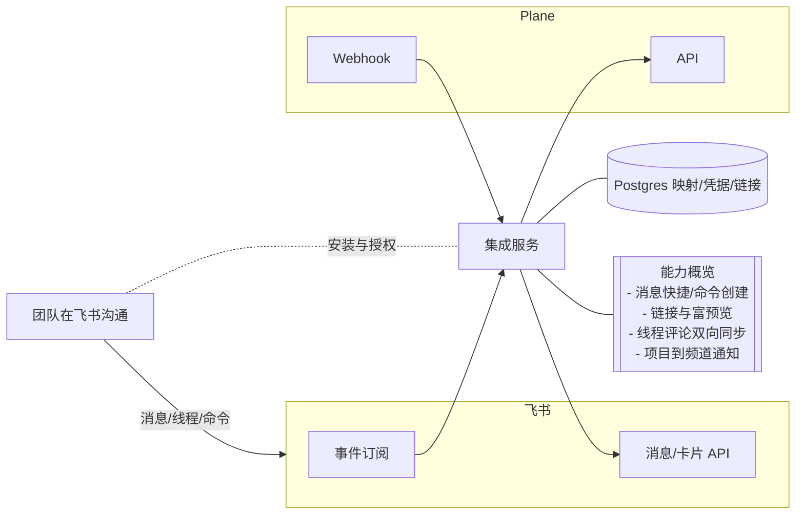
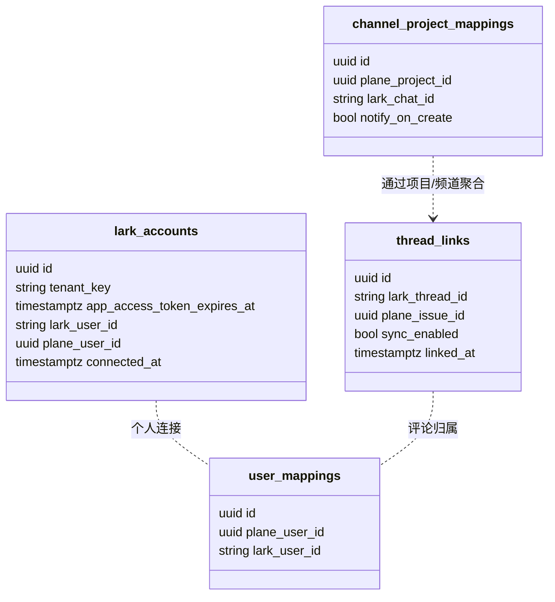
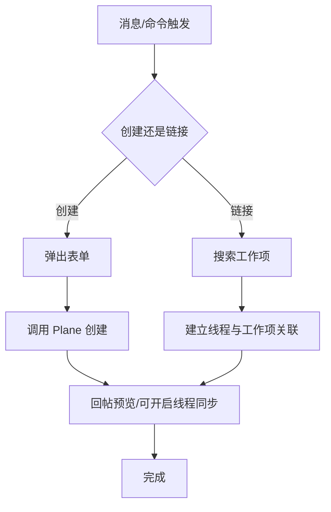
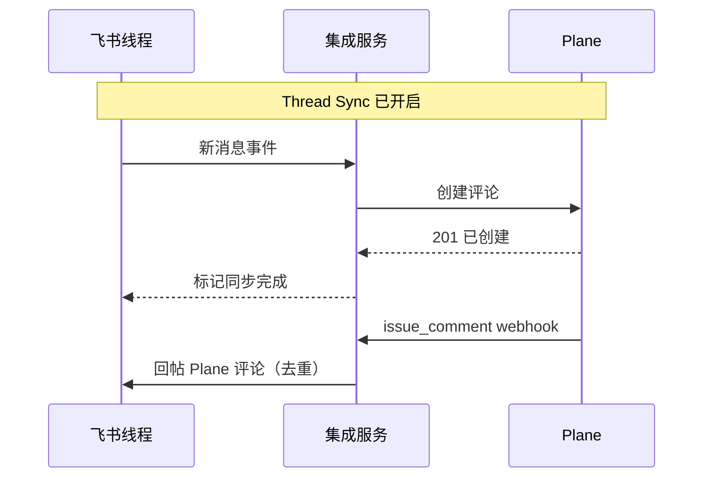

**飞书（Feishu）集成设计（参考 Slack 集成）**

- 目标：在飞书中创建/链接/预览 Plane 工作项，支持线程双向同步、命令创建、项目到频道通知，尽量复用 Slack 集成的用户体验与交互心智。
- 范围：Workspace 级连接与个人账户连接、消息快捷操作/命令、富预览与就地操作（指派/变更状态/评论）、线程与评论同步、项目通知（新建工作项推送）。

**整体架构**
- 技术栈：Go 1.24 + Echo + Postgres 16；同一进程内作为 Plane 与飞书的桥接服务。
- 模块：
  - `plane-connector`：Plane OAuth、Webhook 消费、API 调用。
  - `lark-connector`（飞书）：获取 tenant/user token、订阅事件、验签、IM/卡片/命令接口封装。
  - `sync-core`：线程-工作项关联、用户/项目/频道映射、方向控制、富预览与交互动作编排。
  - `storage` / `jobs`：同 CNB 方案，复用事件去重、重试、可观测。

**部署与配置**
- 环境变量：
  - Plane：`PLANE_CLIENT_ID`，`PLANE_CLIENT_SECRET`，`PLANE_BASE_URL`，`PLANE_WEBHOOK_SECRET`。
  - 飞书：`LARK_APP_ID`，`LARK_APP_SECRET`，`LARK_ENCRYPT_KEY`（如启用加密），`LARK_VERIFICATION_TOKEN`（或 `X-Lark-Signature` 验签所需配置）。
  - 通用：`DATABASE_URL`，`ENCRYPTION_KEY`，`PORT`。
- 回调/端点：
  - Plane OAuth：`/plane/oauth/start`、`/plane/oauth/callback`
  - 飞书安装与鉴权：按内部/企业自建应用流程拉取 `tenant_access_token`；暴露：
    - 事件订阅：`/webhooks/lark/events`
    - 交互回调（卡片/动作）：`/webhooks/lark/interactivity`
    - 命令入口（如实现 `/plane` 同等体验）：`/webhooks/lark/commands`
  - Plane Webhook：`/webhooks/plane`

**数据模型（Postgres）**
- 复用通用表，并新增：
  - `channel_project_mappings`：项目与飞书群组/频道关联
    - `id`、`plane_project_id`、`lark_chat_id`、`notify_on_create`（bool）。
  - `thread_links`：飞书消息线程与 Plane 工作项关联
    - `id`、`lark_thread_id`（根消息/话题 id）、`plane_issue_id`、`sync_enabled`（bool）、`linked_at`。
  - `lark_accounts`：飞书租户与用户连接
    - `id`、`tenant_key`、`app_access_token_expires_at`、`lark_user_id`、`plane_user_id`、`connected_at`。

**关键功能设计**
- 消息快捷操作 → 创建工作项：
  - 在消息操作中选择“创建 Plane Issue”，弹出表单（项目、标题、描述、标签、优先级、状态、指派），勾选“开启线程同步”。
  - 创建成功：在飞书消息线程回帖工作项预览与链接。
- 命令创建（等价 `/plane`）：
  - 在任意群/私聊输入命令（或点击快捷入口）打开表单创建工作项。
- 链接已有工作项：
  - 在消息操作中选择“链接工作项”，支持根据标题/ID 搜索；链接后显示预览，可开启线程同步。
- 线程同步：
  - 开启后，线程中的新消息同步到 Plane 评论；Plane 侧评论同步回线程。若未连通个人账户则以 Bot 身份留言。
- 项目→频道通知：
  - 将 Plane 项目绑定到飞书群组，新增工作项时推送富预览卡片。
- 富预览与就地操作：
  - 粘贴 Plane Issue/Cycle/Module 链接在飞书中展示预览（标题、状态、优先级、指派、进度等），并提供操作按钮（指派给我、变更状态、添加评论）。

**同步与映射**
- 用户映射：`user_mappings` 记录 plane_user_id ↔ lark_user_id；缺失则由 Bot 代理发布。
- 频道/项目映射：`channel_project_mappings` 管理项目通知；提供 API/后台配置页面。
- 线程/工作项链接：`thread_links` 控制是否启用 Thread Sync；幂等地增量同步评论。

**安全与验签**
- 飞书事件：
  - 校验 `X-Lark-Request-Timestamp`/`X-Lark-Signature`（或使用 `verification token`/加密密钥）；处理初次 `challenge` 握手。
- Plane Webhook：
  - 校验 `X-Plane-Signature`（HMAC-SHA256），参考 docs/developer-docs-preview/dev-tools/intro-webhooks.mdx。
- Token 安全：`tenant_access_token`/`user_access_token` 加密保存，按过期时间自动续期。

**接口设计（Echo）**
- `GET /healthz`：健康检查。
- `POST /webhooks/lark/events`：事件订阅入口（消息接收、加群/退群、@Bot 触发等）。
- `POST /webhooks/lark/interactivity`：卡片按钮/多选等交互回调。
- `POST /webhooks/lark/commands`：命令入口（打开模态表单）。
- `POST /webhooks/plane`：Plane 事件回调。
- `POST /admin/mappings/channel-project`：群组与项目绑定。

**事件处理（概要）**
- 飞书 → Plane：
  - 消息事件（带命令/快捷操作）：创建或链接工作项；若启用 Thread Sync，记录 `thread_links` 并回帖预览。
  - 线程消息：增量上送 Plane 评论；记录评论映射避免重复。
- Plane → 飞书：
  - 新建工作项：推送到已绑定的频道（如启用通知）。
  - 评论与状态变更：在启用 Thread Sync 的线程中回帖；预览卡片支持状态/指派/评论就地操作。

**冲突与方向控制**
- 评论：双向合并，按时间与来源判重；重复/回环通过评论来源标记与 `thread_links` 抑制。
- 字段更新：在飞书场景通常由 Plane 为权威，UI 操作通过 API 回 Plane 生效后再广播到飞书卡片（避免并发冲突）。

**Go/Echo 参考实现结构**
- 目录结构与 CNB 版本一致，新增 `internal/connectors/lark.go`，封装：
  - token 拉取与续期、事件验签、消息/卡片发送、命令/模态表单、富预览渲染。
- 中心服务 `sync-core` 编排：
  - 将“创建/链接/预览/评论/状态变更”抽象为动作，按来源（飞书/Plane）调用对应 connector。

**关键流程（文字时序）**
- 消息快捷操作 → 创建 Issue：事件到达 → 打开表单 → 提交 → 调用 Plane API 新建 → 写入 `thread_links` → 回复预览卡片。
- 线程同步：新消息 → 查 `thread_links` → 上送 Plane 评论；Plane 评论 webhook → 查链接 → 回帖飞书卡片/文本。
- 项目通知：Plane 新建 webhook → 查 `channel_project_mappings` → 推送飞书卡片。

**测试与验收**
- 单元：验签、加密、线程/评论幂等、富预览渲染。
- 集成：模拟飞书事件订阅 payload 与 Plane webhook 示例；手动回路验证“创建/链接/同步/通知”。
- 渐进发布：先开“消息创建 + 链接 + 预览”，稳定后开启 Thread Sync 与项目级通知。

**里程碑**
- M1：创建/链接/预览（无 Thread Sync），项目到频道通知（仅新建）。
- M2：Thread Sync、评论双向、就地操作（指派/状态/评论）。
- M3：用户映射完善、可观测与配额节流、权限/私聊支持优化。
