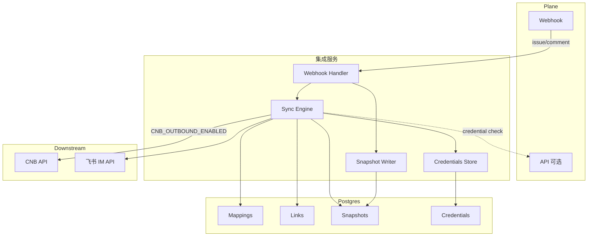

# Feishu 与 CNB 集成功能实现清单（Webhook-only 模式）

本文在 Webhook-only 重构后，细化需要实现的功能项，按里程碑与功能域拆解为可执行清单，并包含最低验收标准（DoD）。

## 公共能力（两条集成共用）

### 配置与启动
- 环境变量读取与校验（必填项缺失时报错并退出）
- `GET /healthz` 健康检查，返回版本与依赖就绪探针

### 安全与鉴权
- Plane Webhook 验签：`X-Plane-Signature`（HMAC-SHA256，原始请求体）
- CNB 回调验签：`Authorization: Bearer $INTEGRATION_TOKEN`
- 飞书事件验签：`X-Lark-Signature`（sha256(timestamp+nonce+encrypt_key+body)）
- 机密管理：Service Token 加密存储（`plane_credentials.token_enc`，透明加密待实现）

### 幂等与可观测
- 入站事件写入 `event_deliveries`（delivery_id、payload_sha256、状态、重试次数、下一次重试时间）
- 同一 delivery_id 或业务指纹重复投递幂等返回 200 并忽略重复处理
- 结构化日志（request_id、source、event_type、latency、result）

### 事件快照机制（核心特性）
- Plane Webhook 事件自动写入 `plane_issue_snapshots` 和 `plane_project_snapshots`
- 提取字段：name、description_html、state_name、priority、labels、assignee_ids、workspace_slug、project_slug
- 用途：
  - 飞书卡片预览（避免实时调用 Plane API）
  - 项目通知内容生成
  - 管理端展示与辅助配置

## 凭据管理（Webhook-only）

### Plane Service Token

**存储表**：`plane_credentials`

| 字段 | 类型 | 说明 |
|------|------|------|
| plane_workspace_id | uuid | Workspace UUID |
| workspace_slug | text | Workspace slug |
| kind | text | 固定为 `service` |
| token_enc | text | 加密后的 Service Token |

**使用场景**：
- 飞书 → Plane 评论同步
- CNB → Plane Issue 创建/更新
- 管理端查询 Plane 资源（当 `credential exists (configured via admin)`）

**配置方式**：
```bash
# 1. 在 Plane 中生成 Service Token
# 2. 通过管理端 API 配置
curl -X POST http://localhost:8080/admin/plane/credentials \
  -H "Content-Type: application/json" \
  -d '{
    "plane_workspace_id": "<workspace-uuid>",
    "workspace_slug": "my-workspace",
    "token": "<your-service-token>"
  }'
```

### 飞书 Tenant Token

**获取方式**：
```go
// 使用 LARK_APP_ID 和 LARK_APP_SECRET 换取
POST https://open.feishu.cn/open-api/auth/v3/tenant_access_token/internal/
{
  "app_id": "<your-app-id>",
  "app_secret": "<your-app-secret>"
}
```

**存储**：内存缓存（2 小时 TTL），过期自动续期

**用途**：
- 发送群消息
- 发送线程回复
- 获取用户信息

## 架构概览



## 核心功能清单

### M1：Webhook-only 基础（已完成）

#### Plane Webhook 接收
- [x] 验证 `X-Plane-Signature`（HMAC-SHA256）
- [x] 去重：`delivery_id + payload_sha256`
- [x] 写入 `event_deliveries` 表
- [x] 异步处理事件

#### 事件快照
- [x] 创建 `plane_issue_snapshots` 表（迁移 0010）
- [x] 创建 `plane_project_snapshots` 表（迁移 0010）
- [x] 在 `handlePlaneIssueEvent` 中写入快照
- [ ] 在 `handlePlaneProjectEvent` 中写入快照（待实现）

#### Service Token 管理
- [x] 创建 `plane_credentials` 表（迁移 0011）
- [ ] 实现 `POST /admin/plane/credentials` 端点
- [ ] 实现 `GET /admin/plane/credentials` 端点
- [ ] 实现 `DELETE /admin/plane/credentials` 端点
- [ ] 透明加密/解密逻辑

#### 配置开关
- [x] 出站调用基于凭据存在性判断
- [x] `CNB_OUTBOUND_ENABLED`（已有）
- [x] 所有出站调用检查开关

### M2：CNB 集成核心

#### Plane → CNB（单向，默认启用）
- [x] Plane issue.created → CNB Issue 创建
- [x] Plane issue.updated → CNB Issue 更新
- [x] Plane issue_comment → CNB Issue Comment
- [x] 标签映射
- [x] 状态映射（open/closed）
- [x] Label Selector 过滤

#### CNB → Plane（需配置 Service Token）
- [x] CNB issue.open → Plane Issue 创建
- [x] CNB issue.close → Plane Issue 状态变更
- [x] 使用 `plane_credentials` 查询 Service Token
- [x] 回写 CNB 评论（附 Plane 链接）

#### PR 生命周期
- [x] PR 状态映射配置（`pr_state_mappings`）
- [x] PR 标题解析 Issue 引用
- [x] PR 状态变更 → Plane Issue 状态自动化

### M3：飞书集成核心

#### 命令绑定
- [x] `/bind <url>` 解析 Plane URL
- [x] 建立 `thread_links` 关联
- [x] 回复绑定成功消息（基于快照）

#### 评论同步（Plane → 飞书）
- [x] Plane issue_comment → 查询 `thread_links`
- [x] 发送飞书线程回复
- [x] 使用快照数据生成预览

#### 评论同步（飞书 → Plane）
- [x] 飞书线程回复 → 检查凭据存在性
- [ ] 调用 Plane API 追加评论（使用 Service Token）
- [ ] 添加已同步 reaction

#### 项目通知
- [x] 配置 `channel_project_mappings`
- [ ] Plane issue.created → 查询频道映射
- [ ] 发送群消息（使用快照数据）

### M4：高级功能

#### 分支与提交 AI 摘要
- [ ] `branch_issue_links` 表（分支↔Issue 关联）
- [ ] `commit_summaries` 表（提交摘要记录）
- [ ] 分支创建 → Plane Issue 状态切换
- [ ] 每日提交汇总 CRON
- [ ] AI 摘要生成与评论回写
- [ ] 分支删除 → Issue 收尾摘要

#### 管理端完善
- [ ] Plane Workspaces 列表（基于 `plane_credentials`）
- [ ] Plane Projects 列表（基于快照或 API）
- [ ] Service Token 管理 UI
- [ ] 快照数据展示

## 环境变量清单

### 必需配置

```bash
# 数据库
DATABASE_URL=postgres://...

# Plane（Webhook-only）
PLANE_BASE_URL=https://api.plane.so
PLANE_WEBHOOK_SECRET=<your-webhook-secret>

# CNB
CNB_APP_TOKEN=<your-cnb-token>
INTEGRATION_TOKEN=<your-integration-secret>
CNB_BASE_URL=https://api.cnb.cool

# 飞书
LARK_APP_ID=<your-lark-app-id>
LARK_APP_SECRET=<your-lark-app-secret>
LARK_ENCRYPT_KEY=<your-encrypt-key>
```

### 可选配置

```bash
# Plane 出站（默认关闭）
no credential (default)

# CNB 出站（默认关闭）
CNB_OUTBOUND_ENABLED=false

# 管理后台
ADMIN_BOOTSTRAP_EMAIL=<your-admin-email>
ADMIN_BOOTSTRAP_PASSWORD=<your-strong-password>

# 作业调度
CLEANUP_THREAD_LINKS_ENABLED=true
CLEANUP_THREAD_LINKS_DAYS=90
```

## 关键决策与权衡

### 为什么选择 Webhook-only？

**原因**：
- Plane 自托管版本不支持 OAuth App
- 简化部署与配置流程
- 减少对 Plane API 的依赖

**优势**：
- 无需 OAuth 授权流程
- 事件驱动，实时性好
- 通过快照缓存减少 API 调用

**劣势**：
- 需要手动配置 Service Token
- 管理端查询能力受限（依赖快照或出站开关）
- 初始快照需要等待首次事件

### 出站功能设计

**默认关闭**（`no credential (default)`）：
- 仅支持 Plane → CNB/飞书 的单向通知
- 不调用 Plane API
- 适合"Plane 作为真理源"的场景

**启用后**（`credential exists (configured via admin)`）：
- 支持 CNB/飞书 → Plane 的写回
- 需要配置 Service Token
- 适合双向协作场景

## 部署检查清单

### 基础部署
- [ ] 运行数据库迁移（0001-0012）
- [ ] 配置 `PLANE_WEBHOOK_SECRET`
- [ ] 在 Plane 中配置 Webhook URL
- [ ] 测试 Webhook 投递与签名验证
- [ ] 检查 `event_deliveries` 和 `plane_issue_snapshots` 表

### 启用 Plane 出站
- [ ] 在 Plane 生成 Service Token
- [ ] 配置到 `plane_credentials` 表
- [ ] 设置 `credential exists (configured via admin)`
- [ ] 测试 CNB → Plane Issue 创建
- [ ] 测试飞书 → Plane 评论同步

### 飞书配置
- [ ] 配置 `LARK_APP_ID` 和 `LARK_APP_SECRET`
- [ ] 配置 `LARK_ENCRYPT_KEY`
- [ ] 在飞书开放平台配置事件订阅 URL
- [ ] 申请必要权限
- [ ] 测试 `/bind` 命令
- [ ] 测试评论双向同步

### CNB 配置
- [ ] 配置 `CNB_APP_TOKEN`
- [ ] 配置 `INTEGRATION_TOKEN`
- [ ] 在 CNB 仓库添加 `.cnb.yml`
- [ ] 测试 Issue 事件回调
- [ ] 测试 PR 事件回调

## 故障排查

### Plane Webhook 失败
- 检查 `PLANE_WEBHOOK_SECRET` 配置
- 检查日志中的签名计算
- 查询 `event_deliveries` 表的失败记录

### 出站调用失败
- 检查凭据存在性 是否启用
- 检查 `plane_credentials` 表是否有对应 Workspace 的 Token
- 验证 Service Token 权限是否足够
- 检查 Plane API 返回的错误码

### 快照数据缺失
- 确认 Webhook 事件类型是否支持（`issue`、`issue_comment`）
- 检查 Webhook payload 中是否包含 `workspace_slug`/`project_slug`
- 查看日志中的快照写入结果

### 飞书通知未发送
- 检查 `thread_links` 或 `channel_project_mappings` 配置
- 验证 `LARK_APP_ID`/`LARK_APP_SECRET` 是否正确
- 检查飞书 tenant_access_token 是否过期
- 确认飞书应用权限已申请

## 迁移路径（从 OAuth 模式）

如果之前部署过 OAuth 版本：

### 1. 运行数据库迁移
```bash
psql "$DATABASE_URL" -f db/migrations/0010_plane_snapshots.sql
psql "$DATABASE_URL" -f db/migrations/0011_plane_credentials.sql
psql "$DATABASE_URL" -f db/migrations/0012_drop_plane_oauth_columns.sql  # 可选
```

### 2. 更新环境变量
```bash
# 移除
unset PLANE_CLIENT_ID
unset PLANE_CLIENT_SECRET
unset PLANE_REDIRECT_URI
unset PLANE_APP_BASE_URL
unset PLANE_OAUTH_ENABLED  # 已删除

# 保留/新增
export PLANE_WEBHOOK_SECRET=<your-secret>
export no credential (default)  # 按需启用
```

### 3. 配置 Service Token

如需保留 Plane 出站功能：
- 在 Plane 中生成 Service Token
- 通过管理端或 SQL 配置到 `plane_credentials` 表
- 设置 `credential exists (configured via admin)`

### 4. 重新部署

```bash
git pull
go build -o bin/server ./cmd/server
./bin/server  # 或通过 Docker/systemd 启动
```

### 5. 验证

- 触发 Plane issue 更新，检查快照表
- 测试 Webhook 签名验证
- （如启用出站）测试 CNB/飞书 → Plane 写回

## 里程碑与优先级

### M1：Webhook-only 基础（✅ 已完成）
- [x] 移除 OAuth 代码与路由
- [x] 创建快照表
- [x] 创建 plane_credentials 表
- [x] 添加配置开关
- [x] 基础文档更新

### M2：快照与管理端（进行中）
- [ ] 实现 Service Token 管理端点
- [ ] 管理端查询改用快照（当出站关闭时）
- [ ] 完善快照写入逻辑（project 事件）
- [ ] 快照数据展示 UI

### M3：出站功能完善
- [ ] 飞书 → Plane 评论同步（使用 Service Token）
- [ ] CNB → Plane 改进错误处理
- [ ] 评论去重与幂等
- [ ] 限流与退避策略

### M4：高级特性
- [ ] 分支关联与 AI 摘要
- [ ] 飞书卡片交互（指派、状态变更）
- [ ] 性能优化与监控指标
- [ ] 透明加密实现

## 参考文档

- Webhook-only 重构方案：`docs/design/plane-webhook-only-refactor.md`
- CNB 集成详细设计：`docs/design/cnb-integration-webhook-only.md`
- 飞书集成详细设计：`docs/design/feishu-integration-webhook-only.md`
- 架构说明：`docs/ARCHITECTURE.md`
- 代码位置：
  - Webhook 处理：`internal/handlers/plane_webhook.go`
  - 快照写入：`internal/handlers/plane_issue.go`
  - 凭据查询：`internal/store/repositories.go`
  - 配置定义：`pkg/config/config.go`
