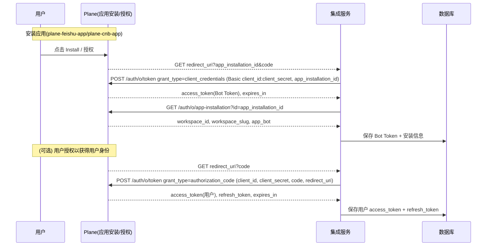
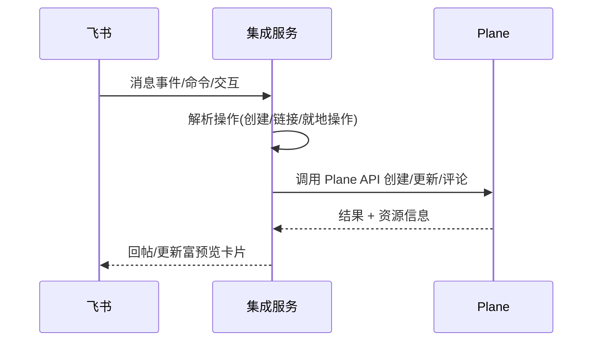
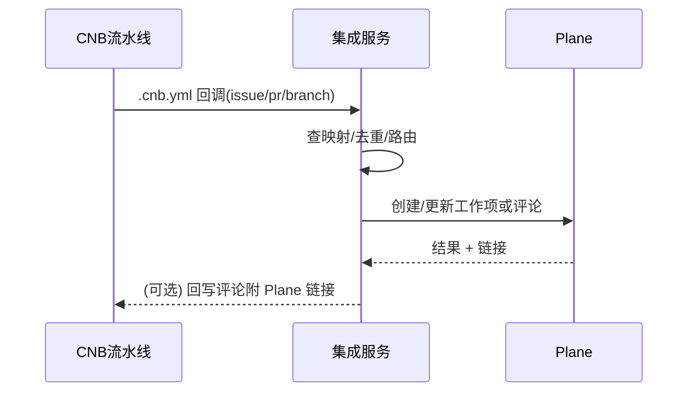

# Feishu 与 CNB 集成功能实现清单（Feature Spec）

本文在现有设计文档（见 `design/feishu-integration.md`、`design/cnb-integration.md`）基础上，细化需要实现的功能项，按里程碑与功能域拆解为可执行清单，并包含最低验收标准（DoD）。

## 公共能力（两条集成共用）
- 配置与启动
  - 环境变量读取与校验（必填项缺失时报错并退出）。
  - `GET /healthz` 健康检查，返回版本与依赖就绪探针。
- 安全与鉴权
  - Plane Webhook 验签（`X-Plane-Signature`，HMAC-SHA256，原始请求体）。
  - 机密管理：`access_token`/`refresh_token`、`tenant_access_token` 加密保存（透明加密封装）。
- 幂等与可观测
  - 入站事件写入 `event_deliveries`（指纹、状态、重试次数、下一次重试时间）。
  - 同一 `delivery_id` 或业务指纹重复投递需幂等返回 200 并忽略重复处理。
  - 结构化日志（request_id、source、event_type、latency、result）。
- 存储与迁移
  - 建表与迁移脚本（Postgres 16）：文档中列举的所有表与索引。

---

## Token 与归属一览（图解）

为避免混淆，下图与要点说明“每种 Token 属于谁、用于什么、如何续期”。

```mermaid
classDiagram
  class PlaneBotToken {
    归属: Plane 为某工作区内的应用颁发
    使用方: 集成服务
    作用域: 应用在该 Workspace 的 Bot 身份
    生命周期: 短期, 需续期
    续期: client_credentials + app_installation_id
    用途: 服务器侧动作/自动化/处理 webhooks
  }
  class PlaneUserAccessToken {
    归属: Plane 为某用户颁发
    使用方: 集成服务
    作用域: 用户在 Workspace 的权限
    生命周期: 短期
    续期: refresh_token 换新 access_token
    用途: 代表用户执行操作(带用户归属)
  }
  class PlaneRefreshToken {
    归属: Plane 为某用户颁发
    使用方: 集成服务(仅存储)
    用途: 刷新用户 access_token
  }
  class PlaneWebhookSecret {
    归属: 集成配置侧密钥
    使用方: 集成服务
    用途: 校验 X-Plane-Signature(HMAC-SHA256)
  }

  class LarkTenantAccessToken {
    归属: 飞书租户
    使用方: 集成服务
    用途: 以 App/Bot 身份调飞书 API
    续期: app_id+app_secret 换取/续期
  }
  class LarkUserAccessToken {
    归属: 飞书用户
    使用方: 集成服务(可选)
    用途: 以用户身份发言(可选, 无则用 Bot)
  }
  class LarkSignature {
    归属: 飞书应用配置
    用途: 校验事件/交互请求来源
  }

  class CNBAppToken {
    归属: CNB 平台
    使用方: 集成服务
    用途: 访问 CNB API(拉取 issue/pr/commit)
  }
  class IntegrationSharedSecret {
    归属: 集成服务
    用途: 校验 .cnb.yml 回调 Authorization: Bearer
  }
```



要点
- “Plane Bot Token / User Access Token / Refresh Token / Webhook Secret”均为 Plane 侧概念；我们用它们在 Plane 中以 Bot 或用户身份执行业务与处理 Webhook。
- “Lark Tenant/User Token 与签名”属于飞书侧；“CNBAppToken 与集成回调密钥”属于 CNB/集成侧；它们仅用于各自平台的 API/回调安全，与 Plane OAuth 相互独立。

---

## Plane 应用（plane-cnb-app 与 plane-feishu-app）

参考：docs/plane-developer-docs/dev-tools/build-plane-app.mdx

- 应用注册（各注册一个独立应用）
  - 在 Plane 开发者入口创建 `plane-cnb-app` 与 `plane-feishu-app`。
  - 填写：
    - `Setup URL`：指向本服务的安装入口（建议 `GET /plane/oauth/start`）。
    - `Redirect URIs`：`GET /plane/oauth/callback`（支持外部安装时的授权码回调）。
    - `Webhook URL`：`POST /webhooks/plane`（Plane → 集成服务）。
    - 可选：启用 App Mentions（若后续在 Plane 内通过“@应用”触发操作）。
- OAuth 实现（两种令牌形态）
  - 应用授权（Client Credentials / Bot, Plane 侧 Token）：回调包含 `app_installation_id` → 使用 `client_id`/`client_secret` 以 `client_credentials` 换取 Plane 的 Bot Token（工作区级）。
  - 用户授权（Authorization Code, Plane 侧 Token）：回调包含 `code` → 调用 Plane 令牌端点换取 `access_token`(用户) + `refresh_token`。
  - 端点：
    - `GET /plane/oauth/start`：生成/重定向至授权页（可作为 Setup URL）。
    - `GET /plane/oauth/callback`：处理 `code` 与 `app_installation_id`，落库并初始化安装信息。
  - Token 管理：
    - Bot Token 过期：使用相同 `app_installation_id` 走 `client_credentials` 续期。
    - 用户 Token 过期：使用 `refresh_token` 刷新 `access_token`。
    - 透明加密存储，记录 `expires_at` 并在调用前检查/续期。

OAuth 概览（图解）



哪些场景用哪个 Token？
- 用 Bot Token（Plane 颁发）：
  - 服务器侧自动化（处理 Plane Webhook、项目级广播、计划任务）。
  - 不依赖具体用户，也不要求操作归属到某个用户。
- 用用户 access_token（Plane 颁发）：
  - 需要在 Plane 中以“某个用户”的身份执行动作并保留归属（如评论、指派），或需要用户授权的受限资源。
- 安装信息获取与存储
  - 调用 `app-installation` 接口获取并保存：`workspace_id`、`workspace_slug`、`app_bot`。
  - 存储结构（适用两条集成）：`workspaces` 表包含 `plane_workspace_id`、`app_installation_id`、`token_type`（bot/user）、加密令牌、`expires_at`，并补充保存 `workspace_slug`、`app_bot` 字段（若已有，补齐列）。
- Webhook 处理（Plane → 集成服务）
  - 统一入口：`POST /webhooks/plane`，校验签名（HMAC-SHA256）。
  - 处理事件：`issue`、`issue_comment` 为主；解析 `activity.actor` 以便用户映射与来源标记。
  - 幂等：按 `webhook_id` 或 `delivery_id` + `payload_sha256` 去重。
- 环境变量（新增/补充）
  - `PLANE_CLIENT_ID`、`PLANE_CLIENT_SECRET`、`PLANE_REDIRECT_URI`、`PLANE_BASE_URL`（默认 `https://api.plane.so`）。
  - `PLANE_WEBHOOK_SECRET`（用于 webhook 签名校验）。
- 里程碑适配
  - M1（两应用）：完成应用注册、OAuth（至少 Bot Token）、安装信息落库、Webhook 验签与基本事件处理。
  - M2+：若需要用户级归属/就地操作身份，补充用户授权流与映射；多工作区多安装管理与运维工具。
- 验收（DoD）
  - 从 Plane 安装应用后，`/plane/oauth/callback` 能写入/更新一条安装记录，并获取 Bot Token。
  - `GET /healthz` 可反映至少一条有效安装（含过期检查）。
  - 收到 `issue`/`issue_comment` webhook 可在日志中看到解析结果并进入后续同步流程。

---

## 飞书（Feishu）集成功能清单

参考文档：`design/feishu-integration.md`

### M1：创建/链接/预览 + 项目新建通知（无线程同步）
- 安装与授权
  - 飞书侧（独立于 Plane OAuth）：使用 `LARK_APP_ID`/`LARK_APP_SECRET` 获取/续期 `tenant_access_token`；必要时获取 `user_access_token`（可选，用于以用户身份发言）。
  - Plane 侧：`GET /plane/oauth/start|/callback` 完成 Plane 应用安装并获取 Bot/User Token（详见“Plane 应用”章节）。
- 回调与接口
  - `POST /webhooks/lark/events`：处理事件订阅握手（challenge），消息事件的基础校验（签名/时间戳/重放保护）。
  - `POST /webhooks/lark/interactivity`：卡片按钮/选择器交互入口（预留，无线程同步时主要用于就地刷新预览）。
  - `POST /webhooks/lark/commands`：命令入口（打开创建 Issue 的表单）。
  - `POST /webhooks/plane`：接收 Plane 事件（用于项目新建推送）。
- 创建与链接工作项
  - 消息快捷操作/命令触发“创建 Plane Issue”弹窗（项目、标题、描述、标签、优先级、状态、指派）。
  - “链接已有工作项”支持按标题/ID 搜索选择。
  - 成功后在原消息下回帖富预览卡片（含标题、状态、优先级、指派、链接）。
- 富预览（链接粘贴展开）
  - 识别 Plane Issue/Cycle/Module 链接，渲染静态卡片；提供基础操作入口（按钮存在但仅支持刷新/打开链接）。
- 项目→频道通知（仅新建）
  - `channel_project_mappings` 配置某 Project 到飞书群；当 Plane 新建 Issue 时在群内推送预览卡片。
- 管理与存储
  - `POST /admin/mappings/channel-project`：创建/更新频道↔项目映射，支持 `notify_on_create`。
  - 数据表：`channel_project_mappings`、`lark_accounts`、`user_mappings`、`thread_links`（预创建，M2 启用）。
 - Token 说明（图解）

```mermaid
flowchart LR
  LarkApp[飞书应用\napp_id+app_secret] --> AuthLark[飞书鉴权]
  AuthLark -->|tenant_access_token| Svc[集成服务]
  User[飞书用户(可选连接)] --> AuthLark
  AuthLark -->|user_access_token(可选)| Svc
  note right of Svc: 仅用于调飞书 API\n与 Plane OAuth 独立
```
- 验收（DoD）
  - 在群里通过命令创建 Issue，消息下出现预览卡片且可打开 Plane 链接。
  - 粘贴 Issue 链接能展开基本预览。
  - 绑定项目后，新建 Issue 自动推送到目标群。

### M2：线程双向同步 + 就地操作
- 线程同步（Thread Sync）
  - `thread_links` 启用：记录 `lark_thread_id ↔ plane_issue_id`、`sync_enabled`。
  - 飞书线程新消息 → 创建 Plane 评论（带来源标记与去重）。
  - Plane 评论 webhook → 飞书回帖（去重，避免回环）。
- 就地操作（交互卡片）
  - 卡片按钮：指派给我、变更状态（下拉）、添加评论（输入框/二次弹窗）。
  - 交互回调在 `POST /webhooks/lark/interactivity` 处理，调用 Plane API 后刷新卡片内容。
- 用户映射与回退
  - `user_mappings`：支持手动建立 `plane_user_id ↔ lark_user_id`，映射缺失时使用 Bot 归属评论。
- 验收（DoD）
  - 开启同步的线程中，双向新增评论均能到达对侧且无重复。
  - 在卡片上变更状态/指派后，Plane 与卡片展示同步更新。

### M3：用户映射完善 + 可观测/配额节流 + 权限优化
- 用户连接流程与后台批量映射能力。
- 速率限制与退避（飞书/Plane API 调用）+ 熔断日志。
- 更细权限控制（群/私聊可见性、Bot 权限校验）。

---

## CNB 集成功能清单

参考文档：`design/cnb-integration.md`

### M1：最小可用（CNB → Plane 单向）
- 安装与授权
  - CNB 侧：读取 `CNB_APP_TOKEN` 访问 CNB API；`.cnb.yml` 回调使用共享 `INTEGRATION_TOKEN`（Authorization: Bearer）供服务校验。
  - Plane 侧：`/plane/oauth/start|/callback` 完成 Plane 应用安装并获取 Bot/User Token（详见“Plane 应用”章节）。
- 入站回调与接口
  - `POST /ingest/cnb/issue`：接收 `issue.open|issue.close|issue.reopen` 最小负载（repo、issue_iid、event）。
  - `POST /ingest/cnb/pr`：预留（M3 使用）。
  - `POST /ingest/cnb/branch`：预留（M4 使用）。
  - `POST /webhooks/plane`：接收 Plane 事件（M2 起用于反向同步）。
- 仓库↔项目映射与同步策略
  - `POST /admin/mappings/repo-project`：创建/更新映射（`plane_project_id`、`cnb_repo_id`、`issue_open_state_id`、`issue_closed_state_id`、`sync_direction`）。
  - 映射为 `cnb_to_plane` 时：.cnb.yml 回调到来 → 拉取 CNB Issue 详情（需含 Plane 识别标签，如 `Plane`）→ 在 Plane 创建/更新 Work Item。
- Issue 与评论（CNB → Plane）
  - 标题、描述、标签、指派、评论：按单向规则同步到 Plane；缺失用户映射时用 Bot 评论。
- 可观测与幂等
  - 所有入站事件记录至 `event_deliveries` 并按状态更新；失败进入重试队列（指数退避）。
- 配置与示例
  - 提供 `.cnb.yml` 片段示例（issue.open/close/reopen）与环境变量注入指引（`$INTEGRATION_URL`、`$INTEGRATION_TOKEN`）。
 - Token 说明（图解）

```mermaid
flowchart LR
  CNB[CNB 平台] -- API -->|CNB_APP_TOKEN| Svc[集成服务]
  Pipeline[.cnb.yml 流水线] -- 回调 -->|Authorization: Bearer INTEGRATION_TOKEN| Svc
  note right of Svc: 仅用于 CNB 交互\n与 Plane OAuth 独立
```
- 验收（DoD）
  - 在带 `Plane` 标签的 CNB Issue 上 open/close/reopen，通过流水线回调创建/更新对应 Plane Work Item，并回写包含 Plane 链接的评论（若需要）。

### M2：Plane ↔ CNB 双向 + 用户映射
- 双向同步
  - `sync_direction=bidirectional` 时：Plane 标题/描述/标签/评论变更通过 `/webhooks/plane` 反写 CNB。
  - Plane State 与 CNB issue open/close 映射（按项目配置的 open/closed 状态）。
- 用户映射
  - `POST /admin/mappings/users`：支持根据 email/用户名批量建立 `plane_user_id ↔ cnb_user_id`。
  - 评论与指派按映射归属；缺失时回退为 Bot。
- 验收（DoD）
  - 在 Plane 侧修改标题/描述/评论能同步到 CNB；CNB open/close 能驱动 Plane 状态变更。

### M3：PR 生命周期自动化
- PR 状态映射
  - `POST /admin/mappings/pr-states`：配置 draft/opened/review_requested/approved/merged/closed → Plane 状态 ID。
  - `.cnb.yml` 在 PR 事件（`pull_request`）中回调 `/ingest/cnb/pr`，服务侧推动 Plane Work Item 状态流转。
- 引用约定
  - PR 标题/描述包含 `[KEY-123]` 触发自动状态；纯 `KEY-123` 仅建立引用而不触发状态。
- 验收（DoD）
  - PR 状态变更能驱动 Plane 状态映射，且在两侧保留相互引用链接。

### M4：分支联动 + 提交 AI 日报
- 分支与 Issue 关联
  - 解析分支名/提交信息中的 Issue Key（默认正则 `(?i)#?([A-Z][A-Z0-9]+-\d+)`）。
  - 维护 `branch_issue_links`：`(repo, branch) ↔ plane_issue_id`；分支创建/删除事件通过 `/ingest/cnb/branch` 或后台轮询。
- 每日提交摘要（Scheduler + AI）
  - 内置 CRON（默认每日 18:00，本地时区可配），对活跃分支汇总自上次窗口的 commit（数量、文件数、增删行）。
  - 生成结构化 Markdown 评论并回写到对应 Plane Issue；保存在 `commit_summaries`，支持去重（`dedup_key`）。
- 生命周期联动
  - 分支创建 → Issue 评论“已开始开发”，状态切至进行中。
  - 分支删除 → Issue 评论“已结束（分支删除）”，状态切至完成/关闭。
- 验收（DoD）
  - 创建形如 `feature/PROJ-002-xxx` 分支并提交后，当日能在 Issue 下看到“进展摘要”；删除分支后有收尾摘要并状态完成。

---

## 架构设计（单服务、多应用）

总体思路
- 单一 Go 服务（Echo）作为桥接层，同时承载 Feishu 与 CNB 两条集成，统一对接 Plane 的 OAuth、API 与 Webhook。
- 在 Plane 侧注册两个应用（`plane-feishu-app`、`plane-cnb-app`），共用同一组 OAuth 端点与实现；各自持有独立的 `client_id/client_secret` 与安装记录。
- 所有凭据、映射、链接与事件日志保存在同一 Postgres；异步重试与调度使用表驱动 jobs。

架构总览

```mermaid
flowchart LR
  subgraph Service[Integration Service (Go/Echo)]
    Lark[Lark Connector]
    CNB[CNB Connector]
    Plane[Plane Connector]
    Sync[Sync Core]
    Jobs[Jobs/Scheduler]
  end
  Service --- DB[(Postgres: 凭据/映射/事件日志)]

  PlaneApps[Plane Apps\nplane-feishu-app / plane-cnb-app]
  PlaneApps -->|OAuth 安装/回调\nPlane Webhook| Service

  LarkAPI[Feishu API] <--> Lark
  CNBAPI[CNB API] <--> CNB
  PlaneAPI[Plane API] <--> Plane

  Lark <--> Sync
  CNB <--> Sync
  Plane <--> Sync
```

模块划分
- Handlers（HTTP 入口）
  - OAuth/安装：`GET /plane/oauth/start`、`GET /plane/oauth/callback`
  - Plane Webhook：`POST /webhooks/plane`
  - Feishu：`POST /webhooks/lark/events`、`/webhooks/lark/interactivity`、`/webhooks/lark/commands`
  - CNB Ingest：`POST /ingest/cnb/issue|pr|branch`
  - Admin：`POST /admin/mappings/repo-project|pr-states|users|channel-project`
  - Health：`GET /healthz`
- Connectors（对接第三方 API）
  - Plane Connector：OAuth（Bot/用户）、安装信息获取、Webhook 验签、资源 API 封装
  - Lark Connector：tenant/user token 获取与续期、事件/交互验签、IM/卡片/命令封装
  - CNB Connector：API 客户端、`.cnb.yml` 回调负载解析
  - AI Connector（CNB M4）：提交摘要生成
- Services（业务编排）
  - Sync Core：创建/链接/预览/评论/状态流转、方向控制、幂等去重与防回环
  - Summaries（CNB M4）：提交拉取、窗口聚合、摘要评论回写
- Storage（数据层）
  - 安装与凭据：`workspaces`、`lark_accounts`、`cnb_installations`
  - 映射与链接：`repo_project_mappings`、`pr_state_mappings`、`channel_project_mappings`、`user_mappings`、`issue_links`、`thread_links`、`branch_issue_links`
  - 幂等与日志：`event_deliveries`、（M4）`commit_summaries`
- Jobs / Scheduler
  - 出/入站事件重试（指数退避）、计划任务（每日提交摘要）

关键数据流（概览）
- Plane 应用安装与授权：见“Plane 应用”章节的 OAuth 概览时序图（Bot Token 与可选用户授权）。
- 飞书消息/命令 → Plane 工作项：



- CNB 流水线回调 → Plane 工作项：



运行与隔离策略（单服务内）
- 为 Feishu 与 CNB 分配独立 HTTP 客户端/连接池/速率限制器/工作池；关键路径配置超时与熔断。
- 日志与指标统一打标签（source=feishu|cnb、endpoint、对端 API），便于独立观测与告警。
- 以 feature flag 控制新能力放量（线程同步、PR 映射、AI 摘要）。
- 密钥与配置按 connector 维度管理，遵循最小权限原则。

安全与幂等
- 签名校验：Plane HMAC（`X-Plane-Signature`）、飞书签名/verification token、CNB Bearer 回调密钥。
- 幂等：事件入库 `event_deliveries` 指纹去重 + 业务键（如 `thread_links`/`issue_links`）防重复创建；失败进入重试队列（指数退避），区分 4xx/5xx。

部署与扩展
- 单二进制、无状态，可水平扩展；依赖 Postgres 16。
- 通过环境变量配置（Plane/Feishu/CNB/DB/加密密钥/端口）；`/healthz` 就绪/存活探针。
- 连接池与并发度按流量与对端速率限额调优；必要时按 connector 拆分实例数。

---

## 非功能性要求（NFR）
- 性能：核心接口 p95 < 300ms（不含对端 API 时延）；重操作采用异步任务。
- 可靠性：对端 429/5xx 自动退避重试；显式区分 4xx 业务错误与可重试错误。
- 可观测：指标（事件吞吐、成功率、重试队列长度）、关键日志与错误分布；必要时加入简单仪表盘。
- 配额与速率：对端 API 速率限制与本地限流器（令牌桶/滑动窗口）。

## 交付与验收
- 每个里程碑提供：
  - API 接口与示例 payload/响应。
  - 最小可用的端到端演示路径（手动步骤说明）。
  - 表结构与迁移脚本。
  - DoD 清单全部通过。
