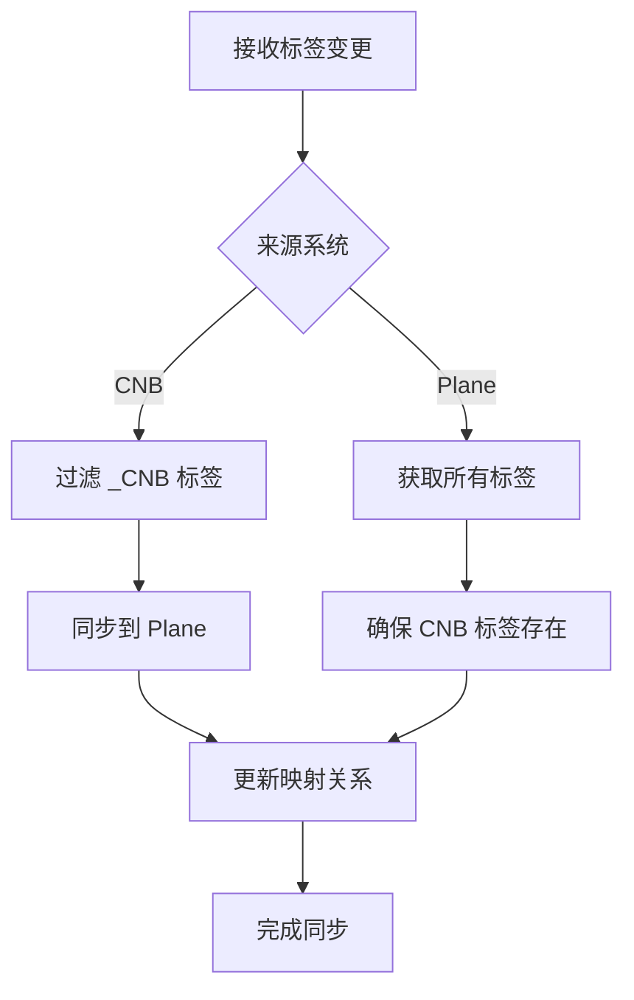
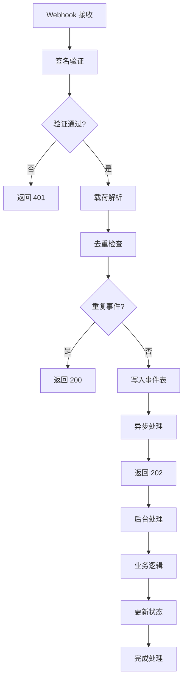
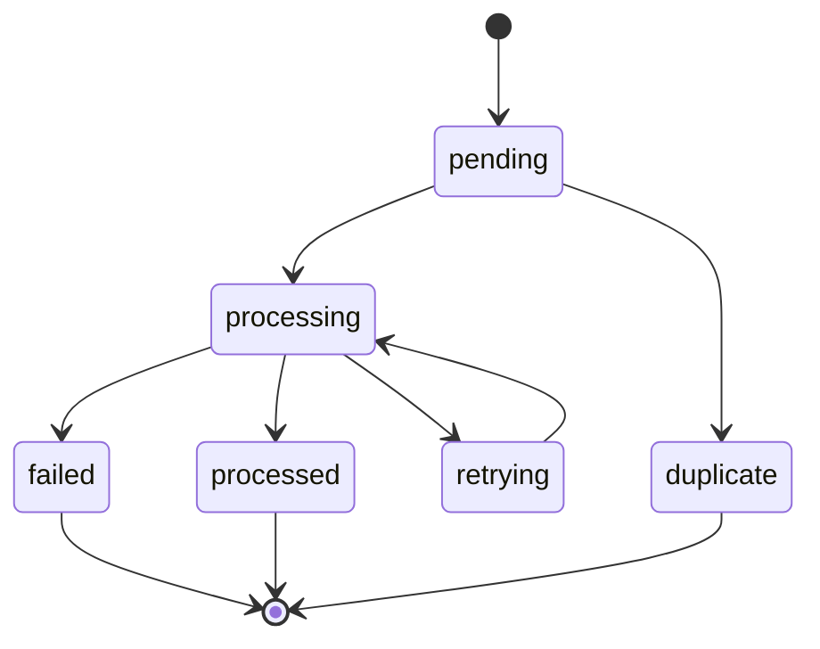
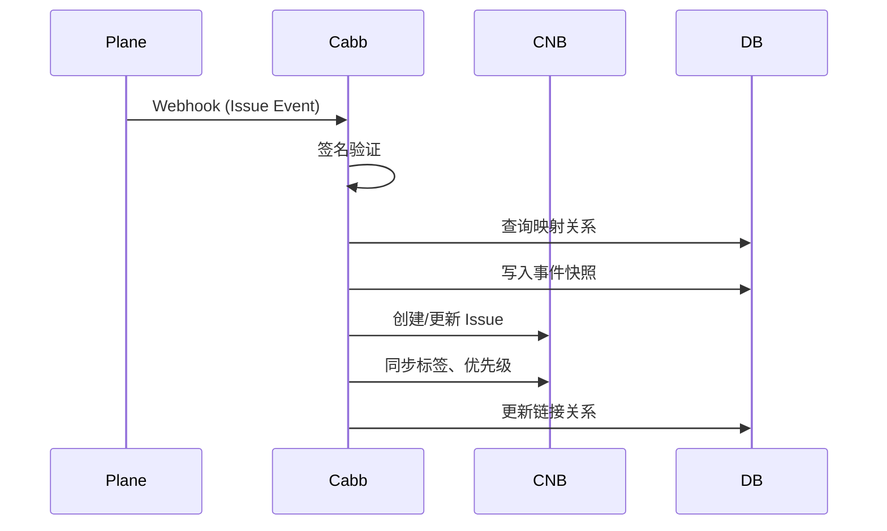
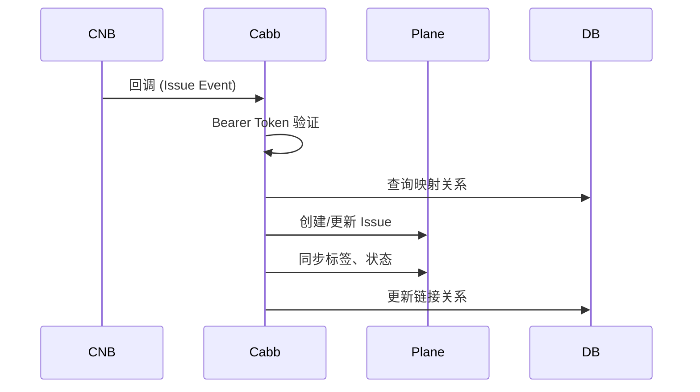

# Plane 与 CNB 集成完整设计文档

## 概述

本文档完整描述 Plane 与 CNB 代码托管平台的深度集成实现，采用纯 Webhook 模式实现双向数据同步，支持 Issue、PR、Branch 的完整生命周期管理，包括架构设计、数据映射规则和 Webhook 处理流程。

## 核心架构

### 1. 集成模式
- **Webhook 模式**：移除 OAuth 依赖，基于事件驱动的异步处理
- **双向同步**：支持 CNB → Plane 和 Plane → CNB 的数据流转
- **事件驱动**：通过 Webhook 触发异步处理，确保高响应性能

### 2. 系统组件

```
┌─────────────┐    Webhook    ┌─────────────┐    API     ┌─────────────┐
│   Plane     │ ──────────→ │   Cabb      │ ────────→ │    CNB      │
│   (Source)  │              │  (Gateway)  │            │  (Target)   │
└─────────────┘              └─────────────┘            └─────────────┘
       ↑                            ↓                            ↑
       │                            │                            │
       └──────────←─────────────────┘────────────────←──────────┘
                    双向同步 & 事件处理
```

### 3. 核心文件结构

```
internal/
├── handlers/
│   ├── plane_webhook.go      # Plane Webhook 接收与处理
│   ├── cnb_ingest.go         # CNB 回调处理
│   ├── issue_label_sync.go   # 标签同步逻辑
│   └── plane_issue.go        # Plane Issue 处理
├── store/
│   └── repositories.go       # 数据访问层
├── plane/
│   └── client.go             # Plane API 客户端
└── cnb/
    └── client.go             # CNB API 客户端
```

## 数据库设计

### 1. 仓库-项目映射表

```sql
CREATE TABLE repo_project_mappings (
  plane_project_id uuid NOT NULL,
  cnb_repo_id text NOT NULL,
  workspace_slug text,
  issue_open_state_id uuid,
  issue_closed_state_id uuid,
  sync_direction sync_direction DEFAULT 'cnb_to_plane',
  label_selector text,
  active boolean DEFAULT true,
  created_at timestamptz DEFAULT now(),
  updated_at timestamptz DEFAULT now()
);
```

**字段说明：**
- `sync_direction`：同步方向（`cnb_to_plane`、`plane_to_cnb`、`bidirectional`）
- `label_selector`：标签选择器，用于过滤需要同步的 Issue
- `issue_open_state_id/closed_state_id`：Plane 中对应的状态 ID

### 2. 统一集成映射表

```sql
CREATE TABLE integration_mappings (
  id uuid PRIMARY KEY DEFAULT gen_random_uuid(),
  scope_kind text CHECK (scope_kind IN ('global','plane_workspace','plane_project','cnb_repo','lark_tenant')),
  mapping_type text CHECK (mapping_type IN ('user','priority','label','state','pr_state','custom')),
  left_system text CHECK (left_system IN ('plane','cnb','lark')),
  right_system text CHECK (right_system IN ('plane','cnb','lark')),
  left_key text NOT NULL,
  right_key text NOT NULL,
  created_at timestamptz DEFAULT now(),
  updated_at timestamptz DEFAULT now()
);
```

**映射类型：**
- `user`：用户映射（Plane UUID ↔ CNB 用户 ID）
- `priority`：优先级映射（P0/P1/P2/P3 ↔ urgent/high/medium/low）
- `label`：标签映射（自定义标签双向映射）
- `state`：状态映射（Open/Closed ↔ Plane 自定义状态）
- `pr_state`：PR 状态映射（open/merged/closed）

**作用域说明：**
- `global`：全局映射，适用于所有项目
- `plane_workspace`：工作空间级别映射
- `plane_project`：项目级别映射
- `cnb_repo`：仓库级别映射
- `lark_tenant`：飞书租户级别映射

### 3. 问题链接表

```sql
CREATE TABLE issue_links (
  plane_issue_id uuid NOT NULL,
  cnb_issue_id text,
  cnb_repo_id text,
  linked_at timestamptz DEFAULT now(),
  updated_at timestamptz DEFAULT now(),
  PRIMARY KEY (plane_issue_id)
);
```

### 4. 事件投递表

```sql
CREATE TABLE event_deliveries (
  id uuid PRIMARY KEY DEFAULT gen_random_uuid(),
  delivery_id text NOT NULL,
  source text NOT NULL,
  event_type text NOT NULL,
  payload_sha256 text NOT NULL,
  status text DEFAULT 'pending',
  processed_at timestamptz,
  created_at timestamptz DEFAULT now()
);
```

## API 端点设计

### 1. Plane Webhook 接收

```
POST /webhooks/plane
```

**功能：** 接收 Plane 事件通知
**事件类型：**
- `issue`：Issue 创建、更新、状态变更
- `issue_comment`：评论创建、更新

**安全验证：**
- HMAC-SHA256 签名校验（`X-Plane-Signature`）
- 常量时间比较，防止时序攻击

### 2. CNB 集成回调

```
POST /ingest/cnb/issue    # CNB Issue 事件
POST /ingest/cnb/pr       # CNB PR 事件
POST /ingest/cnb/branch   # CNB Branch 事件
```

**安全验证：**
- Bearer Token 鉴权（`Authorization: Bearer $INTEGRATION_TOKEN`）

### 3. 标签同步 API

```
POST /api/v1/issues/label-notify  # 完整版标签通知（11个字段）
POST /api/v1/issues/label-sync     # 简化版标签同步（3个字段）
```

### 4. 管理接口

```
GET/POST /admin/mappings/repo-project     # 仓库-项目映射管理
GET/POST /admin/mappings/integration      # 统一映射管理
GET/POST /admin/links/issue              # Issue 链接管理
GET /admin/plane/projects                 # Plane 项目查询
GET /admin/plane/issues                   # Plane Issue 查询
```

## 数据映射规则详解

### 1. 优先级映射

#### 默认映射规则

```go
// internal/handlers/plane_issue.go:514-595
func mapCNBPriorityToPlane(cnb string) (string, bool) {
    switch strings.ToUpper(strings.TrimSpace(cnb)) {
    case "P0": return "urgent", true
    case "P1": return "high", true  
    case "P2": return "medium", true
    case "P3": return "low", true
    case "", "NONE": return "none", true
    case "-1P", "-2P": return "low", true // 负优先级映射为 low
    }
    return "", false
}
```

#### 映射关系表

| CNB 优先级 | Plane 优先级 | 业务含义 | 处理逻辑 |
|-----------|-------------|----------|----------|
| P0        | urgent      | 紧急     | 最高优先级，需要立即处理 |
| P1        | high        | 高       | 高优先级，优先处理 |
| P2        | medium      | 中       | 中等优先级，正常处理 |
| P3        | low         | 低       | 低优先级，可延后处理 |
| -1P, -2P  | low         | 负优先级 | 特殊低优先级，映射为 low |
| 空/None   | none        | 无优先级 | 不设置优先级 |

#### 自定义优先级映射

```sql
-- 示例：自定义优先级映射
INSERT INTO integration_mappings (scope_kind, mapping_type, left_system, right_system, left_key, right_key)
VALUES 
  ('global', 'priority', 'cnb', 'plane', 'P0', 'urgent'),
  ('global', 'priority', 'cnb', 'plane', 'P1', 'high'),
  ('global', 'priority', 'cnb', 'plane', 'P2', 'medium'),
  ('global', 'priority', 'cnb', 'plane', 'P3', 'low');
```

### 2. 标签映射

#### CNB → Plane 标签过滤

```go
// internal/handlers/issue_label_sync.go:26-45
func filterCNBLabels(labels []string) []string {
    var cnbLabels []string
    for _, label := range labels {
        if strings.HasSuffix(label, "_CNB") {
            cnbLabels = append(cnbLabels, label)
        }
    }
    return cnbLabels
}
```

**规则说明：**
- 只同步以 `_CNB` 结尾的标签到 Plane
- 避免同步 CNB 系统标签（如 `bug`、`enhancement` 等）
- 保持 Plane 标签的独立性

#### Plane → CNB 标签同步

```go
// internal/handlers/issue_label_sync.go:47-65
func syncPlaneLabelsToCNB(planeLabels []string, cnbRepoID string) error {
    for _, label := range planeLabels {
        // 确保标签在 CNB 中存在
        err := ensureCNBLabelExists(label, cnbRepoID)
        if err != nil {
            return err
        }
    }
    return nil
}
```

**规则说明：**
- 同步所有 Plane 标签到 CNB
- 自动创建不存在的标签
- 保持标签名称一致性

#### 标签映射配置

```sql
-- 示例：标签映射配置
INSERT INTO integration_mappings (scope_kind, mapping_type, left_system, right_system, left_key, right_key)
VALUES 
  ('plane_project', 'label', 'plane', 'cnb', 'bug', 'bug_CNB'),
  ('plane_project', 'label', 'plane', 'cnb', 'feature', 'feature_CNB'),
  ('plane_project', 'label', 'plane', 'cnb', 'hotfix', 'hotfix_CNB');
```

#### 标签处理流程



### 3. 人员映射

#### 映射表结构

```sql
-- 用户映射示例
INSERT INTO integration_mappings (scope_kind, mapping_type, left_system, right_system, left_key, right_key)
VALUES 
  ('global', 'user', 'plane', 'cnb', 'plane-uuid-1', 'cnb-user-1'),
  ('global', 'user', 'plane', 'cnb', 'plane-uuid-2', 'cnb-user-2');
```

#### 人员查询逻辑

```go
// internal/store/repositories.go:577-597
func (d *DB) FindCNBUserIDsByPlaneUsers(ctx context.Context, planeUserIDs []string) ([]string, error) {
    query := `
        SELECT right_key 
        FROM integration_mappings 
        WHERE mapping_type = 'user' 
        AND left_system = 'plane' 
        AND right_system = 'cnb' 
        AND left_key = ANY($1)
    `
    var cnbUserIDs []string
    err := d.db.Select(ctx, &cnbUserIDs, query, planeUserIDs)
    return cnbUserIDs, err
}
```

#### 人员映射处理

```go
// CNB → Plane 人员映射
func mapCNBAssigneeToPlane(cnbUserID string) (string, error) {
    var planeUUID string
    query := `
        SELECT left_key 
        FROM integration_mappings 
        WHERE mapping_type = 'user' 
        AND left_system = 'plane' 
        AND right_system = 'cnb' 
        AND right_key = $1
    `
    err := db.Get(ctx, &planeUUID, query, cnbUserID)
    return planeUUID, err
}

// Plane → CNB 人员映射
func mapPlaneAssigneeToCNB(planeUUID string) (string, error) {
    var cnbUserID string
    query := `
        SELECT right_key 
        FROM integration_mappings 
        WHERE mapping_type = 'user' 
        AND left_system = 'plane' 
        AND right_system = 'cnb' 
        AND left_key = $1
    `
    err := db.Get(ctx, &cnbUserID, query, planeUUID)
    return cnbUserID, err
}
```

#### 人员映射策略

- **精确匹配**：基于用户 ID 的精确映射
- **邮箱匹配**：支持基于邮箱的自动映射（扩展功能）
- **默认处理**：未映射用户使用系统默认用户

### 4. 状态映射

#### Issue 状态映射

```sql
-- Issue 状态映射示例
INSERT INTO integration_mappings (scope_kind, mapping_type, left_system, right_system, left_key, right_key)
VALUES 
  ('plane_project', 'state', 'cnb', 'plane', 'open', 'open-state-id'),
  ('plane_project', 'state', 'cnb', 'plane', 'closed', 'closed-state-id');
```

#### PR 状态映射

```sql
-- PR 状态映射示例
INSERT INTO integration_mappings (scope_kind, mapping_type, left_system, right_system, left_key, right_key)
VALUES 
  ('cnb_repo', 'pr_state', 'cnb', 'plane', 'open', 'open'),
  ('cnb_repo', 'pr_state', 'cnb', 'plane', 'merged', 'merged'),
  ('cnb_repo', 'pr_state', 'cnb', 'plane', 'closed', 'closed');
```

### 5. 字段映射详情

#### Issue 核心字段映射

| CNB 字段 | Plane 字段 | 映射规则 | 处理逻辑 |
|---------|-----------|----------|----------|
| title | name | 直接映射 | 标题直接同步 |
| body | description | Markdown 转换 | 保持格式一致性 |
| state | state_id | 状态映射 | 查询映射表转换 |
| assignee | assignee_id | 人员映射 | 查询用户映射表 |
| labels | labels | 标签过滤 | CNB 过滤 _CNB 标签 |
| priority | priority | 优先级映射 | P0→urgent, P1→high 等 |
| milestone | milestone | 直接映射 | 里程碑 ID 同步 |
| due_date | target_date | 时间格式转换 | RFC3339 格式 |

#### 评论字段映射

| CNB 字段 | Plane 字段 | 映射规则 | 处理逻辑 |
|---------|-----------|----------|----------|
| body | comment_html | Markdown 转换 | 支持 HTML 格式 |
| user | actor | 人员映射 | 查询用户映射表 |
| created_at | created_at | 时间格式转换 | RFC3339 格式 |
| updated_at | updated_at | 时间格式转换 | RFC3339 格式 |

#### PR 字段映射

| CNB 字段 | Plane 字段 | 映射规则 | 处理逻辑 |
|---------|-----------|----------|----------|
| title | name | 直接映射 | 标题同步 |
| body | description | Markdown 转换 | 描述同步 |
| state | state | PR 状态映射 | open/merged/closed |
| merge_commit_sha | merge_commit | 直接映射 | 提交 SHA 同步 |
| head_branch | source_branch | 直接映射 | 源分支同步 |
| base_branch | target_branch | 直接映射 | 目标分支同步 |

## Webhook 处理流程详解

### 1. 处理流程概览



### 2. Plane Webhook 处理

#### 接收端点

```go
// internal/handlers/router.go:15
e.POST("/webhooks/plane", h.handlePlaneWebhook)
```

#### 处理函数

```go
// internal/handlers/plane_webhook.go:15-99
func (h *Handler) handlePlaneWebhook(c echo.Context) error {
    // 1. 读取原始请求体
    body, err := io.ReadAll(c.Request().Body)
    if err != nil {
        return c.JSON(400, map[string]string{"error": "Failed to read body"})
    }
    
    // 2. 签名验证
    signature := c.Request().Header.Get("X-Plane-Signature")
    if !h.verifyPlaneSignature(body, signature) {
        return c.JSON(401, map[string]string{"error": "Invalid signature"})
    }
    
    // 3. 解析载荷
    var envelope planeWebhookEnvelope
    if err := json.Unmarshal(body, &envelope); err != nil {
        return c.JSON(400, map[string]string{"error": "Invalid JSON"})
    }
    
    // 4. 生成投递 ID
    deliveryID := generateDeliveryID()
    
    // 5. 去重检查
    if h.isDuplicateEvent("plane", envelope.EventType, body) {
        return c.JSON(200, map[string]string{"status": "duplicate"})
    }
    
    // 6. 写入事件表
    if err := h.recordEventDelivery(deliveryID, "plane", envelope.EventType, body); err != nil {
        h.logger.Error("Failed to record event delivery", "error", err)
        return c.JSON(500, map[string]string{"error": "Internal error"})
    }
    
    // 7. 异步处理
    go h.processPlaneWebhook(envelope, deliveryID)
    
    // 8. 立即返回
    return c.JSON(202, map[string]string{"delivery_id": deliveryID})
}
```

#### 签名验证

```go
// internal/handlers/plane_webhook.go:101-115
func (h *Handler) verifyPlaneSignature(body []byte, signature string) bool {
    if signature == "" {
        return false
    }
    
    // 移除 sha256= 前缀
    if strings.HasPrefix(signature, "sha256=") {
        signature = strings.TrimPrefix(signature, "sha256=")
    }
    
    // 计算 HMAC-SHA256
    mac := hmac.New(sha256.New, []byte(h.config.PlaneWebhookSecret))
    mac.Write(body)
    expectedSignature := hex.EncodeToString(mac.Sum(nil))
    
    // 常量时间比较
    return hmac.Equal([]byte(signature), []byte(expectedSignature))
}
```

#### 事件类型处理

```go
// internal/handlers/plane_webhook.go:117-135
func (h *Handler) processPlaneWebhook(envelope planeWebhookEnvelope, deliveryID string) {
    switch envelope.EventType {
    case "issue":
        h.handlePlaneIssueEvent(envelope, deliveryID)
    case "issue_comment":
        h.handlePlaneIssueCommentEvent(envelope, deliveryID)
    default:
        h.logger.Info("Unsupported event type", "type", envelope.EventType)
        h.updateEventDeliveryStatus(deliveryID, "skipped")
        return
    }
    
    h.updateEventDeliveryStatus(deliveryID, "processed")
}
```

#### Issue 事件处理

```go
// internal/handlers/plane_issue.go:26-374
func (h *Handler) handlePlaneIssueEvent(env planeWebhookEnvelope, deliveryID string) {
    // 1. 提取 Issue 数据
    issueData := env.Data.Issue
    
    // 2. 写入快照
    if err := h.store.CreatePlaneIssueSnapshot(ctx, issueData); err != nil {
        h.logger.Error("Failed to create issue snapshot", "error", err)
        return
    }
    
    // 3. 查询映射关系
    mapping, err := h.store.FindRepoProjectMappingByPlaneProject(ctx, issueData.ProjectID)
    if err != nil {
        h.logger.Error("Failed to find mapping", "error", err)
        return
    }
    
    // 4. 检查同步方向
    if mapping.SyncDirection == "cnb_to_plane" {
        h.logger.Info("Sync direction is cnb_to_plane, skipping")
        return
    }
    
    // 5. 双向同步处理
    if err := h.syncPlaneIssueToCNB(issueData, mapping); err != nil {
        h.logger.Error("Failed to sync to CNB", "error", err)
        h.updateEventDeliveryStatus(deliveryID, "failed")
        return
    }
    
    // 6. 飞书通知
    go h.notifyLarkIssueUpdate(issueData, mapping)
}
```

### 3. CNB 回调处理

#### 接收端点

```go
// internal/handlers/router.go:20-22
e.POST("/ingest/cnb/issue", h.handleCNBIssue)
e.POST("/ingest/cnb/pr", h.handleCNBPR)
e.POST("/ingest/cnb/branch", h.handleCNBBranch)
```

#### 通用处理逻辑

```go
// internal/handlers/cnb_ingest.go:48-95
func (h *Handler) handleCNBIssue(c echo.Context) error {
    // 1. Bearer Token 验证
    authHeader := c.Request().Header.Get("Authorization")
    if !h.authorizeIntegration(authHeader) {
        return c.JSON(401, map[string]string{"error": "Unauthorized"})
    }
    
    // 2. 读取请求体
    body, err := io.ReadAll(c.Request().Body)
    if err != nil {
        return c.JSON(400, map[string]string{"error": "Failed to read body"})
    }
    
    // 3. 解析载荷
    var payload cnbIssuePayload
    if err := json.Unmarshal(body, &payload); err != nil {
        return c.JSON(400, map[string]string{"error": "Invalid JSON"})
    }
    
    // 4. 生成投递 ID 和校验和
    deliveryID := generateDeliveryID()
    sum := sha256.Sum256(body)
    
    // 5. 去重检查
    if h.isDuplicateEvent("cnb", "issue", body) {
        return c.JSON(200, map[string]string{"status": "duplicate"})
    }
    
    // 6. 写入事件表
    if err := h.recordEventDelivery(deliveryID, "cnb", "issue", body); err != nil {
        return c.JSON(500, map[string]string{"error": "Internal error"})
    }
    
    // 7. 异步处理
    go h.processCNBIssue(payload, deliveryID, hex.EncodeToString(sum[:]))
    
    // 8. 立即返回
    return c.JSON(202, map[string]string{"delivery_id": deliveryID})
}
```

#### Bearer Token 验证

```go
// internal/handlers/cnb_ingest.go:97-105
func (h *Handler) authorizeIntegration(authHeader string) bool {
    if authHeader == "" {
        return false
    }
    
    expectedToken := "Bearer " + h.config.CNBIntegrationToken
    return authHeader == expectedToken
}
```

#### CNB Issue 处理

```go
// internal/handlers/cnb_ingest.go:235-408
func (h *Handler) processCNBIssue(p cnbIssuePayload, deliveryID, sum string) {
    ctx := context.Background()
    
    // 1. 查询映射关系
    mapping, err := h.store.FindRepoProjectMappingByCNBRepo(ctx, p.RepoID)
    if err != nil {
        h.logger.Error("Failed to find mapping", "error", err)
        h.updateEventDeliveryStatus(deliveryID, "failed")
        return
    }
    
    // 2. 检查同步方向
    if mapping.SyncDirection == "plane_to_cnb" {
        h.logger.Info("Sync direction is plane_to_cnb, skipping")
        h.updateEventDeliveryStatus(deliveryID, "skipped")
        return
    }
    
    // 3. 查找现有链接
    link, err := h.store.FindIssueLinkByCNBIssue(ctx, p.RepoID, p.IssueID)
    if err != nil && err != pgx.ErrNoRows {
        h.logger.Error("Failed to find issue link", "error", err)
        h.updateEventDeliveryStatus(deliveryID, "failed")
        return
    }
    
    var planeIssueID string
    
    if link != nil {
        // 4. 更新现有 Issue
        planeIssueID = link.PlaneIssueID
        if err := h.updatePlaneIssueFromCNB(ctx, p, mapping, planeIssueID); err != nil {
            h.logger.Error("Failed to update Plane issue", "error", err)
            h.updateEventDeliveryStatus(deliveryID, "failed")
            return
        }
    } else {
        // 5. 创建新 Issue
        planeIssueID, err = h.createPlaneIssueFromCNB(ctx, p, mapping)
        if err != nil {
            h.logger.Error("Failed to create Plane issue", "error", err)
            h.updateEventDeliveryStatus(deliveryID, "failed")
            return
        }
        
        // 6. 创建链接关系
        if err := h.store.CreateIssueLink(ctx, planeIssueID, p.IssueID, p.RepoID); err != nil {
            h.logger.Error("Failed to create issue link", "error", err)
        }
    }
    
    // 7. 同步标签
    if err := h.syncLabelsFromCNBToPlane(ctx, p.Labels, planeIssueID, mapping); err != nil {
        h.logger.Error("Failed to sync labels", "error", err)
    }
    
    // 8. 飞书通知
    go h.notifyLarkCNBIssue(p, mapping, planeIssueID)
    
    h.updateEventDeliveryStatus(deliveryID, "processed")
}
```

### 4. 去重机制

#### 内存去重

```go
// internal/handlers/dedupe.go:15-35
type EventDeduper struct {
    cache map[string]time.Time
    mutex sync.RWMutex
    ttl   time.Duration
}

func (d *EventDeduper) IsDuplicate(source, eventType string, body []byte) bool {
    key := fmt.Sprintf("%s:%s:%s", source, eventType, sha256.Sum256(body))
    
    d.mutex.RLock()
    if timestamp, exists := d.cache[key]; exists {
        if time.Since(timestamp) < d.ttl {
            d.mutex.RUnlock()
            return true
        }
    }
    d.mutex.RUnlock()
    
    d.mutex.Lock()
    d.cache[key] = time.Now()
    d.mutex.Unlock()
    
    return false
}
```

#### 数据库去重

```go
// internal/handlers/dedupe.go:37-55
func (h *Handler) isDuplicateEvent(source, eventType string, body []byte) bool {
    sum := sha256.Sum256(body)
    sumHex := hex.EncodeToString(sum[:])
    
    var count int
    query := `
        SELECT COUNT(*) 
        FROM event_deliveries 
        WHERE source = $1 
        AND event_type = $2 
        AND payload_sha256 = $3 
        AND status IN ('pending', 'processed')
    `
    
    err := h.store.db.QueryRow(context.Background(), query, source, eventType, sumHex).Scan(&count)
    if err != nil {
        h.logger.Error("Failed to check duplicate", "error", err)
        return false
    }
    
    return count > 0
}
```

### 5. 异步处理

#### Goroutine 池管理

```go
// internal/handlers/jobs.go:15-45
type JobProcessor struct {
    workers    int
    jobQueue   chan Job
    workerPool chan chan Job
    quit       chan bool
    logger     *Logger
}

type Job struct {
    Type      string
    Payload   interface{}
    DeliveryID string
}

func (p *JobProcessor) Start() {
    for i := 0; i < p.workers; i++ {
        worker := NewWorker(p.workerPool, p.logger)
        worker.Start()
    }
    
    go p.dispatch()
}

func (p *JobProcessor) dispatch() {
    for {
        select {
        case job := <-p.jobQueue:
            go func() {
                workerChannel := <-p.workerPool
                workerChannel <- job
            }()
        case <-p.quit:
            return
        }
    }
}
```

#### 错误处理与重试

```go
// internal/handlers/jobs.go:47-85
func (w *Worker) processJob(job Job) {
    defer func() {
        if r := recover(); r != nil {
            w.logger.Error("Job panic recovered", "panic", r, "job", job)
        }
    }()
    
    var err error
    
    switch job.Type {
    case "plane_issue":
        err = w.processPlaneIssue(job.Payload, job.DeliveryID)
    case "cnb_issue":
        err = w.processCNBIssue(job.Payload, job.DeliveryID)
    default:
        w.logger.Error("Unknown job type", "type", job.Type)
        return
    }
    
    if err != nil {
        w.logger.Error("Job failed", "error", err, "job", job)
        
        // 重试逻辑
        if w.shouldRetry(err) {
            w.retryJob(job)
        } else {
            w.updateJobStatus(job.DeliveryID, "failed")
        }
    } else {
        w.updateJobStatus(job.DeliveryID, "processed")
    }
}

func (w *Worker) shouldRetry(err error) bool {
    // 429 和 5xx 错误重试
    if strings.Contains(err.Error(), "429") || strings.Contains(err.Error(), "5") {
        return true
    }
    return false
}

func (w *Worker) retryJob(job Job) {
    time.Sleep(time.Second * time.Duration(w.retryCount*10))
    w.retryCount++
    
    if w.retryCount > 5 {
        w.updateJobStatus(job.DeliveryID, "failed")
        return
    }
    
    w.jobQueue <- job
}
```

### 6. 状态管理

#### 事件状态流转



#### 状态更新函数

```go
// internal/handlers/util.go:95-115
func (h *Handler) updateEventDeliveryStatus(deliveryID, status string) error {
    query := `
        UPDATE event_deliveries 
        SET status = $1, processed_at = NOW() 
        WHERE delivery_id = $2
    `
    
    _, err := h.store.db.Exec(context.Background(), query, status, deliveryID)
    if err != nil {
        h.logger.Error("Failed to update delivery status", 
            "delivery_id", deliveryID, 
            "status", status, 
            "error", err)
        return err
    }
    
    return nil
}
```

## 事件处理流程

### 1. Plane → CNB 流程



### 2. CNB → Plane 流程



## 幂等性保证

### 1. 去重机制

- **内存去重**：5分钟 TTL 的内存缓存
- **数据库去重**：`event_deliveries` 表记录已处理事件
- **载荷校验**：SHA256 哈希确保内容一致性

### 2. 幂等处理

- 重复事件返回 200 OK，标注 `status=duplicate`
- 支持断点续传和失败重试
- 并发安全的链接关系更新

## 错误处理与监控

### 1. 错误分类

- **4xx 错误**：语义错误，不重试（参数错误、鉴权失败）
- **429 错误**：限流错误，指数退避重试
- **5xx 错误**：服务端错误，指数退避重试

### 2. 结构化日志

```go
// 结构化日志示例
logger.Info("Processing webhook",
    "request_id", requestID,
    "source", "plane",
    "event_type", "issue.created",
    "issue_id", issueID,
    "latency_ms", latency,
)
```

### 3. 监控指标

- QPS、响应时间、错误率
- 事件处理成功率
- 重试队列长度
- 同步延迟统计

## 安全考虑

### 1. 认证与授权

- Plane Webhook：HMAC-SHA256 签名验证
- CNB 回调：Bearer Token 验证
- 管理接口：预留网关层鉴权

### 2. 数据安全

- 敏感信息脱敏（Token、Secret）
- 传输层 HTTPS 加密
- 数据库连接加密

### 3. 防护措施

- 请求体大小限制（1MB）
- 速率限制与防护
- 输入参数校验

## 性能优化

### 1. 异步处理

- Webhook 接收后立即返回 202
- 后台 goroutine 异步处理
- 连接池复用 HTTP 客户端

### 2. 缓存策略

- 映射关系缓存（5分钟 TTL）
- Plane 项目信息缓存
- CNB 仓库信息缓存

### 3. 批量操作

- 标签批量创建
- 评论批量同步
- 状态批量更新

## 映射配置管理

### 1. 管理接口

```bash
# 查询映射配置
GET /admin/mappings/integration?type=user&system=plane

# 创建映射配置
POST /admin/mappings/integration
{
  "scope_kind": "global",
  "mapping_type": "user",
  "left_system": "plane",
  "right_system": "cnb",
  "left_key": "plane-uuid-1",
  "right_key": "cnb-user-1"
}

# 更新映射配置
PUT /admin/mappings/integration/{id}

# 删除映射配置
DELETE /admin/mappings/integration/{id}
```

### 2. 批量映射操作

```bash
# 批量导入用户映射
POST /admin/mappings/integration/batch
{
  "mappings": [
    {
      "scope_kind": "global",
      "mapping_type": "user",
      "left_system": "plane",
      "right_system": "cnb",
      "left_key": "plane-uuid-1",
      "right_key": "cnb-user-1"
    }
  ]
}
```

## 映射冲突处理

### 1. 冲突检测

```go
func detectMappingConflict(mapping IntegrationMapping) error {
    // 检查是否已存在相同映射
    var count int
    query := `
        SELECT COUNT(*) 
        FROM integration_mappings 
        WHERE mapping_type = $1 
        AND left_system = $2 
        AND right_system = $3 
        AND left_key = $4 
        AND id != $5
    `
    err := db.Get(ctx, &count, query, mapping.MappingType, mapping.LeftSystem, mapping.RightSystem, mapping.LeftKey, mapping.ID)
    if err != nil {
        return err
    }
    if count > 0 {
        return errors.New("mapping conflict detected")
    }
    return nil
}
```

### 2. 冲突解决策略

- **优先级策略**：作用域范围小的映射优先
- **时间策略**：最新创建的映射优先
- **手动策略**：需要人工确认的冲突

## 映射验证与测试

### 1. 映射验证接口

```bash
# 验证用户映射
POST /admin/mappings/validate/user
{
  "plane_user_id": "plane-uuid-1",
  "cnb_user_id": "cnb-user-1"
}

# 验证标签映射
POST /admin/mappings/validate/label
{
  "plane_label": "bug",
  "cnb_label": "bug_CNB"
}
```

### 2. 映射测试工具

```bash
# 测试完整映射流程
POST /admin/mappings/test/issue
{
  "source_system": "cnb",
  "target_system": "plane",
  "issue_data": {
    "title": "Test Issue",
    "state": "open",
    "assignee": "cnb-user-1",
    "labels": ["bug_CNB"],
    "priority": "P1"
  }
}
```

## 扩展性设计

### 1. 插件化架构

- 映射规则可配置
- 事件处理器可扩展
- 同步策略可定制

### 2. 多租户支持

- 工作空间级别隔离
- 租户配置独立
- 资源访问控制

### 3. 第三方集成

- 预留飞书集成接口
- 支持自定义 Webhook
- 开放 API 接口

## 部署与运维

### 1. 环境配置

```bash
# 核心配置
PLANE_WEBHOOK_SECRET=your_secret
CNB_INTEGRATION_TOKEN=your_token
DATABASE_URL=postgresql://...
```

### 2. 健康检查

```
GET /healthz  # 系统健康状态
GET /readyz   # 就绪状态检查
```

### 3. 运维监控

- Prometheus 指标暴露
- 结构化日志输出
- 分布式链路追踪

## 版本演进

### v1.0（当前版本）
- 基础双向同步功能
- Issue、PR、Branch 支持
- 标签、优先级、人员映射

### v1.1（规划中）
- 批量操作优化
- 更多字段映射
- 性能监控增强

### v2.0（未来版本）
- 多租户完整支持
- 插件化架构
- 实时同步优化

## 最佳实践

### 1. 映射设计原则

- **一致性**：保持映射规则的一致性
- **可逆性**：支持双向映射转换
- **可扩展性**：预留自定义映射空间
- **性能优先**：优化映射查询性能

### 2. 运维建议

- 定期检查映射完整性
- 监控映射成功率
- 及时处理映射冲突
- 备份重要映射配置

### 3. 故障处理

- 映射失败时的降级策略
- 映射不一致时的修复方案
- 紧急情况下的手动干预流程

### 4. 错误处理原则

- **快速失败**：验证阶段发现问题立即返回
- **优雅降级**：核心功能失败时保证基本可用
- **详细日志**：记录足够的上下文信息
- **监控告警**：关键指标异常时及时通知

### 5. 性能优化建议

- **异步处理**：所有耗时操作异步执行
- **连接复用**：使用连接池管理数据库连接
- **批量操作**：减少网络往返次数
- **缓存策略**：合理使用内存缓存

### 6. 安全防护措施

- **输入验证**：严格验证所有输入参数
- **权限控制**：基于 Token 的访问控制
- **速率限制**：防止恶意请求攻击
- **敏感信息**：避免日志中泄露敏感数据