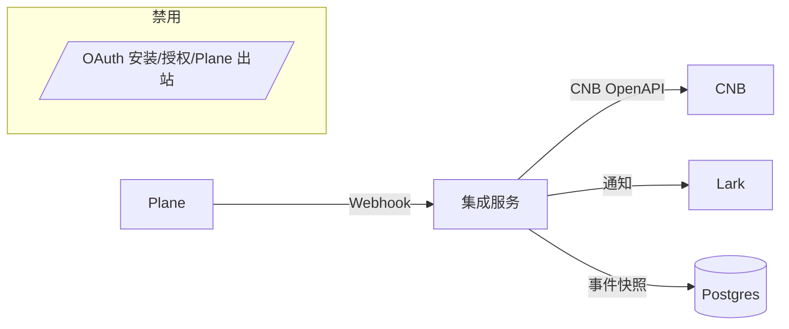

# Plane Webhook-only 重构方案（自托管不支持 OAuth）

先结论（要做什么 / 验收点）
- 取消 Plane OAuth App 依赖，全部通过 Webhook 驱动功能（Plane → 本服务 → 下游）。
- 默认关闭 `/plane/oauth/*` 路由与 Plane 出站调用；保留 `POST /webhooks/plane` 单一入口，强化验签与幂等。
- 以“事件快照 + 管理端手工映射”为主替代 Plane API 查询能力（缓存 issue/project/workspace 关键信息用于预览/通知）。
- 功能边界调整：保留 Plane→CNB 同步、Plane→飞书通知；在配置 Workspace 级 Service Token 后，支持"飞书/CNB→Plane 写回与查询"（官方 API 调用，通过凭据存在性控制启用）。
- 验收：
  - Plane 发出 issue/评论事件后，`/webhooks/plane` 验签通过且事件入库；CNB/Lark 路径按策略生效。
  - 管理端可基于“事件快照 + 手工映射”完成仓库↔项目配置与频道通知；无需 Plane OAuth。

---

## 背景与变更来源
- 重大变更：Plane 自托管版本不支持 OAuth App，现有“安装/授权（/plane/oauth/start|/callback）+ Bot/User Token”的方案不可用。
- 现状依赖：本项目当前 OAuth 相关实现位于：
  - 路由：`internal/handlers/router.go:41–43`（`/plane/oauth/start`、`/plane/oauth/callback`、`/webhooks/plane`）。
  - 处理：`internal/handlers/plane_oauth.go`（授权跳转/令牌交换/安装信息查询）。
  - Webhook：`internal/handlers/plane_webhook.go`（HMAC-SHA256 验签 + 幂等 + 分发）。
- 目标：在不使用 OAuth 的前提下，尽可能保留 Plane 侧触发的业务能力并降低对 Plane 出站 API 的依赖。

## 影响分析
- 移除/禁用能力：
  - 安装跳转与令牌落库（Bot/User Token）不可用；`workspaces` 中 token 字段不再写入。
  - "向 Plane 出站写入或查询"默认不可用（无凭据）；当配置 Workspace 的 Service Token 后，可执行创建/更新/评论与必要的查询（例如：CNB→Plane 更新 Issue、飞书→Plane 追加评论、管理端读取 Workspace/Project/Issue 名称）。
- 保留能力：
  - Plane→CNB：基于 Plane Webhook 触发的“在 CNB 创建/更新 Issue、更新评论/标签/指派、PR 状态联动”（既有实现以 CNB OpenAPI 为主）。
  - Plane→飞书：项目新建/更新的群内通知（基于事件驱动，无需读 Plane API）。
  - 管理端映射：repo↔project、用户/标签/PR 状态映射、线程链接等，改以手工或事件快照辅助。
- 预期影响范围：
  - 文档与部署指南需要去除 OAuth 步骤；新增“Webhook-only”模式说明与环境变量。
  - 代码层面移除 OAuth 依赖；管理端 API 增加降级/占位（501/Not Implemented 或使用缓存），并在存在 Workspace 凭据时走官方 API。

## 目标与非目标
- 目标
  - 单向（Plane→CNB/Lark）事件驱动流程完全可用、稳定、可观测。
  - 通过事件快照覆盖最小预览与通知所需字段（标题、状态名、标签、指派、项目/工作区标识）。
  - 管理端无需 Plane OAuth 也能完成映射配置与联调。
- 非目标（当前阶段）
  - 不依赖 Plane 侧任何 OAuth/Token 交换流程。
  - 向 Plane 出站调用仅在配置 Service Token 时可用，否则降级或返回 501。

## 方案概览
- 安全校验：继续使用 `X-Plane-Signature: sha256=...`，以 `HMAC-SHA256(PLANE_WEBHOOK_SECRET, raw_body)` 常量时间比较（已实现）。
- 事件处理：在现有 `plane_webhook.go` 基础上扩展“事件快照”与“上下文推断”，减轻对 Plane API 的依赖。
- 管理端：
  - 将“实时查询 Plane Workspace/Project/Issue 名称”的功能改为“读取事件快照缓存 + 手工补录”，查询 Plane API 的路径通过特性开关禁用或返回 501。
  - 映射配置表维持不变，新增对 `workspace_slug`/`project_slug` 的可选手工字段（待确认 schema）。
- 可配置化：
  - 新增特性开关：`PLANE_OAUTH_ENABLED`（默认 false）。
  - Plane 出站调用基于凭据存在性判断：无凭据时返回 501 或采用缓存降级。

## 架构变化
- 触发机制（保留）：Plane Webhook → 集成服务 → （CNB/Lark）
- 去除/禁用：安装/授权跳转流（/plane/oauth/start|/callback）与基于 Token 的出站查询。
- 新增数据流：Webhook → 事件快照（issue/project/workspace 关键字段）→ 供预览/通知/管理端读取。

## 数据模型与迁移（建议）
- 复用表：
  - `event_deliveries`（去重/重试）保持不变。
  - `repo_project_mappings`、`user_mappings`、`issue_links` 等保持不变。
  - `workspaces`：保留 `plane_workspace_id` 与 `workspace_slug` 字段用于来源标识；历史 OAuth 列标记弃用，见 Phase C。
- 新增表（建议，幂等写入）：
  - `plane_issue_snapshots`（最小快照，用于预览与管理端）：
    - `plane_issue_id uuid`、`plane_project_id uuid`、`plane_workspace_id uuid`、`workspace_slug text`、`project_slug text`、`name text`、`description_html text`、`state_name text`、`priority text`、`labels text[]`、`assignee_ids uuid[]`、`updated_at timestamptz`。
  - `plane_project_snapshots`（可选）：`plane_project_id uuid`、`workspace_slug text`、`project_slug text`、`name text`、`identifier text`、`updated_at timestamptz`。
  - `plane_credentials`（Service Token 存储，透明加密）：
    - 字段：`id uuid pk`、`plane_workspace_id uuid`、`workspace_slug text`、`kind text`（值域：`service`）、`token_enc text`、`created_at timestamptz`、`updated_at timestamptz`；唯一（`plane_workspace_id`,`kind`）。
    - 说明：与历史 OAuth 字段解耦，仅承载 webhook-only 写回所需的 PAT/Service Token。
- 迁移策略：
  - `0010_plane_snapshots.sql`：创建 `plane_issue_snapshots` 与可选 `plane_project_snapshots`。
  - `0011_plane_credentials.sql`：创建 `plane_credentials` 表（含唯一索引）。
  - `0012_drop_plane_oauth_columns.sql`（可选）：删除 `workspaces` 中历史 OAuth 列（IF EXISTS）。

## 接口与行为变化
- Plane Webhook（保留并强化）
  - `POST /webhooks/plane`：验签 + 幂等；新增“快照写入”逻辑（issue、issue_comment、project 相关事件提取字段入库）。
  - 重复投递：维持按 `delivery_id + payload_sha256` 去重策略（现有）。
- OAuth 相关（禁用/软删除）
  - `GET /plane/oauth/start`、`GET /plane/oauth/callback`：默认不注册路由或返回 `501 Not Implemented`。
  - 管理文档移除“在 Plane 设置页面安装”的章节，替换为“配置 Webhook + Secret”。
- 管理端 API（降级）
  - `GET /admin/plane/workspaces`、`GET /admin/plane/projects`：当无 Workspace 凭据时返回 `501` 或读取快照表提供"最好努力"信息；存在凭据时使用 `plane_credentials` 的 token 调官方 API。
  - 其余 `/admin/mappings/*` 接口不变；映射校验基于手工输入与快照。
  - 新增凭据管理端点（建议）：`POST/GET/DELETE /admin/plane/credentials`（按 `workspace_slug` 录入/轮换 Service Token；服务端加密保存）。

## 配置与部署变更
- 新增环境变量（建议）：
  - `PLANE_OAUTH_ENABLED=false`（默认）：是否启用 OAuth 路由与逻辑（webhook-only 模式下为 false）。
- 保留变量：
  - `PLANE_WEBHOOK_SECRET`（必填）：Webhook 验签密钥。
  - 其他 Plane OAuth 相关变量（`PLANE_CLIENT_ID` 等）在 webhook-only 模式下无需配置。
- 凭据管理：
  - 线上：通过管理端 `POST/GET/DELETE /admin/plane/credentials` 录入并加密存储到 `plane_credentials` 表。
  - 开发期便捷（可选）：`PLANE_SERVICE_TOKEN` 环境变量仅用于本地/测试快速启动。
- 部署检查：
  - 健康检查：`GET /healthz`。
  - Webhook 验证：向 `POST /webhooks/plane` 发送签名正确的示例事件，期望 200 且 `event_deliveries` 记录 `queued/duplicate`。

## 兼容性与回滚
- 双模支持：通过 `PLANE_OAUTH_ENABLED` 实现“OAuth 模式 / Webhook-only 模式”可切换，便于未来恢复 OAuth。
- 回滚：若未来自托管版本恢复 OAuth，可通过开关回退为原方案，无需数据迁移（snapshots 表可继续共存）。

## 验收与验证（DoD）
- Webhook-only 路径（无凭据）：
  - 配置 `PLANE_WEBHOOK_SECRET`；关闭 OAuth：`PLANE_OAUTH_ENABLED=false`。
  - 触发 Plane issue 新建/更新/评论 → 日志包含解析结果，CNB 出站更新执行，飞书频道收到通知（若配置）。
  - 管理端可通过快照/手工映射完成 repo↔project 配置并查询到基础字段。
  - 尝试调用 Plane API 时返回 501「请先配置 Workspace Service Token」。
- Webhook + 出站路径（有凭据）：
  - 通过管理端录入 Workspace 的 Service Token。
  - 飞书/CNB 触发写回 → Plane API 调用成功，Issue 状态/评论正常更新。
  - 管理端可实时查询 Plane Workspace/Project 列表（降级读快照或调官方 API）。
- 错误与边界：
  - `X-Plane-Signature` 校验失败返回 401；重复投递返回 200 `status=duplicate`；超时行为不影响幂等。

## 风险与待确认
- 待确认
  - 自托管 Plane 的 Service Token/PAT 获取与权限范围（最小权限建议与旋转策略）。
  - Webhook 事件 payload 是否包含 `workspace_slug`/`project_slug` 等？若缺失，需在管理端手工输入或通过首次事件补齐。
  - 飞书线程→Plane 评论的双向同步实现细节（评论内容/富文本限制、失败重试/去重策略）。
- 风险
  - 预览/富卡片信息可能不完整（依赖快照覆盖度）；通过后续事件渐进完善。
  - 管理端查询体验下降（无法实时从 Plane 拉取名称/标识）。

## 实施计划（里程碑）
- M0（1–2 天）：
  - 禁用 OAuth 路由（`PLANE_OAUTH_ENABLED=false`）；路由降级为 501 或不注册。
  - 文档更新（README/ARCHITECTURE）：去除 OAuth 安装步骤，新增 webhook-only 指南。
- M1（2–3 天）：
  - 新增 `plane_issue_snapshots` 迁移与写入逻辑（issue/评论事件）；管理端读取快照作为展示/辅助配置。
  - 新增 `plane_credentials` 迁移与管理端点（录入/轮换 Service Token，透明加密存储）。
  - 调整管理端 Plane 查询接口，在无凭据时降级或改读快照。
- M2（2–3 天）：
  - 完善飞书通知/预览对快照的使用；补充缓存失配与缺字段容错。
  - 在存在 Workspace 凭据的前提下，接入最小写回路径（评论/状态/标题/标签/指派），并完善幂等与重试。
  - 观测与报警：QPS、p95、验签失败率、duplicate 比例、快照覆盖率。
- M3（可选）：
  - 若确认存在 PAT/Service Token：在 webhook-only 大框架内按需开启“有限出站”能力（例如仅查询名称/标识或追加评论），并保持向后兼容。

## 参考与代码位置
- 路由注册：`internal/handlers/router.go:41–43`
- OAuth 处理：`internal/handlers/plane_oauth.go:20–41,47–121`
- Webhook 验签/幂等：`internal/handlers/plane_webhook.go:16–41,43–55`
- 事件去重存储：`db/migrations/0001_init.sql:107–120`

---

变更说明（提交前自检）
- 已明确范围与边界（webhook-only），包含环境变量与端点清单。
- 标注“待确认”与下一步行动。
- 保持与现有代码一致的端点与表名；方案采用特性开关最小改动原则。

---

## OAuth 彻底清理计划（代码/配置/数据）

目标：完全移除 OAuth 相关代码路径与依赖，删除不再使用的配置与数据列，避免“僵尸配置/无效路径”。支持分阶段回滚策略（先特性开关冻结，再物理删除）。

分阶段策略
- Phase A（冻结，最小风险）
  - 路由开关：在路由注册处用开关禁用 `GET /plane/oauth/start` 与 `GET /plane/oauth/callback`；请求命中时返回 501。
  - 出站降级：统一检查 Workspace 凭据存在性，无凭据时任何 Plane 出站调用直接短路或返回 501。
  - 文档标注：README/ARCHITECTURE 增加“webhook-only 模式”并明确 OAuth 已禁用。
- Phase B（删除实现与引用）
  - 删除 OAuth 处理器文件与引用：
    - 删除文件：`internal/handlers/plane_oauth.go`
    - 移除路由注册：`internal/handlers/router.go:41–43` 中的 `GET /plane/oauth/start|/callback`（保留 `/webhooks/plane`）
  - 移除配置项与读取：
    - 从配置中删除 `PlaneClientID`、`PlaneClientSecret`、`PlaneRedirectURI`、`PlaneAppBaseURL` 字段与相关 `FromEnv()` 读取（`pkg/config/config.go:16–21,66–71`）。
    - 保留 `PLANE_WEBHOOK_SECRET` 与必要的 `PLANE_BASE_URL`（若仍用于构造链接或日志上下文）。
  - 出站调用重构（替代删除）：
    - 保留 `internal/plane/client.go` 作为 Plane 出站适配器；所有调用统一检查凭据存在性。
    - 管理端依赖 Plane API 的查询：无凭据时改为读快照或返回 501；有凭据时使用 `plane_credentials` 的 token 调用。
    - 飞书与 CNB 写回：仅在存在对应 Workspace 的 Service Token 时启用。
  - 移除 DB 交互中对 OAuth Token 的写入：
    - `UpsertWorkspaceToken` 的调用在 OAuth 移除后不再出现；清理对应引用（见 `internal/handlers/plane_oauth.go:98–106` 已被移除）。
- Phase C（数据库瘦身，可选，生产窗口执行）
  - 新增迁移：删除不再使用的列（IF EXISTS，先在测试/预发布验证）：
    - `ALTER TABLE workspaces DROP COLUMN IF EXISTS token_type;`
    - `ALTER TABLE workspaces DROP COLUMN IF EXISTS access_token;`
    - `ALTER TABLE workspaces DROP COLUMN IF EXISTS refresh_token;`
    - `ALTER TABLE workspaces DROP COLUMN IF EXISTS expires_at;`
    - `ALTER TABLE workspaces DROP COLUMN IF EXISTS app_installation_id;`
    - `ALTER TABLE workspaces DROP COLUMN IF EXISTS app_bot;`
  - 保留：`plane_workspace_id`、`workspace_slug`（用于 webhook 源标识与快照归属）。
  - 同步引入：`plane_credentials` 表（见上文），用于 Service Token 管理。
  - 迁移文件示例：`db/migrations/0012_drop_plane_oauth_columns.sql`（仅 DROP IF EXISTS，不修改旧迁移）。
- Phase D（文档与前端）
  - README：删除“在 Plane 设置页面配置与安装（全流程）”章节与 OAuth 环境变量；新增“自托管 webhook-only 安装指引 + 出站写回配置（Service Token + 开关）”。
  - web 前端：移除任何指向 `/plane/oauth/start` 的入口；根据凭据状态展示“出站已启用/未启用”的 UI 与指引（含凭据录入入口）。

代码待办（按提交粒度拆分）
- chore(config): 移除 OAuth 配置字段与 env 读取，保留 `PLANE_WEBHOOK_SECRET`。
- refactor(router): 取消注册 `/plane/oauth/*` 路由（或返回 501）。
- refactor(handlers): 删除 `plane_oauth.go` 与相关调用；在 Admin/Lark/CNB 路径移除 Plane 出站调用或改读快照。
- feat(db): 新增 snapshots 表 + 可选移除 OAuth 列的迁移脚本。
- docs: README/ARCHITECTURE 与设计文档同步更新（去除 OAuth、补充 webhook-only）。

回滚策略
- 任意阶段可用开关回退到 Phase A（仅禁用，不删除）；删除动作（Phase B/C）需在单独发布窗口并具备数据备份/回滚脚本。

验收
- 代码中不再存在对 `/plane/oauth/*` 的路由注册与实现引用。
- 构建不包含 `internal/handlers/plane_oauth.go` 与 Plane 出站调用（或在开关关闭时不可达）。
- 环境变量列表不再出现 OAuth 相关项；健康检查与 webhook 流程均工作正常。

---

## API 调用计划（飞书/CNB → Plane）

场景目标
- 在 webhook-only 模式下，仍然支持“从飞书/CNB 将变更写回 Plane”的能力；前提是具备 Plane 可接受的鉴权方式（自托管 PAT/Service Token 或专用机器人账户 Token，待确认）。
- 通过配置 Workspace 级 Service Token 启用；未启用时所有 Plane 出站调用短路为 501 或降级为提示。

鉴权与地址
- Authorization: `Bearer <token>`（官方 API 参考）；token 来源：
  - 首选：自托管 Plane 提供的 Service Token 或 PAT（待确认）；按 Workspace 维度存储与轮换。
  - 备选：专用机器人账户的用户 Token（风险/合规评估后再启用）。
- Path 维度：均需 `workspace-slug` 与 `project_id`；来源顺序：
  - 事件快照（快照表或最近一次 webhook payload 提供）→ 管理端映射（repo↔project 含 `plane_project_id`）→ 手工补录的 `workspace_slug`（新增映射字段，待迁移）。

端点与最小字段（以官方文档为准）
- 创建 Issue（docs/plane-developer-docs/api-reference/issue/add-issue.mdx）
  - `POST /api/v1/workspaces/{workspace-slug}/projects/{project_id}/issues/`
  - Body 最小：`name`。可选（参考 dev-tools/build-plane-app.mdx 示例）：`description_html`、`priority`、`assignees`、`labels`（待确认 labels 传值形态）。
- 更新 Issue（docs/plane-developer-docs/api-reference/issue/update-issue-detail.mdx）
  - `PATCH /api/v1/workspaces/{workspace-slug}/projects/{project_id}/issues/{issue_id}`
  - Body：按需包含 `name`、`description_html`、`priority`、`state`/`state_id`、`assignees`、`labels`。
  - 用途：
    - CNB PR 生命周期 → Plane 状态：使用映射将 `opened/approved/merged/closed` 转为 Plane `state_id`（待确认：状态字段名与 id 形态）。
    - 标签与指派：映射后更新对应字段（labels 与 assignees 的 id 形态待确认）。
- 追加评论（docs/plane-developer-docs/api-reference/issue-comment/add-issue-comment.mdx）
  - `POST /api/v1/workspaces/{workspace-slug}/projects/{project_id}/issues/{issue_id}/comments/`
  - Body：`comment_html`。
  - 用途：飞书线程评论/CNB 评论 → Plane 评论。
- 标签维护（docs/plane-developer-docs/api-reference/label/add-label.mdx）
  - `POST /api/v1/workspaces/{workspace-slug}/projects/{project_id}/labels/`（必要时建新标签）。
  - 读接口：`GET /labels/` 与 `GET /labels/{label_id}`（用于比对/缓存）。
- 成员解析（docs/plane-developer-docs/api-reference/members/get-workspace-members.mdx）
  - `GET /api/v1/workspaces/{workspace-slug}/members/`（用于邮件/外部 id → Plane user id 的离线构建与缓存，避免热路径实时拉取）。

字段与映射（待确认点）
- priority：dev-tools 示例支持字符串值（如 `high`）；正式值域与大小写需按当前版本确认。
- assignees：数组元素是否为 Plane 用户 `id`（UUID）；若需 project scope id，需在上线前确认并在管理端做映射缓存。
- labels：更新 Issue 时的字段名与值类型（id 数组还是对象列表）需确认；若仅支持 id，则需先“建/查 label → 提取 id → 回写”。
- state：推荐使用 `state_id`（UUID）更新，避免名称歧义；需要在 PR 状态映射中维护 `state_id`。

错误处理与幂等
- 4xx：参数/权限错误不重试；记录 `error.code` 与上下文（workspace_slug、project_id、issue_id）。
- 429/5xx：指数退避重试，读取 `Retry-After`（若返回）；超时与连接错误视作可重试错误。
- 幂等：
  - 评论：以“线程消息 id 或 CNB 评论 id + plane_issue_id”去重（本地表），避免重复写评论。
  - 更新：在 PATCH 前根据快照比对，避免空更新；必要时按 ETag/If-Match（若 Plane 支持，待确认）。

实现落地（与代码对应）
- 出站客户端：复用/精简 `internal/plane/client.go` 中的方法：
  - CreateIssue（L59）、PatchIssue（L96）、AddComment（L124）、GetIssueName（L203），并新增/补全 Labels/Members 读取方法（按 API 参考）。
- 写入入口：
  - 飞书路径：在 `internal/handlers/lark_events.go` 的命令/交互处理中，按映射与快照得到 `workspace_slug/project_id/issue_id`，构造调用；失败时回帖提示。
  - CNB 路径：在 `internal/handlers/cnb_ingest.go` 的回调里，把 PR/Issue 的变更翻译为 Plane 字段，调用 Patch/Comment；标签/指派先查映射与缓存。
- 配置与凭据：
  - 每 Workspace 通过管理端录入并加密保存 Service Token（`plane_credentials` 表）；存在凭据时才执行出站调用。

验收（写回路径）
- 飞书：在已绑定的线程中发送 `/comment hello` → Plane 对应 Issue 出现评论；断网/限流时重试并告警。
- CNB：PR 合入 → Plane 对应 Issue 状态切换为“已完成/已合并”（映射目标 state_id），并在活动流能看到变更。
